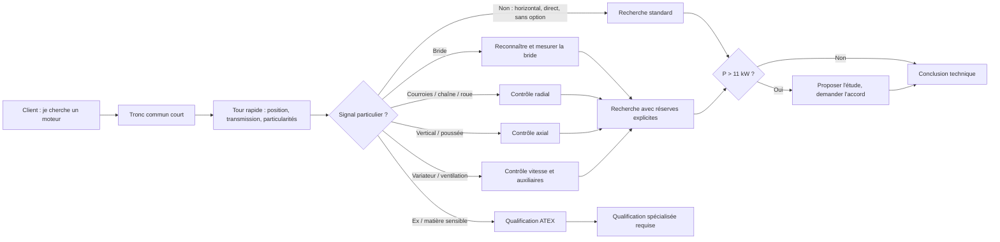
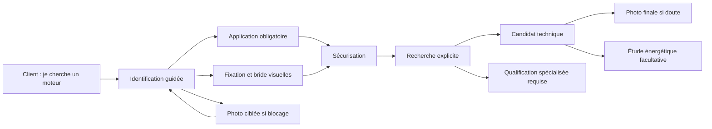

# C7-1 v2 — parcours téléphonique de remplacement moteur

Ce document remplace l'hypothèse écran par écran v6. Il décrit le parcours de
découverte issu des décisions PO et des cinq simulations de co-conception du 04/08/2026.
Il ne constitue pas encore une spécification d'implémentation.

Statut : **C7-1 terminé et validé par le PO le 05/08/2026 ; GO C7-2 modèle
conceptuel uniquement / NO-GO design, prototype et code produit**.

Décision PO complémentaire du 06/08/2026 : la structure C7-3 remplace la liberté
d'ordre envisagée ici par un **arbre déterministe, question après question**. Les
informations données spontanément sont conservées et permettent de sauter plus tard
une question déjà satisfaite, sans laisser le TCS réordonner librement le parcours.

## Décisions acquises pendant les simulations

- Le client commence généralement par « je cherche un moteur » ; il ne fournit
  spontanément ni l'application ni le vocabulaire technique.
- **L'application et la fonction du moteur sont obligatoires avant une solution
  techniquement validée.** Une recherche préliminaire peut partir avec moins
  d'informations, jamais devenir silencieusement une validation technique.
- Le chemin standard doit rester court. Puissance, application, carcasse, fixation,
  vitesse et alimentation constituent le noyau de l'appel.
- Le TCS non spécialiste ne connaît ni les codes B3/B5/B14/B35/B34, ni la cote de
  bride à demander. L'interface porte cette expertise avec des visuels explicites.
- La photo n'est jamais obligatoire en ouverture. Elle est demandée au point de
  blocage ou à la fin pour confirmer un doute.
- Une puissance installée strictement supérieure à 11 kW déclenche une invitation
  énergétique majeure. La simulation reste facultative et soumise à l'accord du client.
- La solution énergétique est neutre : Dyneo+, asynchrone ou autre système compatible
  sont comparés sur leur consommation annuelle au profil réel.

## Job story

Quand un client appelle sans savoir décrire techniquement son moteur, le TCS doit pouvoir
poser les bonnes questions avec les bons visuels, trouver la bonne référence technique et
savoir exactement ce qui reste à confirmer avant de valider la compatibilité.

Le succès n'est pas « avoir rempli tous les champs ». Le succès est d'atteindre l'un des
résultats explicites suivants :

| Résultat | Signification |
| --- | --- |
| **Recherche préliminaire** | La recherche technique peut commencer, mais des faits importants manquent |
| **Candidat technique** | Une référence semble pertinente, avec réserves explicites |
| **Solution techniquement validée** | Les compatibilités nécessaires sont suffisamment fondées |
| **Qualification spécialisée requise** | ATEX, non-IEC, charge particulière ou autre cas expert ; aucune validation standard |

## Principes d'interaction

- Une question principale et des choix courts sont mis en avant. Le configurateur
  n'impose jamais au TCS une formulation à réciter au client.
- Le configurateur conduit le TCS dans un ordre déterministe, une question principale
  à la fois, et lui indique où le client peut trouver l'information demandée.
- Une aide contextuelle facultative explique pourquoi l'information est nécessaire, où
  elle se trouve, comment la reconnaître ou la mesurer, et l'effet d'une inconnue sur la
  conclusion. Elle reste secondaire et ne ralentit pas le parcours principal.
- Le TCS peut corriger un fait. Les informations supplémentaires données spontanément
  sont conservées afin de ne pas reposer ensuite une question déjà satisfaite.
- Le relevé acquis reste visible sans devenir un formulaire dense.
- Chaque information inconnue reste inconnue ; « standard » n'est jamais supposé.
- Un visuel sert à reconnaître ou mesurer. Il n'est jamais décoratif ni utilisé comme
  preuve catalogue.
- Chaque fait sépare sa source sémantique de son canal de preuve.
- Une photo reste un canal d'information que le TCS peut exploiter avec une consigne
  précise. La qualification spécialisée n'intervient qu'après épuisement du guidage
  accessible au TCS, sauf expertise explicitement réservée comme l'ATEX.

## Synthèse du rejeu de co-conception du 05/08/2026

Le PO a rejoué les cinq cas en se plaçant comme un TCS connaissant les bases du moteur mais
pas toutes les particularités. Comportements observés sur les cinq échanges :

- puissance, vitesse, alimentation et fixation sont demandées naturellement, souvent dans
  une seule phrase ;
- l'application arrive ensuite, mais la machine entraînée et sa fonction réelle ne sont pas
  toujours séparées spontanément ;
- dès qu'une carcasse ou une référence semble plausible, le TCS tend à conclure « c'est bon » ;
- position, transmission, options, cause de panne, roulements et environnement sensible sont
  facilement oubliés sans relance du configurateur ;
- une application connue permet au TCS de comprendre une alerte, mais pas de déterminer seul
  les mesures, charges ou limites constructeur à vérifier ;
- les cas rares ou piégeux — courroies, pompe verticale, ventilation forcée et ATEX — doivent
  donc ouvrir des questions ciblées sans allonger le cas standard.

Niveau de confiance : **observé en co-conception sur cinq cas avec un même participant, le
PO connaissant le travail réel du TCS**. Cette limite est conservée comme contexte de preuve,
sans créer une équipe ou des participants fictifs. Le PO juge cette matière suffisante pour
clore C7-1 et autoriser le seul travail de modèle conceptuel C7-2.

## Arbre de décision déterministe à branches conditionnelles

### Principe directeur

Le configurateur ne déroule jamais toutes les questions. Il détermine le prochain nœud
depuis les faits déjà obtenus :

1. un **tronc commun court** identifie le moteur et son usage ;
2. un **tour rapide de l'installation** détecte les embranchements ;
3. chaque réponse ouvre uniquement les contrôles concernés ;
4. une réponse standard ferme immédiatement la branche ;
5. une information inconnue reste inconnue et limite le niveau de conclusion.

L'application sert à choisir les prochaines questions. Elle ne détermine jamais seule une
bride, un roulement, un variateur, une qualification ATEX ou une solution technique.

### Tronc commun — six groupes ordonnés maximum

| Groupe | Question à porter | Réponse standard qui n'ouvre rien |
| --- | --- | --- |
| Plaque | Puissance, vitesse, tension/fréquence et alimentation réelle | Valeurs lisibles et cohérentes |
| Usage | Machine entraînée **et** fonction réelle dans le process | Usage compris, sans particularité signalée |
| Construction | Carcasse ou hauteur d'axe, pattes/bride et forme physique | Construction reconnue et dimensions disponibles |
| Position | Horizontal, vertical, arbre vers le haut ou vers le bas | Horizontal |
| Transmission | Direct, accouplement, courroies, chaîne, réducteur ou roue sur arbre | Accouplement direct documenté |
| Remplacement et tour rapide | Cause du remplacement + frein, ventilation séparée, variateur, fils, deuxième arbre, deux vitesses, ATEX ou environnement particulier | Remplacement standard, aucune particularité |

Le configurateur présente un groupe puis une question active à la fois. Si le client donne
plusieurs faits dans la même réponse, le TCS les consigne immédiatement et l'arbre saute
ensuite les nœuds déjà satisfaits. Cela évite les répétitions sans rendre l'ordre libre.

### Branches ouvertes uniquement si nécessaire

| Signal obtenu | Module ajouté | Questions minimales ajoutées | Sortie possible |
| --- | --- | --- | --- |
| Bride | **Identification de bride** | Grande/petite, avec/sans pattes, trous traversants/taraudés, mesures réellement discriminantes | Candidat avec réserves tant que la bride n'est pas fondée |
| Carcasse IEC confirmée + bride | **Tailles standard possibles** | Montrer les brides constructeur possibles pour cette carcasse, sans en présélectionner une ; faire reconnaître puis mesurer | Aucune bride inventée depuis la carcasse |
| Courroies, chaîne ou roue sur arbre | **Charge radiale** | Poulie moteur, diamètre, nombre de courroies, porte-à-faux, tension, retension récente, limites constructeur | Contrôle radial ; aucun roulement prescrit automatiquement |
| Panne avec bruit, vibrations ou chauffe | **Cause de panne** | Ancienneté, chronologie, intervention récente et constat terrain | Cause plausible seulement, jamais diagnostic automatique |
| Montage vertical ou application pouvant transmettre une poussée | **Charge axiale** | Sens, valeur, organe qui reprend l'effort, butée de la machine, roulements existants et documentation | Qualification spécialisée si la reprise reste inconnue |
| Variateur | **Fonctionnement à vitesse variable** | Profil de vitesse, longues durées à basse vitesse, câble et aptitude constructeur selon le cas | Contrôle thermique/électrique ciblé |
| Ventilation forcée | **Auxiliaire distinct** | Plaque propre, alimentation réelle, commande, fonctionnement et fils associés | Inconnues explicites ; jamais reprise de l'alimentation moteur |
| Option visible | **Détail de l'option** | Frein, codeur, sondes, deuxième arbre, deux vitesses ou capot : uniquement les champs de l'option présente | Aucun questionnaire sur les options absentes |
| Matière inflammable, poussières, gaz, marquage `Ex` ou doute ATEX | **Dépistage ATEX** | Marquage complet, zone déclarée par le site, matière, certificat et conditions d'utilisation | Qualification spécialisée ; `IP` seul ne suffit jamais |
| Moteur installé de puissance `P > 11 kW` | **Opportunité énergétique** | Invitation visible puis accord du client ; si accord seulement, besoin variable, régulation et profil | Aucun calcul ni gain promis automatiquement |
| Non-IEC, moteur intégré, charge non quantifiée ou incohérence | **Arrêt expert** | Liste courte des faits et documents encore nécessaires | Qualification spécialisée requise |

Les tailles de bride proposées depuis une carcasse confirmée sont des **possibilités
constructeur à reconnaître**, jamais une déduction. La décision vient de la forme observée,
des trous traversants ou taraudés et des mesures guidées.

### L'application choisit la question suivante

La taxonomie d'applications doit couvrir largement les usages CIR, mais chaque choix ne
porte que quelques questions contextuelles. Exemples issus des cinq cas :

| Application reconnue | Questions ajoutées immédiatement | Ce qui n'est jamais déduit |
| --- | --- | --- |
| Pompe | Monobloc ou accouplée ? Horizontale ou verticale ? Que pompe-t-elle et pour quelle fonction ? | Effort axial, roulement ou variateur |
| Ventilateur | Roue sur l'arbre, accouplement direct ou courroies ? Besoin d'air constant ou variable ? | Charge radiale, cause de panne ou économie |
| Convoyeur / vis | Accouplement, chaîne ou réducteur ? Quelle matière est déplacée ? | ATEX depuis le seul mot « farine » |
| Levage | Charge suspendue ? Frein présent ? Service et démarrages ? | Frein ou service admissible |
| Broyeur / concasseur | Transmission ? Chocs ou blocages observés ? Inertie et démarrage documentés ? | Roulement renforcé ou puissance requise |
| Application non reconnue | Décrire la machine et sa fonction, puis ouvrir une qualification spécialisée si un risque ne peut être borné | Assimilation silencieuse à une application voisine |

La matrice de travail complète des 28 cas est documentée dans
`03-regles-metier-et-calculs.md`. Elle reste à valider en C7-6. Ajouter ou corriger une
application signifie définir : son vocabulaire client, deux à quatre questions
contextuelles, les modules qu'elle peut ouvrir et les conclusions qu'elle ne permet jamais
à elle seule.

### Lecture simplifiée de l'arbre



La recherche reste déclenchable tôt. En revanche, une branche critique ouverte et non
résolue empêche le libellé « solution techniquement validée » et expose précisément la
question restante.

## Breadboard du parcours

### 1. Début de l'appel

```text
Début de l'appel
- commencer le relevé → Identification guidée
- reprendre un relevé interrompu → Question précédemment active
[« Le client cherche un moteur de remplacement. »]
[Aucune photo demandée automatiquement]
```

Le client n'est pas censé connaître un code de montage, une carcasse ou une cote IEC.

### 2. Identification guidée

```text
Identification guidée
- répondre à la question active → prochain nœud déterminé
- donner une information supplémentaire → fait consigné, futur nœud satisfait ignoré
- le client ne trouve pas → indication de l'emplacement, mesure ou photo guidée
- corriger une réponse → fait corrigé avec provenance conservée
- rechercher dès que possible → Résultats
[Question active + choix courts + aide facultative « où trouver l'information » + visuel utile + relevé acquis]
```

Ordre déterministe, sans question inutile :

| Priorité | Information | Ce que l'étape demande | Visuel attendu | Règle |
| --- | --- | --- | --- | --- |
| 1 | **Puissance** | Puissance nominale en kW, lue sur la plaque | Plaque avec `kW` entouré | Toujours demandée |
| 2 | **Application et fonction** | Machine entraînée, puis fonction réelle dans le process | Familles de machines illustrées, puis une précision contextuelle | Obligatoire avant solution techniquement validée |
| 3 | **Carcasse / hauteur d'axe** | Valeur lue sur la ligne Type ou Carcasse | Ligne de plaque entourée ; exemple `132 M` | Aucune extraction non confirmée d'un nombre constructeur |
| 4 | **Fixation** | Construction reconnue parmi les possibilités montrées | Galerie complète des constructions | Le code est déduit du choix visuel, jamais demandé |
| 5 | **Vitesse** | Vitesse nominale en tours par minute | `tr/min` entouré sur la plaque | Les pôles peuvent être suggérés avec cause visible |
| 6 | **Alimentation** | Tension, fréquence et mode d'alimentation réel | `V`, `Hz`, phases et `Δ/Y` entourés | Le réseau réel reste distinct des valeurs de plaque |

Ces libellés décrivent l'information à obtenir, pas une phrase à réciter. L'aide
contextuelle facultative de chaque étape indique où la trouver, comment la reconnaître
ou la mesurer.

L'application comporte deux faits distincts :

- la **machine entraînée** : pompe, ventilateur, compresseur, convoyeur, broyeur,
  réducteur, agitateur, levage ou autre cas à expertiser ;
- sa **fonction réelle** : pomper un fluide, extraire de l'air, maintenir une pression,
  déplacer une charge, lever, broyer, mélanger, etc.

Une famille ouvre au maximum la précision utile : pompe monobloc ou accouplée,
ventilateur direct ou par courroie, convoyeur direct ou via réducteur, levage avec ou sans
frein. Le simple libellé de l'application ne prescrit jamais un roulement ou un variateur.

### 3. Identification visuelle de la fixation et de la bride

```text
Galerie des fixations
- choisir l'image correspondante → Détails de la fixation
- aucune image ne correspond → mesure ou photo guidée, puis qualification si le cas reste non bornable
- le client hésite → Assistance photo
[Moteurs complets vus de profil et de face, codes techniques secondaires]
```

La galerie doit montrer simultanément et sans ambiguïté :

| Construction visible | Code secondaire | Différence à montrer |
| --- | --- | --- |
| Pattes seules | B3 | Quatre points de fixation sous le moteur, aucune bride active |
| Grande bride sans pattes | B5 | Trous traversants ; boulons passant dans la bride |
| Petite bride sans pattes | B14 | Trous taraudés ; vis se vissant dans la bride |
| Pattes + grande bride | B35 | Pattes et bride à trous traversants |
| Pattes + petite bride | B34 | Pattes et bride taraudée |

Après reconnaissance, l'interface ne demande que les mesures capables de départager les
candidats. Chaque mesure dispose de deux représentations :

- une vue 2D cotée avec la zone surlignée ;
- une vue réaliste indiquant où placer le mètre.

Les libellés client précèdent les symboles `M`, `N`, `P`, `S`, `T` et `Z`. La hauteur
d'axe `H` est mesurée seulement si elle n'est pas confirmée par une carcasse IEC fiable.

### 4. Sécurisation mécanique et particularités

```text
Sécurisation
- confirmer les dimensions utiles → Recherche ou solution techniquement validée
- signaler une particularité → Branche de contrôle correspondante
- aucune particularité → Recherche
- cas sensible → Qualification spécialisée requise
[Arbre + grille visuelle des particularités + réserves restantes]
```

Le bout d'arbre est contrôlé lorsque la référence ou la carcasse ne suffit pas à garantir
sa géométrie : diamètre `D`, longueur `E` et clavette `F`, montrés un par un.

Une grille finale demande « Voyez-vous une de ces particularités ? » :

- frein ;
- ventilation forcée ;
- codeur ou tachymètre ;
- deuxième bout d'arbre ;
- deux vitesses ;
- montage vertical ;
- capot pare-pluie / anti-pluie ;
- alimentation par variateur ;
- marquage ATEX ;
- lavage, forte chaleur, extérieur ou ambiance corrosive.

« Rien de tout cela » permet de continuer. ATEX quitte réellement le parcours standard
vers une qualification dédiée. Le configurateur conserve les faits et cherche une
référence techniquement compatible ; il ne prépare aucun devis.
Courroie, chaîne, roue directement sur l'arbre, montage vertical ou options non identifiées
ouvrent des contrôles explicites, jamais une prescription automatique.

Une ventilation forcée est un équipement distinct : sa plaque, sa tension, sa fréquence et
son alimentation effective ne sont jamais reprises depuis le moteur principal. Des fils
auxiliaires non identifiés restent « à confirmer » et peuvent déclencher une photo ciblée de
la boîte à bornes ou du schéma, sans être automatiquement qualifiés de sonde thermique.

Sur variateur, l'aptitude thermique à basse vitesse et le profil de vitesse doivent être
confirmés avant de remplacer une ventilation forcée par un moteur autoventilé standard.
En position verticale, tenue axiale, graissage et limites constructeur sont des contrôles,
pas une déduction automatique de roulement.

La branche verticale demande et illustre :

- arbre vers le haut ou vers le bas ;
- charge portée par la machine ou reprise par les roulements du moteur ;
- effort axial vers le haut ou vers le bas, et valeur si elle est connue ;
- roulement ou butée spécifique déjà présent, seulement si lu ou documenté ;
- installation intérieure, extérieure ou exposée aux ruissellements ;
- présence et forme du capot pare-pluie, sans masquer les besoins de ventilation.

Une charge axiale remontant vers le moteur peut nécessiter une construction ou des
roulements spécifiques, mais la décision dépend de l'effort réel et des limites publiées.
Le capot pare-pluie est une option de remplacement à confirmer visuellement ; son absence
ou son oubli reste une réserve explicite.

Pour une transmission par poulies et courroies, l'interface fait préciser visuellement le
montage puis demande :

- combien de poulies et laquelle est montée sur l'arbre moteur ;
- le nombre de courroies ;
- pourquoi l'ancien moteur est déclaré hors service ;
- depuis combien de temps il était installé ;
- si les courroies ont été remplacées ou retendues récemment.

Ces réponses déclenchent un contrôle de charge radiale, de poulie, de tension et de limite
constructeur. Elles ne prouvent ni la cause de la panne ni un type de roulement précis.

### 5. Recherche et qualification technique

```text
Résultats
- retenir un candidat technique → Récapitulatif des réserves
- fonder la solution technique → Questions restantes utiles
- demander une photo de confirmation → Assistance photo
- ouvrir l'étude énergétique → Consentement énergétique
- transférer → Qualification spécialisée requise
[Compatibilité technique + inconnues + réserves]
```

La recherche est explicitement déclenchée par le TCS. Elle ne part pas à chaque frappe.

La carte résultat distingue :

- les faits techniques constructeur et leur provenance ;
- la compatibilité vérifiée, indéterminée ou sous réserve ;
- les dimensions et particularités encore à confirmer.

Une application inconnue autorise seulement une recherche préliminaire. Elle bloque les
libellés « candidat technique » et « solution techniquement validée » jusqu'à
qualification. Prix, remises, stocks, délais et devis sont extérieurs au configurateur
technique et ne participent à aucun état C7.

### 6. Assistance photo conditionnelle

```text
Assistance photo
- demander une photo ciblée → attente non bloquante
- photo reçue → reprise exacte à la question interrompue
- photo inutilisable → nouvelle consigne ou mesure guidée
- abandonner la photo → retour avec fait inconnu
[Une seule photo demandée pour un besoin nommé]
```

La demande précise ce qui doit être visible : plaque, bride, moteur entier ou particularité.
Le client envoie la photo par email au TCS ; aucune photo n'est téléversée dans le
configurateur C7. Le TCS reprend ensuite le relevé à la question interrompue et saisit
uniquement les faits qu'il peut effectivement lire ou confirmer. À la fin, il peut demander
une photo de confirmation s'il conserve un doute. La photo est un canal de preuve ; la
valeur lue reste sémantiquement une valeur de plaque ou un fait observé. Le rattachement
durable éventuel d'une pièce relève de C8.

### 7. Consentement et étude énergétique

```text
Consentement énergétique
- le client accepte → Questions avancées C11/C13
- le client préfère plus tard → Résultat technique
- le client refuse → Résultat technique
[Invitation majeure si puissance installée > 11 kW]
```

La formulation ne promet pas une économie avant calcul :

> « Vu la puissance du moteur et votre mode de fonctionnement actuel, il peut y avoir un
> potentiel d'économie important. Souhaitez-vous que nous le chiffrions ? »

Pour `P > 11 kW`, l'invitation est grande et persistante, même sans classe IE. Sous ce
seuil, l'étude reste disponible comme action secondaire.

C11 qualifie l'application, la variabilité du besoin, la régulation actuelle, la présence
d'un variateur et le profil de fonctionnement. C13 compare ensuite moteur existant,
candidats, moteur avec variateur et évolutions de régulation. Le classement reste neutre
entre Dyneo+, asynchrone et autres solutions compatibles.

### 8. Qualification spécialisée requise

```text
Qualification spécialisée requise
- créer la liste des informations manquantes → récapitulatif expert
- rechercher une référence techniquement compatible → candidat avec réserves expertes
- reprendre après qualification → question concernée
[Cause du transfert + faits acquis + aucune recommandation standard]
```

Cas minimaux : ATEX, moteur non IEC, application inconnue persistante, moteur intégré,
deux vitesses, arbre spécial, charge axiale/radiale non qualifiable ou incohérence entre
plaque, mesures et installation.

Hors expertise explicitement réservée, cette sortie n'est proposée qu'après les questions,
repères visuels, mesures, documents et photos ciblées accessibles au TCS. L'absence de
connaissance spontanée du TCS ne suffit jamais à déclencher un transfert.

Pour ATEX, l'interface conserve séparément :

- le marquage complet recopié sans interprétation partielle ;
- fabricant, type, numéro de série et année si disponibles ;
- groupe/catégorie et indication gaz ou poussières tels qu'inscrits ;
- mode de protection, groupe de gaz ou poussières, température et niveau de protection
  tels qu'ils apparaissent sur la plaque ;
- numéro de certificat et conditions particulières éventuelles ;
- zone et matière dangereuse déclarées par le site, distinctes du marquage de l'ancien moteur ;
- température ambiante, IP, montage et accessoires.

Une photo nette de la plaque complète ou le document de certification devient nécessaire
avant validation ATEX. Le marquage de l'ancien moteur ne suffit pas à déduire silencieusement
la classification actuelle de la zone. La directive 2014/34/UE exige notamment un marquage
lisible du groupe, de la catégorie et de l'usage gaz/poussières :
<https://eur-lex.europa.eu/eli/dir/2014/34/oj>.

## Vue d'ensemble



## Simulations réalisées le 04/08/2026

Ces séances sont des simulations de co-conception avec le PO jouant un TCS. Elles donnent
des preuves de vocabulaire, d'enchaînement et d'oublis typiques. Elles ne sont pas présentées
comme une étude multi-utilisateur : le PO les accepte comme preuve suffisante pour C7-1.

### Simulation 1 — moteur B3 standard

Questions réellement posées :

1. puissance ;
2. alimentation 400 V triphasée ;
3. mode de fixation ;
4. vitesse.

Le TCS a annoncé, hors configurateur technique, un moteur disponible sous 24 h après quatre
questions. Aucun visuel ni photo n'a été nécessaire. **Écart découvert après la simulation :
l'application n'avait pas été demandée.** Selon la décision PO suivante, ce résultat reste
une recherche préliminaire et non un candidat technique suffisamment fondé.

### Simulation 2 — moteur à grande bride

Questions réellement posées :

1. application et puissance ;
2. alimentation et vitesse ;
3. fixation ;
4. diamètre extérieur de la bride ;
5. accouplement.

Le montage B5 et les quatre pôles ont été déduits pendant l'échange, puis une disponibilité
commerciale extérieure au configurateur a été annoncée. L'accouplement est resté inconnu
sans bloquer la recherche. **Écart
découvert : un TCS non spécialisé ne saura pas spontanément demander la bonne cote de
bride.** L'interface doit montrer toutes les constructions puis guider la mesure exacte.

### Simulation 3 — ventilateur entraîné par courroies

Questions réellement posées :

1. application, puissance, alimentation et fixation ;
2. vitesse ;
3. mode d'entraînement, après rappel de l'interface ;
4. clarification du nombre de poulies et de courroies ;
5. cause apparente de la panne et ancienneté du moteur.

Le moteur est un B3 de 15 kW, 400 V triphasé, 1 470 tr/min, installé depuis environ huit
ans. Une poulie est montée sur son arbre et entraîne la poulie du ventilateur par trois
courroies. Le moteur faisait du bruit, vibrait, chauffait puis s'est arrêté ; les courroies
avaient été remplacées et retendues récemment.

Le TCS a d'abord annoncé une information de stock, extérieure à la décision C7, avant de
demander le mode d'entraînement. Le parcours doit donc ouvrir automatiquement la question
direct/courroies pour un ventilateur, puis
faire rechercher la cause de panne. Les symptômes et la retension rendent un problème de
charge ou de roulement plausible, mais ne le démontrent pas. Un candidat technique reste
possible sous réserve ; une solution techniquement validée exige le contrôle radial applicable.

### Simulation 4 — pompe verticale avec ventilation forcée

Questions réellement posées :

1. application, puissance, alimentation, vitesse et fixation ;
2. confirmation de la pompe verticale, arbre vers le bas ;
3. présence d'options particulières ;
4. lecture de la plaque propre à la ventilation forcée.

Le moteur entraîne une pompe de circulation d'eau de refroidissement. Il est donné pour
18,5 kW, 400/690 V triphasé et 1 475 tr/min, alimenté par variateur. Il est monté
verticalement sans pattes sur une grande bride, arbre vers le bas. Une ventilation séparée
porte sa propre plaque 230/400 V, 50 Hz, 0,12 kW ; son branchement effectif reste inconnu.
Deux fils auxiliaires visibles dans la boîte à bornes ne sont pas identifiés.

La reconnaissance naturelle de la ventilation forcée est bonne, mais la carcasse/type, les
dimensions de bride, le branchement réel de l'auxiliaire, la nature des deux fils, le profil
de vitesse et les contraintes verticales restent à confirmer avant une solution
techniquement validée. La revue métier suivant la simulation a ajouté deux omissions fréquentes : le sens
et la reprise de l'effort axial, qui peuvent imposer une construction spécifique, et le
capot pare-pluie sur installation exposée. Une photo ciblée en fin d'appel est justifiée ici
par des inconnues précises, pas demandée par principe.

### Simulation 5 — convoyage de farine en atmosphère poussiéreuse ATEX

Questions réellement posées :

1. puissance, vitesse, position de montage et alimentation ;
2. application et options particulières ;
3. hauteur d'axe, confirmation B3 et mode d'accouplement.

Le moteur de 22 kW, 1 470 tr/min et 400 V triphasé entraîne une vis de convoyage de farine
via un accouplement élastique et un réducteur. Il est monté sur pattes, carcasse indiquée
`180 M`. Le client lit `Ex tb IIIC T125 °C Db` et `IP65` sur la plaque.

Le TCS considère disposer des informations nécessaires pour poursuivre le traitement de la
demande. Le parcours ne doit donc pas produire une impasse : il conserve le relevé, ouvre
les confirmations ATEX et affiche **qualification spécialisée requise**, sans préparer de
devis. La simulation a aussi montré que l'application
n'était pas posée dans le premier groupe de questions ; l'interface doit continuer à la
marquer obligatoire avant toute solution techniquement validée, même lorsque le reste de la
plaque est complet.

Restent nécessaires avant validation : photographie ou documentation du marquage complet,
classification de zone fournie par le site, produit/poussière concerné, certificat et
conditions d'utilisation. `IP65` seul ne constitue jamais une qualification ATEX.

### Simulations de co-conception terminées

Les cinq situations prévues ont été jouées avec le PO dans une logique de co-conception.
Elles ont permis de découvrir les oublis qui doivent guider le TCS, de distinguer le tronc
commun des questions conditionnelles et de consolider les cinq scénarios. Le projet étant
porté par une seule personne, aucun recrutement, binôme facilitateur/observateur ou cycle de
dix séances n'est exigé. Une observation extérieure pourra enrichir le parcours plus tard,
mais elle n'est pas une condition de sortie de C7-1.

## Questions transmises aux tranches suivantes

- Quel minimum exact fonde un candidat technique pour chaque construction ?
- Quelles mesures de bride départagent réellement les candidats présents au catalogue ?
- Quels visuels permettent au client d'identifier la bride et de placer le mètre sans
  vocabulaire technique ?
- Quelle taxonomie d'applications est comprise par les TCS sans devenir un formulaire C11 ?
- Quelles particularités imposent une qualification spécialisée et lesquelles restent une
  réserve explicite sur un candidat technique ?
- La reprise après réception d'une photo par email ramène-t-elle sans ambiguïté à la question
  interrompue tout en conservant source sémantique et canal de preuve distincts ?

## Critères précis de sortie de C7-1

Les preuves de sortie acceptées par le PO le 05/08/2026 sont :

1. les cinq scénarios ont été joués intégralement par le PO en posture de TCS ;
2. les questions réellement posées et les commentaires métier ont été consignés scénario
   par scénario ;
3. les oublis critiques ont été identifiés : application/fonction, position, transmission,
   construction de bride, options, causes de panne, charges, auxiliaires et ATEX ;
4. le parcours court et adaptatif est défini, avec un tronc commun puis des questions
   conditionnelles selon l'application et les signaux observés ;
5. les quatre niveaux techniques, les limites de preuve, la séparation des données
   commerciales et les interdictions de déduction sont explicites ;
6. la matrice de 28 cas d'application fournit la matière nécessaire au modèle suivant sans
   prétendre prescrire une bride, un roulement ou une solution depuis la seule application ;
7. le PO accepte explicitement cette preuve issue d'un participant unique et prononce la
   sortie de C7-1.

Décision : **C7-1 terminé — GO C7-2 modèle conceptuel uniquement**. Cette décision
n'autorise ni design visuel, ni prototype, ni contrat, ni code. Les alertes et prescriptions
techniques restent soumises au checkpoint métier C7-6.
