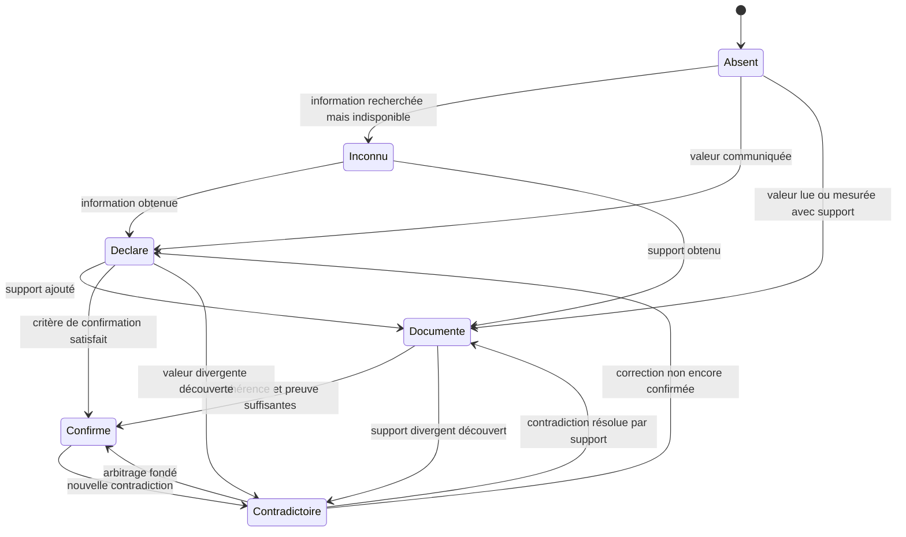
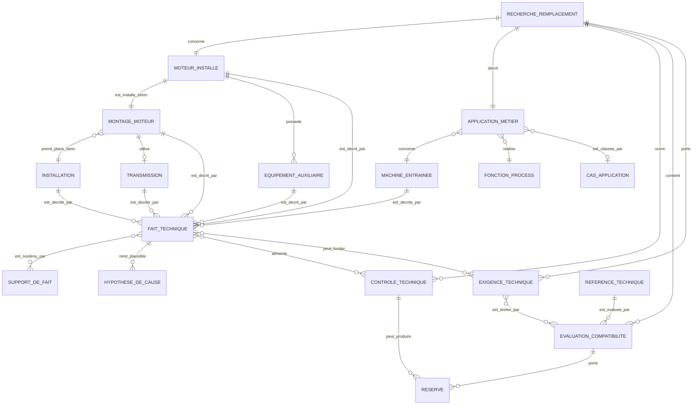
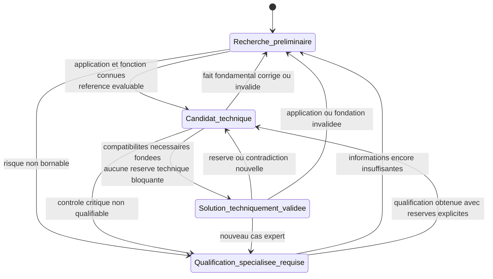

# C7-2 — Modèle conceptuel du remplacement moteur

Statut : **C7-2 terminé — modèle fondé sur C7-1 ; GO C7-3
structure du parcours uniquement / NO-GO design, prototype, contrats et code**.

Ce document définit ce qui existe dans le configurateur technique de remplacement,
comment ces éléments se relient et dans quels états une recherche peut se trouver.
Il décrit le métier, pas une base de données, un contrat API ou une interface.

Sources de travail : les cinq simulations de co-conception C7-1, l'arbre adaptatif,
la matrice des 28 cas d'application et les frontières C7/C8/C9/C11/C13 du présent
dossier. Le prototype HTML v6 reste une archive obsolète.

## 1. Décisions structurantes

1. Une **recherche de remplacement** concerne exactement un moteur installé. Un
   second moteur ouvre une seconde recherche afin de ne pas mélanger faits,
   contrôles, candidats et conclusions.
2. L'**application métier** désigne l'usage réel : une machine entraînée accomplissant
   une fonction dans le process. Elle reste distincte du bloc technique actuellement
   nommé `application` dans le contrat backend.
3. Un objet technique possède des informations utiles, mais chaque valeur affirmée
   est représentée par un **fait technique** sourcé et qualifié. Une absence ne crée
   jamais une valeur par défaut.
4. Une référence catalogue devient **candidate** uniquement dans le contexte d'une
   évaluation liée à une recherche. Le moteur installé, la référence technique et son
   rôle de candidate ne sont jamais fusionnés.
5. **Candidat technique**, **solution techniquement validée** et
   **qualification spécialisée requise** sont des états de la recherche, pas de
   nouveaux produits ni des copies de références catalogue.
6. L'application et la fonction process sont nécessaires dès l'état
   **candidat technique**. Si elles restent inconnues, la recherche demeure
   préliminaire.
7. Un contrôle peut demander des faits ou comparer une limite documentée. Il ne
   produit jamais automatiquement une bride, une charge, un roulement, une zone ATEX,
   un variateur ou une économie.
8. Une correction ou une contradiction rouvre les contrôles et évaluations qui
   dépendaient du fait concerné. L'état technique peut alors revenir en arrière.
9. L'absence de référence compatible dans le périmètre interrogé est un résultat de
   recherche documenté, jamais la preuve d'une impossibilité technique universelle.
   Si le parcours standard ne peut pas conclure, la recherche passe en qualification
   spécialisée.
10. Prix, remises, stocks, délais, disponibilité, référence vendable et devis ne
    participent à aucun objet, contrôle, verdict ou état C7.

## 2. Inventaire et classement des concepts C7-1

| Concepts rencontrés | Classement C7-2 | Décision |
| --- | --- | --- |
| Recherche, relevé, remplacement | Objet métier | **Recherche de remplacement** porte le raisonnement technique. |
| Ancien moteur, moteur en place, moteur terrain | Objet métier | Terme retenu : **moteur installé**. |
| Pompe, ventilateur, vis, broyeur, réducteur | Objet métier | Instances de **machine entraînée**. |
| Circuler, extraire, convoyer, broyer, maintenir une pression | Objet métier | Instances de **fonction process**. |
| Application, usage, cas d'application | Objet + classification | **Application métier** est l'usage réel ; **cas d'application** est sa classification C7-6. |
| Site, réseau réel, ambiance, zone, exposition | Objet métier | **Installation**. |
| Fixation, construction, orientation, position IM | Objet métier + attributs | **Montage moteur** porte la relation physique et ses caractéristiques. |
| Accouplement, courroies, chaîne, réducteur, roue sur arbre | Objet métier | **Transmission**. |
| Frein, ventilation forcée, codeur, sondes, capot, variateur | Objet métier | Instances d'**équipement auxiliaire**. |
| Puissance, vitesse, tension, carcasse, cotes, IP, marquage | Attributs qualifiés | Valeurs représentées par des **faits techniques**. |
| Plaque, mesure, catalogue, règle, déclaration du client | Provenance | **Sources sémantiques** d'un fait, selon ce qui est affirmé. |
| Oral, photo par email, mesure, document | Preuve | **Canaux de preuve** portés par un support de fait. |
| Bruit, vibrations, chauffe, arrêt | Faits | **Symptômes**, jamais causes démontrées. |
| Problème de charge, roulement, défaut d'alignement | Objet de raisonnement | **Hypothèse de cause**. |
| Besoin, limite à respecter, zone déclarée | Objet métier | **Exigence technique**. |
| Radial, axial, thermique, électrique, ATEX | Objet métier | **Contrôle technique** à ouvrir et clore. |
| Moteur du catalogue | Objet métier | **Référence technique**. |
| Satisfait, sous réserve, indéterminé, non satisfait | État d'évaluation | Verdicts d'une **évaluation de compatibilité**. |
| Fait manquant ou contrôle non clos affectant un candidat | Objet métier | **Réserve**. |
| Recherche préliminaire, candidat, solution validée, qualification | États | Les quatre états exacts de la recherche. |
| Question, module, galerie, écran, chip, compteur | Interface | Exclus du modèle conceptuel. |
| Photo client | Support externe | Jamais téléversée ni conservée par C7 ; seul le canal et le fait lu sont consignés. |
| Invitation et accord énergétique | Événements/décisions | Portés par la recherche ; l'étude appartient à C11/C13. |
| Prix, stock, délai, remise, devis | Hors C7 | Données commerciales sans effet technique. |

## 3. Objets fondamentaux

### 3.1 Recherche de remplacement

- **Représente** : le dossier de raisonnement technique pour remplacer un moteur
  installé déterminé.
- **Informations utiles** : état technique, application métier, faits acquis et
  inconnus, contrôles ouverts, références évaluées, réserves, motifs d'escalade et
  décision énergétique.
- **Relations** : concerne un moteur installé ; décrit une application ; ouvre des
  contrôles ; évalue zéro à plusieurs références techniques.
- **N'en fait pas partie** : prix, stock, délai, devis, étude énergétique complète,
  fichier photo ou PDF client.
- **Actions métier** : compléter ou corriger un fait, lancer une recherche, étudier une
  référence, lever une réserve, demander une qualification spécialisée.
- **Inconnues conservables** : tout fait non indispensable au niveau de conclusion
  actuel, explicitement visible comme absent ou inconnu.

### 3.2 Moteur installé

- **Représente** : le moteur physiquement en place, qu'il soit ou non identifiable dans
  un catalogue.
- **Informations utiles** : identité lue, caractéristiques de plaque, construction,
  dimensions, état observé, ancienneté, symptômes et particularités.
- **Relations** : objet d'une recherche ; installé selon un montage ; relié à la machine
  par une transmission ; peut posséder des auxiliaires.
- **N'en fait pas partie** : exigences actuelles du site, caractéristiques supposées du
  candidat ou conclusion sur la cause de panne.
- **Actions métier** : relever, mesurer, observer, corriger et confirmer ses faits.
- **Inconnues conservables** : toute valeur illisible, absente de la plaque ou non
  mesurée.

### 3.3 Installation

- **Représente** : le contexte réel du site dans lequel le remplacement doit fonctionner.
- **Informations utiles** : réseau réellement disponible, ambiance, exposition,
  ruissellement, température, matière dangereuse et zone déclarée par le site.
- **Relations** : accueille le montage moteur et la machine entraînée ; produit des
  exigences techniques lorsqu'elles sont fondées.
- **N'en fait pas partie** : tension inscrite sur la plaque de l'ancien moteur, marquage
  ATEX de cet ancien moteur ou limites du futur candidat.
- **Actions métier** : observer, déclarer, documenter et faire qualifier les conditions.
- **Inconnues conservables** : zone, réseau effectif, conditions d'exposition ou usage
  non encore documentés.

### 3.4 Montage moteur

- **Représente** : la manière dont le moteur est physiquement fixé et orienté dans
  l'installation, ainsi que son interface avec la machine.
- **Informations utiles** : pattes ou bride, forme reconnue, dimensions utiles,
  orientation de l'arbre, surface d'appui et position normalisée si elle est fondée.
- **Relations** : associe le moteur installé, l'installation et la transmission.
- **N'en fait pas partie** : une bride déduite de la seule carcasse ou une charge axiale
  déduite de la seule verticalité.
- **Actions métier** : reconnaître, mesurer, documenter et corriger.
- **Inconnues conservables** : code IM, cote discriminante, orientation ou interface non
  reconnue.

### 3.5 Machine entraînée

- **Représente** : l'équipement mécanique recevant l'énergie du moteur.
- **Informations utiles** : nature, technologie, organe entraîné, charge ou inertie
  documentée et relation mécanique au moteur.
- **Relations** : accomplit une ou plusieurs fonctions process ; participe à une
  application métier ; est reliée au moteur par une transmission.
- **N'en fait pas partie** : fonction réelle supposée, exigences moteur automatiques ou
  cas d'application imposé sans confirmation.
- **Actions métier** : identifier, préciser et documenter son fonctionnement.
- **Inconnues conservables** : technologie exacte, organe reprenant les efforts ou
  paramètres process.

### 3.6 Fonction process

- **Représente** : le résultat réel attendu de la machine dans le process du client.
- **Informations utiles** : action accomplie, produit ou fluide concerné, caractère
  constant ou variable lorsque connu.
- **Relations** : est accomplie par une machine ; participe à l'application métier.
- **N'en fait pas partie** : type de machine, solution moteur ou économie présumée.
- **Actions métier** : identifier et qualifier sans interprétation automatique de texte
  libre.
- **Inconnues conservables** : détail fonctionnel qui nécessite une qualification C11.

### 3.7 Application métier

- **Représente** : l'usage du moteur, formé par une machine entraînée et sa fonction
  process dans une recherche donnée.
- **Informations utiles** : machine, fonction et éventuel cas d'application reconnu.
- **Relations** : appartient à une recherche ; relie machine et fonction ; peut ouvrir
  des contrôles ou des questions contextuelles.
- **N'en fait pas partie** : IP, frein requis, variateur requis ou toute prescription
  automatique issue de l'actuel bloc backend homonyme.
- **Actions métier** : préciser, classer, corriger ou déclarer non reconnue.
- **Inconnues conservables** : cas détaillé non reconnu ; dans ce cas aucun état candidat
  n'est autorisé tant que l'application elle-même reste inconnue.

### 3.8 Transmission

- **Représente** : la liaison mécanique moteur-machine.
- **Informations utiles** : type, géométrie disponible, poulie, courroies, porte-à-faux,
  tension, alignement et intervention récente.
- **Relations** : relie moteur installé et machine ; ouvre éventuellement des contrôles
  radiaux, axiaux, d'alignement ou de démarrage.
- **N'en fait pas partie** : valeur de charge inventée ou type de roulement prescrit.
- **Actions métier** : reconnaître, décrire, mesurer et documenter.
- **Inconnues conservables** : type exact, géométrie ou effort réel.

### 3.9 Équipement auxiliaire

- **Représente** : un équipement distinct nécessaire au fonctionnement ou à la protection
  du moteur.
- **Informations utiles** : nature, plaque propre, alimentation effective, commande,
  caractéristiques et état observé.
- **Relations** : associé au moteur, au montage ou à l'installation selon son rôle.
- **N'en fait pas partie** : caractéristiques héritées automatiquement du moteur
  principal.
- **Actions métier** : identifier, relever, confirmer et faire qualifier.
- **Inconnues conservables** : nature de fils, tension, commande ou compatibilité.

### 3.10 Fait technique

- **Représente** : une affirmation structurée à propos d'un seul objet technique.
- **Informations utiles** : sujet, caractéristique affirmée, valeur ou inconnue explicite,
  source sémantique, état de confirmation, supports, contradictions et contrôles qui en
  dépendent.
- **Relations** : s'applique à un objet ; est soutenu par zéro à plusieurs supports ; peut
  ouvrir un contrôle, fonder une exigence ou alimenter une évaluation.
- **N'en fait pas partie** : valeur par défaut, conclusion commerciale ou interprétation
  silencieuse.
- **Actions métier** : déclarer, documenter, confirmer, contredire, corriger ou laisser
  explicitement inconnu.
- **Inconnues conservables** : une valeur peut rester absente ou inconnue sans être
  remplacée par zéro ou « standard ».

### 3.11 Support de fait

- **Représente** : la manière dont une affirmation a été obtenue ou soutenue.
- **Informations utiles** : canal, auteur ou origine disponible, moment et description
  minimale de ce qui a été consulté.
- **Relations** : soutient un ou plusieurs faits ; un fait peut avoir plusieurs supports.
- **N'en fait pas partie** : fichier photo téléversé dans C7 ou duplication du contenu
  technique déjà porté par le fait.
- **Actions métier** : consigner un canal, ajouter un support ou signaler son insuffisance.
- **Inconnues conservables** : document ou photo non disponible ; le canal oral peut rester
  le seul support sans devenir automatiquement confirmation.

### 3.12 Hypothèse de cause

- **Représente** : une explication possible d'un symptôme ou d'une panne.
- **Informations utiles** : cause envisagée, faits qui la rendent plausible, contrôles
  nécessaires et état plausible/démontrée/écartée.
- **Relations** : s'appuie sur des faits ; peut ouvrir des contrôles.
- **N'en fait pas partie** : diagnostic automatique depuis bruit, vibrations, chauffe,
  courroies ou retension.
- **Actions métier** : proposer, vérifier, démontrer ou écarter.
- **Inconnues conservables** : la cause réelle peut rester inconnue sans bloquer tout
  candidat si aucun contrôle de compatibilité ne l'exige.

### 3.13 Exigence technique

- **Représente** : une condition que la solution de remplacement doit satisfaire.
- **Informations utiles** : objet concerné, condition, origine, niveau de confirmation et
  règle éventuelle.
- **Relations** : provient d'un fait déclaré/documenté ou d'une règle fondée ; est testée
  dans une évaluation.
- **N'en fait pas partie** : simple caractéristique de l'ancien moteur élevée sans preuve
  au rang de besoin réel.
- **Actions métier** : déclarer, fonder, confirmer, contredire ou retirer avec motif.
- **Inconnues conservables** : une exigence pressentie peut rester à confirmer et ouvrir un
  contrôle plutôt que devenir une prescription.

### 3.14 Contrôle technique

- **Représente** : une vérification nécessaire avant un niveau de conclusion donné.
- **Informations utiles** : signal d'ouverture, question technique, faits nécessaires,
  état ouvert/clos et conclusion éventuelle.
- **Relations** : appartient à une recherche ; utilise des faits ; peut concerner une
  exigence ou une évaluation ; peut produire une réserve lorsqu'il reste ouvert.
- **N'en fait pas partie** : réponse déduite du seul signal d'ouverture.
- **Actions métier** : ouvrir, renseigner, clore, rouvrir ou transférer en qualification.
- **Inconnues conservables** : contrôle non bornable dans le parcours standard.

### 3.15 Référence technique

- **Représente** : l'identité technique d'un moteur documenté dans un catalogue.
- **Informations utiles** : caractéristiques et limites constructeur avec provenance.
- **Relations** : fait l'objet d'une évaluation dans zéro à plusieurs recherches.
- **N'en fait pas partie** : prix, stock, disponibilité, remise ou statut de devis.
- **Actions métier** : consulter et évaluer ; elle n'est jamais modifiée par une recherche.
- **Inconnues conservables** : caractéristique non publiée, qui reste indéterminée.

### 3.16 Évaluation de compatibilité

- **Représente** : l'analyse d'une référence technique dans le contexte d'une recherche.
- **Informations utiles** : critères étudiés, faits et exigences utilisés, règles,
  verdicts satisfait/sous réserve/indéterminé/non satisfait et réserves.
- **Relations** : associe exactement une recherche et une référence technique ; utilise
  des contrôles ; porte zéro à plusieurs réserves.
- **N'en fait pas partie** : garantie globale ou information commerciale.
- **Actions métier** : calculer, expliquer, réévaluer après correction ou écarter avec
  motif.
- **Inconnues conservables** : un critère non publié reste indéterminé, jamais satisfait
  par défaut.

### 3.17 Réserve

- **Représente** : une limite explicite affectant l'usage d'une référence comme candidate.
- **Informations utiles** : fait ou contrôle concerné, effet sur la conclusion et moyen de
  la lever.
- **Relations** : appartient à une évaluation ; renvoie à un contrôle ou un fait manquant.
- **N'en fait pas partie** : simple information non pertinente pour la compatibilité ou
  incompatibilité déjà démontrée.
- **Actions métier** : expliquer, lever, maintenir ou transformer en incompatibilité après
  contrôle négatif.
- **Inconnues conservables** : la donnée attendue et son obtention possible.

## 4. Modèle du fait technique

### 4.1 Contenu minimal

Un fait répond toujours aux questions suivantes :

1. **Qu'est-ce qui est affirmé ?** Une caractéristique nommée et, si disponible, sa
   valeur avec unité.
2. **À quel objet cela s'applique-t-il ?** Un seul moteur installé, montage,
   installation, auxiliaire, machine, transmission, référence ou autre objet nommé.
3. **Quelle est sa source sémantique ?** Ce que la valeur signifie réellement.
4. **Par quel canal est-elle soutenue ?** Comment le TCS l'a obtenue.
5. **Quel est son niveau actuel ?** Absent, inconnu explicite, déclaré, documenté,
   confirmé ou contradictoire.
6. **Existe-t-il une contradiction ?** Autre valeur, source divergente ou incohérence
   avec l'installation.
7. **Quels contrôles en dépendent ?** Toute correction doit permettre de les rouvrir.

### 4.2 Source sémantique et canal de preuve

| Source sémantique du fait | Exemple | Canal possible |
| --- | --- | --- |
| **Plaque** | `18,5 kW`, `400/690 V`, marquage Ex recopié | déclaration orale, photo reçue par email, document |
| **Mesure terrain** | diamètre, entraxe, hauteur, tension mesurée | mesure dictée, relevé documenté |
| **Installation observée** | arbre vers le bas, moteur exposé, courroies présentes | déclaration, photo reçue par email, visite/document |
| **Document** | schéma de câblage, certificat, fiche machine | document |
| **Catalogue** | dimension ou limite publiée du candidat | page catalogue/document constructeur |
| **Règle technique** | pôles suggérés depuis vitesse et fréquence | règle nommée et entrées citées |
| **Déclaration du client ou du site** | fonction process, zone déclarée, historique de panne | déclaration orale ou document du site |

Une photo est uniquement un canal. C7 ne conserve ni fichier, ni vignette, ni lien vers
la photo. Une information dictée depuis une plaque reste de source `plaque`; une zone
annoncée par le site reste de source `déclaration du site`, même si l'ancien moteur porte
un marquage Ex différent.

Le canal ne suffit pas universellement à confirmer un fait. Le niveau minimal requis
selon la nature du fait — notamment ATEX, charge, alimentation ou dimension — reste une
règle métier à valider en C7-6.

### 4.3 Cycle de vie d'un fait

La correction ne supprime pas silencieusement le fait précédent : C7 exige que le
raisonnement sache qu'une évaluation antérieure n'est plus fondée. La persistance et la
durée de cet historique seront décidées en C8/C7-7.

## 5. Relations entre les objets

Le diagramme représente des objets et associations métier. Il ne propose ni table, ni
clé, ni choix de stockage.

Une application relie exactement une machine entraînée et une fonction process dans une
recherche. Un fait s'applique à un seul objet, même si un même support — par exemple une
photo reçue par email — a permis au TCS de lire plusieurs faits.

## 6. Les quatre états techniques

### 6.1 Recherche préliminaire

- **Entrée minimale** : une demande de remplacement existe et quelques faits permettent
  d'interroger ou préparer une recherche.
- **Peut encore manquer** : application, fonction, fixation, dimensions, transmission,
  exigences ou toute autre donnée décisive.
- **Le TCS peut affirmer** : que la recherche est amorcée et nommer précisément les faits
  manquants.
- **Il ne peut pas affirmer** : qu'une référence est un candidat technique, qu'elle est
  compatible ou qu'une solution est validée.
- **Avance** : application et fonction identifiées, minimum technique disponible, au moins
  une référence évaluée sans incompatibilité déjà démontrée.
- **Retour** : état initial naturel ou retour après correction d'un fait fondamental.
- **Qualification spécialisée** : application persistante non qualifiable, construction
  non reconnue ou risque impossible à borner dans le parcours standard.

### 6.2 Candidat technique

- **Entrée minimale** : application et fonction connues ; une référence semble pertinente
  au regard des faits disponibles ; toutes ses limites connues sont exposées.
- **Peut encore manquer** : faits obtenables ou contrôles non critiques explicitement
  portés comme réserves, ainsi que des confirmations ciblées.
- **Le TCS peut affirmer** : que la référence mérite d'être poursuivie comme candidate,
  avec la liste exacte des réserves.
- **Il ne peut pas affirmer** : compatibilité validée, absence de risque ou prescription
  fondée d'un équipement encore non qualifié.
- **Avance** : les compatibilités nécessaires sont fondées et les réserves affectant la
  compatibilité sont levées.
- **Retour** : application invalidée, contradiction, nouvelle exigence ou incompatibilité
  découverte.
- **Qualification spécialisée** : contrôle critique non bornable, ATEX, charge non
  quantifiable, non-IEC, arbre spécial, moteur intégré ou incohérence persistante.

### 6.3 Solution techniquement validée

- **Entrée minimale** : application et fonction connues ; compatibilités nécessaires
  suffisamment fondées ; aucune contradiction ouverte ni réserve affectant la
  compatibilité requise.
- **Peut encore manquer** : informations sans effet sur la conclusion technique C7 ou
  appartenant aux études futures C11/C13.
- **Le TCS peut affirmer** : que la référence satisfait les exigences techniques connues
  dans le périmètre explicitement évalué.
- **Il ne peut pas affirmer** : garantie universelle, disponibilité commerciale,
  économie, conformité d'un domaine non qualifié ou aptitude hors limites documentées.
- **Avance** : état terminal C7 pour la décision technique standard ; C7-3 définira le
  parcours, pas un état supplémentaire.
- **Retour** : correction, contradiction, nouvelle exigence ou évolution du périmètre.
- **Qualification spécialisée** : une nouvelle information révèle un cas expert qui ne
  peut pas rester dans le parcours standard.

### 6.4 Qualification spécialisée requise

- **Entrée minimale** : un motif nommé empêche le parcours standard de conclure de façon
  fondée.
- **Peut encore manquer** : faits, documents, mesures, limites constructeur ou décision
  d'un spécialiste.
- **Le TCS peut affirmer** : pourquoi une qualification est nécessaire, quels faits sont
  acquis et ce qui doit encore être obtenu.
- **Il ne peut pas affirmer** : impossibilité technique, compatibilité ATEX, prescription
  experte ou validation standard.
- **Avance** : après qualification, retour vers recherche préliminaire ou candidat
  technique selon les faits obtenus ; aucun passage direct silencieux vers solution
  validée.
- **Retour** : la qualification résout le motif ou démontre que le signal initial ne
  s'applique pas.
- **Cas minimaux** : ATEX, non-IEC, moteur intégré, deux vitesses, arbre spécial, charge
  axiale/radiale non qualifiable, incohérence non résolue ou application non reconnue dont
  le risque ne peut pas être borné.

### 6.5 Diagramme d'états

## 7. Contrôles et interdictions de prescription

| Signal | Ce que le modèle peut ouvrir | Ce qu'il interdit de conclure seul |
| --- | --- | --- |
| Carcasse IEC + présence d'une bride | Reconnaissance des constructions possibles puis mesures | Bride réelle déduite de la carcasse |
| Courroies, chaîne ou roue sur arbre | Contrôle radial, géométrie et limites constructeur | Valeur de charge ou roulement requis |
| Montage vertical | Contrôle axial, graissage, butée et organe reprenant l'effort | Charge axiale ou roulement depuis la position |
| Ancien roulement lu | Fait observé sur le moteur installé | Besoin réel de l'installation ou bon dimensionnement historique |
| IP65 | Contrôle de protection contre l'environnement | Qualification ATEX |
| Marquage Ex de l'ancien moteur | Conservation du marquage et ouverture ATEX | Zone actuelle du site |
| Application reconnue | Questions contextuelles et contrôles à envisager | Bride, roulement, variateur, puissance ou économie |
| Panne, bruit, vibrations, chauffe | Hypothèse de cause et contrôles | Cause démontrée |
| Moteur installé `P > 11 kW` | Invitation énergétique et demande de consentement | Gain, économie ou solution énergétique |

Les taxonomies, seuils, alertes, contrôles bloquants et règles transformant des faits en
exigences ne sont pas fixés par C7-2. Ils restent matière de validation C7-6 et de
dimensionnement C11.

## 8. Rejeu des cinq scénarios

### S1 — B3 standard 2,2 kW

- **Objets présents** : recherche, moteur installé, montage B3, installation électrique.
- **Faits connus** : 2,2 kW, 400 V triphasé, vitesse et fixation sur pattes.
- **Faits absents** : application, machine entraînée, fonction process, transmission et
  tour des particularités.
- **Contrôles ouverts** : identification de l'application et de la fonction ; vérification
  minimale de la transmission et des particularités.
- **Réserves** : aucune référence ne peut encore recevoir le rôle de candidate faute
  d'application.
- **État maximal fondé** : **recherche préliminaire**.

Le modèle ne transforme donc pas les quatre informations de plaque en candidat technique.

### S2 — B5 grande bride 7,5 kW

- **Objets présents** : moteur installé, application, machine entraînée, montage à grande
  bride, installation et référence technique évaluée.
- **Faits connus** : application, puissance, alimentation, vitesse, bride sans pattes et
  diamètre extérieur observé.
- **Faits absents** : construction de bride complètement fondée, mesures discriminantes et
  transmission restée inconnue.
- **Contrôles ouverts** : reconnaissance B5 sans déduction depuis la carcasse, mesures de
  bride réellement discriminantes et transmission.
- **Réserves** : bride et interface mécanique à confirmer sur chaque référence évaluée.
- **État maximal fondé** : **candidat technique**, si une référence reste pertinente avec
  ces réserves ; jamais solution validée à ce stade.

### S3 — ventilateur 15 kW par courroies

- **Objets présents** : moteur installé, ventilateur, fonction de ventilation,
  application, transmission par poulies/courroies et hypothèse de cause.
- **Faits connus** : B3, 15 kW, 400 V, 1 470 tr/min, trois courroies, moteur installé depuis
  environ huit ans, bruit, vibrations, chauffe, arrêt et retension récente.
- **Faits absents** : charge radiale, diamètre et porte-à-faux complets, tension réelle,
  limites du candidat et cause démontrée.
- **Contrôles ouverts** : charge radiale, géométrie de transmission, limites constructeur
  et recherche de cause.
- **Réserves** : contrôle radial non clos ; les symptômes rendent une cause plausible sans
  la démontrer.
- **État maximal fondé** : **candidat technique** sous réserve. La solution validée exige
  la clôture du contrôle radial applicable.

### S4 — pompe verticale 18,5 kW sur variateur

- **Objets présents** : moteur installé, pompe, fonction de circulation d'eau de
  refroidissement, application, montage vertical, variateur et ventilation forcée distincte.
- **Faits connus** : 18,5 kW, 400/690 V, 1 475 tr/min, alimentation par variateur, grande
  bride sans pattes, arbre vers le bas, plaque auxiliaire 230/400 V 50 Hz 0,12 kW.
- **Faits absents** : carcasse/type, dimensions de bride, branchement réel de l'auxiliaire,
  nature de deux fils, profil basse vitesse, effort axial, organe de reprise et exposition.
- **Contrôles ouverts** : bride, auxiliaire, thermique basse vitesse, axial, fils non
  identifiés et capot pare-pluie si exposition.
- **Réserves** : chaque inconnue affectant le candidat est portée séparément ; aucune
  alimentation n'est héritée du moteur principal vers l'auxiliaire.
- **État maximal fondé** : **candidat technique** sous réserves tant que les contrôles
  restent obtenables. Une charge non bornable ou une incohérence persistante ouvre la
  qualification spécialisée.

### S5 — convoyage de farine ATEX 22 kW

- **Objets présents** : moteur installé, vis transporteuse, fonction de convoyage,
  application, accouplement élastique, réducteur, installation sensible et contrôle ATEX.
- **Faits connus** : 22 kW, 1 470 tr/min, 400 V, B3, carcasse indiquée `180 M`, farine,
  marquage recopié `Ex tb IIIC T125 °C Db` et `IP65`.
- **Faits absents** : preuve complète du marquage, zone déclarée par le site, matière et
  caractéristiques de poussière, certificat et conditions particulières.
- **Contrôles ouverts** : qualification ATEX complète et compatibilité entre marquage du
  candidat, zone, matière, montage et accessoires.
- **Réserves** : `IP65` ne qualifie jamais ATEX ; le marquage de l'ancien moteur ne prouve
  pas la zone actuelle.
- **État maximal fondé** : **qualification spécialisée requise**. Les faits acquis sont
  conservés ; aucune validation standard ni impossibilité technique n'est affirmée.

Les cinq scénarios passent sans valeur inventée, exception cachée ou recours à une donnée
commerciale.

## 9. Vocabulaire commun

| Terme retenu | Définition | Alternatives rejetées | Motif |
| --- | --- | --- | --- |
| **Recherche de remplacement** | Raisonnement technique concernant un moteur installé | dossier, configuration, devis | Ne préjuge ni stockage C8 ni résultat commercial. |
| **Moteur installé** | Moteur réellement en place | ancien moteur, moteur catalogue | Ne suppose ni obsolescence ni correspondance catalogue. |
| **Machine entraînée** | Équipement recevant l'énergie mécanique | application | Évite de confondre l'équipement et son usage. |
| **Fonction process** | Résultat réel accompli dans le process | usage générique | Rend explicite ce que fait la machine. |
| **Application métier** | Machine + fonction dans le contexte de la recherche | `application` backend | Le métier prime ; le bloc backend homonyme décrit autre chose. |
| **Montage moteur** | Fixation et orientation réelles du moteur | position seule, fixation seule | Regroupe la relation physique sans confondre construction et orientation. |
| **Transmission** | Liaison mécanique moteur-machine | accouplement générique | Inclut courroies, chaîne, roue et réducteur. |
| **Fait technique** | Affirmation qualifiée sur un objet | champ, donnée brute | Porte sens, provenance et incertitude. |
| **Source sémantique** | Nature réelle de l'information affirmée | provenance seule | Distingue plaque, mesure, catalogue, règle ou déclaration du site. |
| **Canal de preuve** | Moyen par lequel le fait a été obtenu | source photo | Une photo est un canal, jamais la source sémantique de la puissance. |
| **Contrôle technique** | Vérification ouverte sans réponse présumée | alerte, prescription | Une alerte attire l'attention ; un contrôle doit pouvoir être clos. |
| **Exigence technique** | Condition que le remplacement doit satisfaire | caractéristique de l'ancien moteur | Une observation historique n'est pas automatiquement une exigence. |
| **Référence technique** | Identité catalogue étudiable | produit disponible | Exclut disponibilité et autres données commerciales. |
| **Candidat technique** | État où une référence est pertinente avec réserves explicites | proposition rapide | N'implique ni commerce ni validation finale. |
| **Solution techniquement validée** | État où les compatibilités nécessaires sont fondées | compatible garanti | La validation reste bornée au périmètre étudié. |
| **Qualification spécialisée requise** | État où le parcours standard ne peut pas conclure | impossible, rejeté | Ne confond pas besoin d'expertise et impossibilité technique. |
| **Réserve** | Limite explicite affectant un candidat | question, avertissement | Nomme l'effet technique et le moyen de la lever. |
| **Économie simulée** | Résultat futur fondé sur hypothèses et provenance | économie garantie | L'étude complète appartient à C13. |

## 10. Décisions reportées aux tranches suivantes

### C7-3 — structure du parcours

- ordre et regroupement des actions ;
- attente et reprise après demande ciblée de photo ;
- présentation d'un retour en arrière après correction ;
- transfert et reprise après qualification spécialisée.

### C7-6 — validation métier

- contenu définitif des 8 familles et 28 cas d'application ;
- listes de valeurs fermées, notamment fonction process, options et ATEX ;
- contrôles obligatoires, bloquants ou seulement informatifs ;
- niveau de preuve minimal par type de fait ;
- règles de déduction, seuils et limites d'expertise ;
- frontière exacte entre alerte C7 et prescription C11.

### C7-7/C8 — contrats et continuité

- représentation technique des objets et de leur historique ;
- stratégie de correction, invalidation et reprise ;
- stockage durable du relevé structuré, sans téléversement photo C7 ;
- extensions minimales de provenance et de faits.

### C9/C11/C13 — hors C7

- identité et génération du PDF client ;
- dimensionnement depuis le process et prescriptions associées ;
- référence énergétique terrain, profils, scénarios, kWh, euros et retour fondé.

## 11. Vérification des critères de sortie C7-2

| Critère | Preuve dans ce document |
| --- | --- |
| Objets et frontières définis | §3 |
| Relations importantes nommées | §5 |
| Machine et fonction distinctes | §3.5 à §3.7 |
| Installé, candidat et solution distincts | §1, §3.2, §3.15–3.16, §6 |
| Source et canal distincts | §4.2 |
| Absence conservée | §4.1 et §4.3 |
| Quatre états et transitions | §6 |
| Réserves et contrôles représentables | §3.14, §3.17 et §5 |
| Cinq scénarios sans invention | §8 |
| Données commerciales exclues | §1 et §3.15 |
| Aucune décision d'interface, contrat ou stockage | périmètre et §10 |
| Expertise reportée à C7-6 | §7 et §10 |

**Décision de sortie : C7-2 terminé — GO C7-3 structure du parcours
uniquement.** Cette décision n'autorise toujours ni design visuel, ni prototype, ni
contrat, ni code, ni migration.
