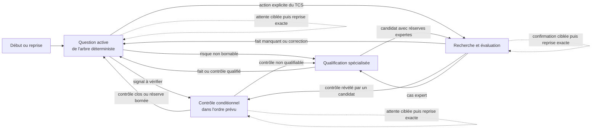

# C7-3 — Structure du parcours de remplacement moteur

Statut : **C7-3 validé par le PO le 06/08/2026 après intégration de deux
corrections structurantes ; NO-GO C7-4, design, prototype, contrats, code,
stockage et migration sans décision PO distincte**.

Ce document définit la logique d'interaction du configurateur technique pendant un
appel client. Il s'appuie sur le modèle conceptuel C7-2 et ne décide ni de la mise en
page, ni des composants, ni de l'apparence des futurs écrans.

Le prototype HTML v6 est une archive obsolète. Il n'est ni une source de structure,
ni une cible à corriger.

## 1. Périmètre et décisions structurantes

### 1.1 Job story

Quand un client appelle sans savoir décrire techniquement son moteur, le TCS doit
pouvoir suivre un arbre de décision déterministe, poser une question à la fois avec
l'indication de l'endroit où trouver l'information, lancer explicitement une recherche
dès qu'elle devient utile et reprendre exactement après une interruption. Il peut ainsi
obtenir du client les faits nécessaires, expliquer le niveau technique atteint et dire
ce qui reste à confirmer sans dépendre d'un spécialiste pour conduire l'appel standard.

La réussite n'est pas d'avoir parcouru toutes les questions possibles. Elle consiste à
suivre jusqu'à sa sortie la branche rendue nécessaire par les réponses du client, puis à
terminer l'échange avec l'un des quatre résultats exacts du modèle C7-2 :

| Résultat | Ce que signifie la fin du parcours |
| --- | --- |
| **Recherche préliminaire** | La demande est amorcée et le périmètre interrogé est explicite. Aucun candidat n'est affirmé. Les faits manquants et le prochain moyen de les obtenir sont nommés. |
| **Candidat technique** | Une référence mérite d'être poursuivie. Les compatibilités déjà étudiées, les réserves, les contrôles ouverts et le moyen de les lever sont tous explicites. |
| **Solution techniquement validée** | Une référence satisfait les exigences connues dans le périmètre évalué. Application et fonction sont connues ; aucune contradiction ni réserve affectant la compatibilité nécessaire ne reste ouverte. |
| **Qualification spécialisée requise** | Le parcours standard ne peut pas conclure de façon fondée. Le motif du transfert, les faits acquis, les documents ou mesures attendus et le point de reprise sont préparés. Aucune impossibilité technique n'est affirmée. |

Aucun cinquième état n'est créé. En particulier, **« aucune référence compatible
dans le périmètre interrogé »** est un résultat explicable d'une recherche. Il ne
signifie ni qu'aucune solution n'existe universellement, ni qu'un nouvel état doit
être ajouté.

### 1.2 Principes de progression

1. Le TCS conduit l'appel en suivant un **arbre déterministe étape par étape**. Les
   faits déjà acquis choisissent la prochaine question ; le TCS ne réordonne pas
   librement le parcours.
2. Chaque étape affiche une question et des choix courts, la raison de cette étape et
   l'endroit où le client peut trouver l'information : plaque, moteur, installation,
   document, mesure ou photo par email. Le configurateur est un outil technique étape
   par étape, pas un script téléphonique : il n'impose aucune formulation à réciter.
   L'aide contextuelle qui explique comprendre, reconnaître, localiser ou mesurer une
   information reste facultative et secondaire au parcours principal.
3. Si le client donne spontanément plusieurs faits, ils sont qualifiés séparément et
   les étapes déjà satisfaites sont ensuite sautées. Cette saisie groupée ne change pas
   l'ordre de décision de l'arbre.
4. « Le client ne sait pas » est une réponse complète : le fait reste inconnu, son
   effet sur la conclusion est visible et l'arbre propose le moyen déterministe suivant
   pour l'obtenir ou poursuivre sous réserve.
5. Une question déjà répondue n'est pas reposée. Une réponse standard ferme la
   branche correspondante.
6. La recherche part uniquement sur une action explicite du TCS, jamais à chaque
   saisie ou correction.
7. Une photo est un moyen d'information guidé que le TCS peut demander lui-même. La
   consigne nomme ce qu'il faut photographier, où le trouver et pourquoi ; aucun fichier
   n'entre dans C7.
8. Une correction invalide les conclusions qui dépendaient de l'ancien fait avant
   toute nouvelle évaluation.
9. Une branche conditionnelle ouvre des questions et des contrôles. Elle ne produit
   aucune prescription automatique.
10. Le spécialiste intervient seulement lorsque l'arbre a épuisé les questions,
    sources et contrôles accessibles au TCS, ou lorsqu'une expertise réservée est
    explicitement requise.
11. Les données commerciales restent extérieures au parcours et ne modifient jamais
   son état technique.

## 2. Les cinq lieux logiques

Le parcours tient en cinq lieux principaux. Les variantes d'attente, d'erreur, de
résultat vide ou de correction sont des états de ces lieux, pas des lieux
supplémentaires.

| Lieu | Responsabilité | Pourquoi il est distinct |
| --- | --- | --- |
| **1. Début ou reprise** | Créer le contexte d'un moteur installé ou retrouver le point exact d'une recherche interrompue | Il fixe l'objet de la recherche et évite de mélanger deux moteurs ou deux interruptions. |
| **2. Relevé guidé** | Faire avancer l'arbre déterministe, une question à la fois, tout en consignant les faits spontanément fournis | C'est le lieu continu de l'appel ; la prochaine question et son aide de recherche y sont explicites. |
| **3. Contrôles conditionnels** | Traiter uniquement les branches ouvertes par les faits recueillis | Un contrôle a sa propre question, ses entrées et sa clôture ; il ne doit pas alourdir le tronc commun. |
| **4. Recherche et évaluation** | Lancer la recherche, sélectionner une référence, expliquer les verdicts et réserves, puis conclure | La recherche est une action explicite et l'évaluation porte sur une référence dans le contexte du relevé. |
| **5. Qualification spécialisée** | Préparer un transfert fondé, suivre les informations attendues et reprendre après qualification | Le parcours standard cesse de conclure, mais le raisonnement et la continuité restent actifs. |

### 2.1 Ce qui n'est pas un lieu principal

- **Attente d'une information ou d'une photo** : état transversal du relevé, d'un
  contrôle ou de la qualification ; le point interrompu reste la destination de
  reprise.
- **Résultats et réserves** : états du lieu Recherche et évaluation ; ils portent la
  même référence, la même évaluation et les mêmes actions.
- **Correction et contradiction** : état de révision du lieu courant ; il rouvre les
  dépendances avant de ramener le TCS au relevé, au contrôle ou à l'évaluation
  concernée.
- **Invitation énergétique** : décision annexe au résultat technique ; elle ne lance
  ni C11 ni C13 et ne crée pas un résultat technique supplémentaire.

## 3. Breadboard complet

La notation suivante décrit uniquement les actions, destinations et contenus métier.
Les états conditionnels sont nommés après le lieu auquel ils appartiennent.

### Lieu 1 — Début ou reprise

```text
Début ou reprise
- commencer une recherche pour un moteur installé → Relevé guidé / première étape du tronc déterministe
- reprendre une recherche interrompue → lieu et élément exacts mémorisés au moment de l'interruption
- constater que la demande concerne un autre moteur → Début ou reprise / nouvelle recherche distincte
- consulter le résultat technique déjà atteint → Recherche et évaluation / dernier résultat fondé
[Un moteur installé exactement]
[Motif de l'appel et éventuel état technique déjà atteint]
[Dernier lieu, dernière question ou dernier contrôle interrompu]
[Informations ou qualifications encore attendues]
```

Une reprise ne revient ni systématiquement au début, ni au premier fait manquant. Elle
revient à l'élément qui a causé l'interruption, après avoir rappelé brièvement ce qui
était déjà acquis et ce qui a changé depuis.

### Lieu 2 — Relevé guidé

```text
Relevé guidé
- répondre à la question active → Relevé guidé / prochain nœud déterminé ou Contrôles conditionnels / contrôle nouvellement ouvert
- consigner des faits supplémentaires donnés spontanément → même nœud puis saut ultérieur des étapes déjà satisfaites
- indiquer « le client ne sait pas » → Relevé guidé / source alternative guidée, fait inconnu ou branche suivante autorisée
- revenir corriger ou contredire une réponse précédente → Relevé guidé / révision d'impact puis recalcul du nœud actif
- guider le client vers la plaque, le moteur, l'installation, un document, une mesure ou une photo ciblée → Relevé guidé / information obtenue ou attente ciblée avec point de reprise
- ouvrir un contrôle révélé par un fait → Contrôles conditionnels / contrôle concerné
- lancer explicitement une recherche dès que le minimum contractuel est disponible → Recherche et évaluation / recherche en cours
- préparer sans exécuter la recherche tant que le minimum manque → Relevé guidé / faits minimaux manquants
- transférer après épuisement des moyens accessibles au TCS ou exigence experte explicite → Qualification spécialisée / motif nommé
[Question active imposée par l'arbre et raison de cette étape]
[Choix courts et aide facultative pour trouver, reconnaître ou mesurer l'information]
[Groupes du tronc commun : plaque, usage, construction, position, transmission, remplacement et tour rapide]
[Faits acquis, source sémantique, canal et niveau de confirmation]
[Faits inconnus ou absents, sans valeur par défaut]
[Contrôles ouverts, clos ou rouverts]
[État technique maximal actuellement fondé]
```

#### Relevé guidé — attente ciblée

```text
Attente ciblée dans le relevé
- consigner l'information reçue → question ou contrôle exact interrompu
- consigner les seuls faits lisibles sur la photo reçue par email → question ou contrôle exact interrompu
- déclarer la photo inutilisable → même attente avec consigne corrigée ou Relevé guidé / autre moyen d'obtenir le fait
- abandonner la demande → question ou contrôle exact interrompu avec fait inconnu
- continuer selon l'arbre si le nœud suivant ne dépend pas de l'information attendue → Relevé guidé / prochain nœud déterminé
- mettre fin à l'appel → Début ou reprise / reprise exacte conservée conceptuellement
[Besoin nommé]
[Information ou cadrage demandé]
[Canal attendu : déclaration, mesure, document ou photo par email]
[Question ou contrôle de retour]
[Travail indépendant encore possible]
```

#### Relevé guidé — révision d'impact

```text
Révision d'impact d'un fait
- accepter la nouvelle valeur et sa provenance → Relevé guidé / dépendances recalculées
- laisser la contradiction non résolue → Contrôles conditionnels / contradiction ouverte ou Qualification spécialisée / incohérence non bornable
- obtenir un support suffisant → Relevé guidé / fait documenté ou confirmé
- annuler la correction avant validation → lieu d'origine / fait et conclusions inchangés
[Ancien fait et nouvelle affirmation]
[Source et canal de la nouvelle affirmation]
[Contrôles, exigences, évaluations et réserves qui dépendaient de l'ancien fait]
[Conclusions retirées et état technique maximal après invalidation]
```

### Lieu 3 — Contrôles conditionnels

```text
Contrôles conditionnels
- répondre aux questions minimales du contrôle → même contrôle / vérification suivante ou Relevé guidé / contrôle clos
- indiquer qu'une donnée est inconnue → même contrôle / réserve explicite
- demander une mesure, un document ou une photo ciblée → même contrôle / attente ciblée avec retour exact
- revenir au fait qui a ouvert le contrôle → Relevé guidé / fait déclencheur
- corriger un fait utilisé par le contrôle → même contrôle / réouverture et révision d'impact
- clore le contrôle avec des faits fondés → Relevé guidé / prochaine information utile ou Recherche et évaluation / réévaluation explicite
- maintenir le contrôle ouvert mais bornable → Recherche et évaluation / candidat avec réserve possible
- constater que le contrôle n'est pas bornable dans C7 → Qualification spécialisée / motif, faits et question experte
[Signal d'ouverture]
[Question technique à résoudre]
[Faits nécessaires et supports disponibles]
[Ce qui est établi, inconnu ou contradictoire]
[Références évaluées et réserves affectées]
[Interdiction de prescription depuis le seul signal]
```

L'arbre détermine si un contrôle doit être traité immédiatement ou après une autre
étape du tronc commun. Le TCS n'en choisit pas librement l'ordre. Son existence reste
visible tant qu'il n'est ni clos, ni transféré. Une réponse standard qui démontre que
le signal ne s'applique pas ferme le contrôle sans ouvrir ses détails.

### Lieu 4 — Recherche et évaluation

```text
Recherche et évaluation
- lancer la recherche explicitement → même lieu / recherche en cours
- annuler une recherche en cours → Relevé guidé / faits conservés et aucun nouveau résultat
- relancer après un échec technique → même lieu / recherche en cours
- revenir compléter ou corriger les faits → Relevé guidé / question ou fait concerné
- sélectionner une référence à étudier → même lieu / évaluation de cette référence
- écarter une référence avec motif → même lieu / résultats restant à évaluer
- ouvrir un contrôle révélé par une référence → Contrôles conditionnels / contrôle concerné
- demander une confirmation ciblée → même lieu / attente ciblée avec retour à la réserve concernée
- retenir la référence avec réserves explicites → même lieu / candidat technique
- constater que toutes les compatibilités nécessaires sont fondées → même lieu / solution techniquement validée
- constater qu'aucune référence n'est compatible dans le périmètre interrogé → même lieu / résultat vide expliqué
- transférer un cas non bornable → Qualification spécialisée / dossier de qualification
- traiter l'invitation énergétique → même lieu / décision énergétique sans changement d'état technique
[Périmètre exact de la recherche]
[Faits et exigences utilisés]
[Références trouvées ou absence de résultat]
[Verdicts satisfait, sous réserve, indéterminé ou non satisfait]
[Provenance catalogue, contrôles, réserves et moyens de les lever]
[État technique courant et limites de ce que le TCS peut affirmer]
```

#### Recherche et évaluation — recherche en cours, erreur ou résultat vide

```text
Recherche en cours
- attendre le résultat → Recherche et évaluation / résultats ou erreur explicite
- revenir au relevé sans perdre les faits → Relevé guidé / dernier point actif
[Périmètre envoyé et absence de progression fictive]

Erreur de recherche
- relancer la même recherche → Recherche et évaluation / recherche en cours
- modifier les faits avant de relancer → Relevé guidé / fait choisi
- terminer sans résultat nouveau → Recherche et évaluation / dernier état fondé avant l'erreur
[Cause connue ou message d'échec]
[Aucun verdict ni état technique fabriqué depuis l'erreur]

Résultat vide dans le périmètre interrogé
- vérifier les faits et le périmètre → Relevé guidé / faits utilisés par la recherche
- conserver la recherche préliminaire et les prochaines informations utiles → Recherche et évaluation / recherche préliminaire
- transférer lorsque le cas complet sort du standard → Qualification spécialisée / motif « aucun candidat standard fondé dans ce périmètre »
[Périmètre, snapshot ou corpus interrogé lorsqu'ils sont connus]
[Critères qui ont écarté les références]
[Faits manquants susceptibles de modifier le résultat]
[Mention explicite : ce résultat ne prouve pas une impossibilité universelle]
```

#### Recherche et évaluation — réserves d'un candidat

```text
Réserves d'un candidat
- traiter une réserve maintenant → Contrôles conditionnels / contrôle ou Relevé guidé / fait manquant associé
- demander une confirmation finale ciblée → même lieu / attente ciblée avec retour à cette réserve
- conserver la réserve et terminer comme candidat technique → même lieu / candidat technique
- lever la dernière réserve affectant la compatibilité → même lieu / solution techniquement validée
- découvrir une incompatibilité → même lieu / référence écartée et état recalculé
[Chaque réserve, son effet, son origine et le moyen de la lever]
[Aucune réserve noyée dans un verdict global]
```

### Lieu 5 — Qualification spécialisée

```text
Qualification spécialisée
- vérifier que les questions, aides de localisation et moyens de preuve accessibles au TCS sont épuisés, sauf expertise réservée explicite → même lieu / transfert autorisé ou Relevé guidé / prochaine étape accessible
- préparer la qualification → même lieu / dossier prêt à transmettre
- compléter un fait encore accessible pendant l'appel → Relevé guidé / question ciblée puis retour à la qualification
- demander un document, une mesure ou une photo ciblée → même lieu / attente ciblée avec retour au motif concerné
- recevoir une qualification qui résout le motif → Relevé guidé / fait ou contrôle qualifié
- recevoir une qualification avec réserves → Recherche et évaluation / candidat à réévaluer avec réserves expertes
- constater que les informations restent insuffisantes → Recherche et évaluation / recherche préliminaire ou même lieu / attente qualifiée
- constater que le signal initial ne s'applique pas → Relevé guidé / contrôles conditionnels recalculés
- corriger un fait après qualification → même lieu / qualification rouverte si elle dépendait de ce fait
[Motif exact du transfert]
[Faits acquis avec sources et canaux]
[Contrôles ouverts, contradictions et références déjà évaluées]
[Question précise soumise au spécialiste]
[Documents, mesures ou confirmations attendus]
[Point exact de reprise et niveau technique maximal fondé]
```

La qualification ne remet jamais directement la recherche en « solution
techniquement validée ». Sa réponse alimente un fait ou clôt un contrôle ; l'évaluation
de la référence est ensuite rejouée avant de rétablir l'état technique approprié.

## 4. Flux nominal sans photo

### 4.1 Minimum permettant de commencer et de rechercher

Le parcours peut **commencer** dès qu'une demande de remplacement concerne un moteur
installé déterminé. Le TCS suit ensuite le tronc déterministe. Une information fournie
spontanément est enregistrée immédiatement, mais ne donne pas au TCS la responsabilité
de choisir la prochaine étape.

Dans le contrat actuel, une recherche `fromSpec` devient exécutable lorsque les trois
faits contractuels sont disponibles :

- puissance électrique ;
- fréquence ;
- mode d'alimentation réel, réseau ou variateur.

Cette capacité technique ne change pas le niveau de preuve. Sans application métier
et fonction process connues, tout résultat reste une **recherche préliminaire** : aucune
référence ne reçoit le rôle de candidat technique.

### 4.2 Ordre déterministe, branches conditionnelles

L'arbre fait couvrir six groupes courts dans cet ordre. Une étape déjà satisfaite par
une réponse spontanée est sautée ; une réponse qui déclenche un risque ouvre la branche
prévue, puis le parcours revient au tronc :

1. **Plaque** : puissance, vitesse, tension, fréquence et informations d'alimentation ;
2. **Usage** : machine entraînée et fonction réelle dans le process ;
3. **Construction** : carcasse ou hauteur d'axe, pattes, bride et forme reconnue ;
4. **Position** : horizontal, vertical, sens de l'arbre et exposition utile ;
5. **Transmission** : direct, accouplement, courroies, chaîne, réducteur ou roue sur arbre ;
6. **Remplacement et tour rapide** : cause déclarée, symptômes, variateur,
   auxiliaires, particularités et environnement sensible.

Puissance, application et fonction, carcasse/fixation, vitesse et alimentation sont
recherchées tôt parce qu'elles structurent la recherche. Position, transmission et
particularités ne deviennent pas un questionnaire exhaustif : une question de tour
rapide les détecte, puis seuls les contrôles signalés s'ouvrent.

À chaque nœud, le TCS voit une seule question principale, des choix courts et une aide
facultative pour localiser, reconnaître ou mesurer l'information. Si le client fournit dans sa réponse la vitesse, la
fixation et la machine alors que seule la puissance était demandée, les quatre faits
sont consignés. L'arbre saute ensuite les nœuds déjà satisfaits mais conserve son ordre
déterministe pour choisir la prochaine question encore nécessaire.

### 4.3 Déroulé nominal

1. Le TCS démarre la recherche pour un moteur installé.
2. Il suit la première question du tronc, avec ses choix courts et l'aide facultative
   permettant au client de trouver l'information.
3. Il qualifie séparément la machine entraînée et sa fonction process.
4. Il fait reconnaître la construction et recueille seulement les mesures demandées
   par l'arbre.
5. Il vérifie position, transmission et particularités dans la séquence prévue.
6. Toute réponse standard ferme sa branche ; tout signal ouvre seulement le contrôle
   correspondant.
7. Dès que puissance, fréquence et mode d'alimentation sont connus, le TCS peut lancer
   explicitement une recherche préliminaire sans attendre la fin du relevé.
8. Il continue au nœud déterminé ou revient corriger un fait ; les inconnues restent
   visibles. Une nouvelle recherche n'est lancée que sur une nouvelle action explicite.
9. Application et fonction connues, il sélectionne une référence et lit ses verdicts,
   réserves et contrôles.
10. Il termine en recherche préliminaire, candidat technique, solution techniquement
    validée ou qualification spécialisée requise, selon le niveau réellement fondé.

Une application inconnue bloque **candidat technique** et **solution techniquement
validée** parce qu'une référence ne peut pas être évaluée contre l'usage réel du moteur.
Elle n'empêche ni le relevé, ni l'interrogation préliminaire du catalogue, ni
l'explication des faits encore nécessaires.

## 5. Assistance photo conditionnelle

### 5.1 Déclencheurs et demande adressée au client

| Besoin nommé | Déclencheur | Demande précise du TCS |
| --- | --- | --- |
| **Plaque illisible** | Une valeur indispensable ne peut pas être lue ou est contradictoire | « Envoyez-moi par email une photo nette de toute la plaque, prise de face, sans reflet, avec les quatre bords visibles. » |
| **Bride non reconnue** | Le client hésite entre les constructions ou ne sait pas placer la mesure discriminante | « Envoyez-moi une photo de face de la bride et une photo de côté montrant les pattes éventuelles et le passage ou le taraudage des trous. » |
| **Moteur entier ou montage incertain** | Position, transmission, exposition ou interface machine restent ambiguës | « Envoyez-moi une vue assez large pour voir le moteur entier, son support, l'arbre et la liaison avec la machine. » |
| **Boîte à bornes ou auxiliaire non identifié** | Fils, plaque propre, frein, ventilation forcée, codeur ou autre auxiliaire ne sont pas qualifiés | « Envoyez-moi la plaque propre de l'auxiliaire et une vue nette de la boîte ou des fils, sans les déplacer ni les débrancher. » |
| **Marquage complet ou particularité à confirmer** | ATEX, plaque spéciale, capot ou détail nécessaire à une confirmation finale | « Envoyez-moi le marquage complet ou la particularité nommée, net et lisible dans son contexte. » |

La formulation exacte pourra être travaillée en surface C7-4. C7-3 fixe seulement que
la demande nomme **un objet, un cadrage et un but**. Aucune demande générique « envoyez
des photos du moteur » n'est déclenchée automatiquement.

### 5.2 Autonomie guidée du TCS

La photo n'est ni une expertise ni un transfert. C'est un canal que le TCS utilise pour
obtenir lui-même une information lorsque le client ne sait pas la lire ou la décrire.
Avant toute qualification spécialisée, le parcours doit lui fournir successivement :

1. la question exacte à poser ;
2. l'endroit où chercher l'information ;
3. le visuel ou le repère permettant de la reconnaître ;
4. la mesure, le document ou la photo utile si la lecture directe ne suffit pas ;
5. la conséquence d'une réponse inconnue sur la conclusion.

Un spécialiste n'est donc pas sollicité parce que le TCS ignore spontanément une cote,
un marquage ou une particularité. Il intervient seulement si l'information reste
inaccessible après ce guidage, si le contrôle ne peut pas être borné par les sources
disponibles ou si le cas exige explicitement une expertise réservée, notamment ATEX.

### 5.3 Attente, poursuite et reprise

Au moment de la demande, le parcours conserve conceptuellement :

- le fait ou contrôle interrompu ;
- le besoin que la photo doit résoudre ;
- le cadrage demandé ;
- l'état technique avant attente ;
- le prochain nœud indépendant que l'arbre peut encore proposer ;
- la destination exacte de reprise.

Pendant l'attente, l'arbre peut conduire le TCS vers le prochain groupe ou contrôle qui
ne dépend pas de la photo. La recherche préliminaire reste possible si son minimum est
disponible. Le parcours ne transforme pas l'attente en blocage global.

Quand l'email arrive, le TCS ne téléverse rien. Il consulte la photo dans son email,
revient au fait ou au contrôle interrompu et consigne uniquement ce qu'il lit
effectivement. La source sémantique reste par exemple `plaque` ou `installation
observée`; le canal consigné est `photo`.

Si la photo est inutilisable, le TCS choisit entre :

- reformuler le cadrage et attendre une nouvelle photo ;
- obtenir le fait par déclaration, mesure ou document ;
- abandonner la demande et conserver le fait inconnu.

Une confirmation finale peut être demandée lorsqu'une référence candidate subsiste
mais qu'un doute nommé affecte encore sa compatibilité. Si le doute n'est pas levé,
la conclusion reste candidat sous réserve ou qualification spécialisée selon la
nature du contrôle ; elle ne devient jamais silencieusement validée.

## 6. Correction, contradiction et retour en arrière

### 6.1 Séquence obligatoire

Lorsqu'un fait est corrigé ou contredit, le parcours suit cet ordre :

1. identifier l'ancien fait et la nouvelle affirmation ;
2. consigner la source sémantique et le canal de la nouvelle affirmation ;
3. marquer comme non fondées les conclusions qui utilisaient l'ancien fait ;
4. retrouver tous les contrôles, exigences, recherches et évaluations dépendantes ;
5. rouvrir les contrôles concernés avant de réévaluer les références ;
6. recalculer le niveau technique maximal encore justifié ;
7. expliquer au TCS la cause précise du retour en arrière ;
8. relancer une recherche uniquement si le TCS le demande explicitement.

La persistance technique de l'historique reste une décision C7-7/C8. C7-3 exige
seulement que l'ancienne conclusion ne reste jamais active ou présentée comme fondée.

### 6.2 Retours d'état possibles

| Correction ou contradiction | Effet minimal sur le parcours |
| --- | --- |
| Application ou fonction invalidée | Retour à **recherche préliminaire** ; aucun candidat technique ne reste affirmé. |
| Puissance, fréquence ou alimentation fondamentale invalidée | Recherche précédente retirée ; retour au relevé puis recherche préliminaire après nouvelle action explicite. |
| Fixation, dimension, position, transmission ou exigence modifiée | Contrôles et évaluations mécaniques concernés rouverts ; une solution validée revient au moins à **candidat technique**. |
| Nouvelle contradiction critique non résolue | Retour à **candidat technique** ou **recherche préliminaire** selon la fondation restante ; qualification spécialisée si le risque n'est plus bornable. |
| Réserve finalement levée par un fait fondé | Réévaluation explicite ; passage éventuel vers **solution techniquement validée**, jamais automatique depuis la seule saisie. |
| Qualification antérieure contredite | Qualification rouverte et conclusion dépendante retirée. |

L'explication au TCS relie toujours le fait corrigé à l'effet : « la fixation a changé,
donc les contrôles de bride et l'évaluation de cette référence doivent être repris ».

## 7. Branches conditionnelles

Les signaux et contenus ci-dessous proviennent de C7-1/C7-2. Ils structurent
l'interaction sans valider de règle, seuil, taxonomie ou prescription nouvelle.

| Branche | Signal d'ouverture | Questions ou contrôles ouverts | Fermeture ou sortie |
| --- | --- | --- | --- |
| **Identification de bride** | Bride présente, hésitation ou construction non fondée | Avec ou sans pattes, grande ou petite forme, trous traversants ou taraudés, mesures discriminantes réellement nécessaires | Retour au relevé ou au candidat avec réserve ; qualification si l'interface reste non reconnue |
| **Charge radiale** | Courroies, chaîne ou roue sur arbre | Géométrie, poulie moteur, diamètre, nombre de courroies, porte-à-faux, tension, intervention et limites constructeur | Contrôle clos sur faits/limites publiés, candidat sous réserve ou qualification |
| **Charge axiale** | Montage vertical ou poussée possible | Sens, valeur si connue, organe de reprise, butée machine, roulements existants documentés et limites publiées | Contrôle clos, réserve, ou qualification si la charge reste non bornable |
| **Variateur et basse vitesse** | Alimentation par variateur | Profil de vitesse, durée à basse vitesse, refroidissement, câble et aptitude documentaire selon le cas | Contrôle thermique/électrique clos, réserve ou qualification |
| **Ventilation forcée et auxiliaires** | Auxiliaire visible ou déclaré | Plaque propre, alimentation réelle, commande, fonctionnement et fils associés | Auxiliaire qualifié séparément ou réserve ; aucune caractéristique héritée du moteur |
| **Environnement sensible** | Lavage, chaleur, extérieur, ruissellement, corrosion ou exposition | Condition réelle, protection, refroidissement, condensats et limites documentées | Exigence fondée, réserve ou qualification |
| **ATEX** | Marquage Ex, gaz, poussières, matière inflammable ou doute déclaré | Marquage complet, zone du site, matière, certificat, conditions, montage et accessoires | **Qualification spécialisée requise** ; jamais de validation standard depuis IP ou marquage ancien seul |
| **Cause de panne** | Bruit, vibrations, chauffe, arrêt ou intervention récente | Symptômes, chronologie, ancienneté, retension, alignement ou événement observé | Hypothèse maintenue, démontrée ou écartée ; aucun diagnostic automatique |
| **Opportunité énergétique** | Puissance installée strictement supérieure à 11 kW | Invitation, accord/différé/refus ; aucune étude ni promesse dans C7 | Retour au résultat technique avec décision énergétique visible |
| **Arrêt ou transfert spécialisé** | Non-IEC, moteur intégré, arbre spécial, deux vitesses, charge non qualifiable, incohérence ou application non bornable | Motif, faits acquis, question experte, documents ou mesures nécessaires | Qualification spécialisée puis reprise au fait ou contrôle concerné |

Une branche peut en ouvrir une autre, mais leur cumul ne transforme pas les signaux en
conclusion. Le caractère obligatoire, bloquant ou seulement informatif de chaque
contrôle reste à valider en C7-6.

## 8. Branche énergétique sans démarrer C11 ni C13

Pour une puissance installée **strictement supérieure à 11 kW**, l'invitation
énergétique est visible quel que soit le niveau IE connu. Elle n'affirme aucun gain et
ne change aucun des quatre états techniques.

```text
Décision énergétique dans Recherche et évaluation
- le client accepte → même lieu / accord consigné et suite C11/C13 explicitement différée
- le client préfère plus tard → même lieu / décision « différée » sans relance automatique
- le client refuse → même lieu / décision « refusée » sans conséquence sur l'état technique
[Puissance installée fondée]
[Invitation sans montant, technologie ni promesse]
[Accord, différé ou refus]
[Mention : étude process C11 et référence terrain C13 non démarrées]
```

En cas d'accord, C7 peut préparer la continuité en rappelant les faits déjà acquis :
application, fonction, présence d'un variateur et informations de fonctionnement
spontanément connues. Il ne pose pas le questionnaire complet C11, ne calcule ni kWh ni
euros, ne classe aucune technologie et ne crée aucune référence terrain C13.

## 9. Préparation et reprise d'une qualification spécialisée

La qualification spécialisée est une sortie déterminée de l'arbre, pas une aide de
premier recours. Avant de l'ouvrir, le parcours vérifie que le TCS a reçu les bonnes
questions et les indications permettant au client de trouver les informations. Si une
mesure, un document, une lecture de plaque ou une photo ciblée peut encore résoudre le
point, le TCS reste dans le parcours standard.

Lorsque l'expertise devient nécessaire, la préparation rassemble uniquement ce qui
évite au spécialiste de recommencer l'appel :

- motif de qualification nommé ;
- moteur installé, application et fonction connues ;
- faits acquis, inconnus et contradictoires avec leurs sources et canaux ;
- contrôles ouverts et raisons de leur ouverture ;
- références déjà évaluées, verdicts et réserves ;
- question exacte à trancher ;
- document, mesure, limite constructeur ou confirmation attendu ;
- point exact où le parcours doit reprendre.

Après réponse du spécialiste, le TCS revient d'abord au fait ou contrôle qualifié. Il
consigne ce qui a été obtenu, rouvre toute dépendance contredite, puis rejoue
l'évaluation. La reprise aboutit à recherche préliminaire ou candidat technique selon
les faits disponibles. Une solution techniquement validée ne peut être rétablie qu'après
réévaluation explicite de toutes les compatibilités nécessaires.

## 10. Vue d'ensemble du flux

Le diagramme sert uniquement à l'orientation. Le breadboard textuel reste la source
des conditions et destinations.



## 11. Rejeu structurel des cinq scénarios C7-1

| Scénario | Passage dans les lieux | Résultat maximal fondé |
| --- | --- | --- |
| **S1 — B3 2,2 kW** | Début → questions déterministes ; les faits spontanément donnés sont consignés et leurs nœuds sautés → recherche explicite ; application et fonction restent inconnues | **Recherche préliminaire** avec application, fonction, transmission et particularités visibles comme manquantes |
| **S2 — B5 7,5 kW** | Début → tronc déterministe → contrôle bride guidé → recherche → sélection d'une référence → réserves bride/transmission | **Candidat technique** si la référence reste pertinente ; retour direct au contrôle bride pour lever la réserve |
| **S3 — ventilateur 15 kW par courroies** | Début → tronc déterministe avec application → branche charge radiale et cause de panne → recherche → candidat sous contrôle radial | **Candidat technique** ; aucune cause ni aucun roulement déduits |
| **S4 — pompe verticale 18,5 kW sur variateur** | Début → tronc déterministe → contrôles bride, axial, basse vitesse et auxiliaire → TCS guidé vers la mesure ou la photo utile → reprise exacte → recherche/évaluation | **Candidat technique** sous réserves, ou qualification après épuisement du guidage si charge/auxiliaire ne sont pas bornables ; invitation énergétique séparée |
| **S5 — convoyage farine ATEX 22 kW** | Début → tronc déterministe → signal ATEX → collecte guidée du marquage, de la zone, de la matière et du certificat → qualification spécialisée explicitement requise → reprise après expertise | **Qualification spécialisée requise** ; invitation énergétique sans étude, aucune validation ATEX standard |

Le rejeu conserve les états établis par C7-2 et couvre le flux sans photo comme chemin
principal. La photo n'apparaît que pour une inconnue précise de S4 ou pour documenter le
marquage complet de S5.

## 12. États temporels et cas limites

| Situation | Comportement requis |
| --- | --- |
| Aucun fait encore recueilli | Début possible avec la demande de remplacement ; aucune recherche exécutée et aucun défaut prérempli. |
| Faits partiels | Le relevé montre acquis et inconnus ; l'arbre choisit la prochaine question et saute les étapes déjà satisfaites. |
| Recherche en cours | Le périmètre envoyé reste identifiable ; aucune progression fictive ni verdict anticipé. |
| Recherche en erreur | Les faits et le dernier état fondé restent intacts ; relance ou retour au relevé possibles. |
| Résultat vide | Le périmètre et les critères d'exclusion sont expliqués ; aucune impossibilité universelle n'est affirmée. |
| Information attendue | L'arbre peut avancer uniquement vers un nœud indépendant ; le point de reprise exact est conservé conceptuellement. |
| Photo reçue mais inutilisable | Nouvelle consigne, autre canal ou abandon avec fait inconnu ; aucune valeur interprétée. |
| Correction après solution validée | Conclusions dépendantes retirées, contrôles rouverts et état ramené en arrière avant réévaluation. |
| Qualification reçue partiellement | Retour au fait concerné, puis candidat sous réserves ou recherche préliminaire ; jamais solution validée directe. |
| Interruption ou fin d'appel | Reprise au dernier élément interrompu ; la persistance durable appartient à C8. |
| Édition concurrente | Besoin de détection nommé pour C8/C7-7 ; aucune sémantique de stockage décidée en C7-3. |

## 13. Décisions reportées, sans blocage C7-3

- La persistance du point de reprise, de l'historique des corrections et des décisions
  d'attente relève de C8/C7-7.
- Le niveau de preuve minimal pour confirmer chaque type de fait, les contrôles
  bloquants et les règles de déduction relèvent de C7-6.
- Les listes fermées définitives d'applications, fonctions, options et qualifications
  ATEX restent à valider en C7-6.
- Le contenu exact des formulations, les visuels, la densité, la navigation clavier et
  l'apparence des états relèvent de C7-4 puis de la recette C7-5.
- Le mécanisme de recherche, les extensions de contrat et le transport des nouveaux
  faits restent à décider en C7-7.
- La sauvegarde structurée relève de C8, le PDF de C9, le dimensionnement process de
  C11 et la référence énergétique terrain de C13.

Ces reports sont réversibles et ne modifient ni les objets, ni les quatre états, ni la
logique d'interaction décrite ici.

## 14. Vérification des critères de sortie C7-3

| Critère | Preuve dans ce document |
| --- | --- |
| Job story et quatre résultats exacts | §1.1 |
| Cinq lieux principaux au maximum | §2 |
| Breadboard avec destinations précises | §3 |
| Flux nominal sans photo | §4 |
| Recherche explicitement déclenchée | §3 lieu 4 et §4 |
| Arbre déterministe étape par étape, avec faits spontanés conservés | §1.2, §3 lieu 2 et §4.2 |
| Inconnues et retour à une question | §3 lieu 2 |
| TCS guidé vers l'information, photo ciblée, attente et reprise exacte | §3 état d'attente et §5 |
| Correction, contradiction et recul d'état | §3 révision d'impact et §6 |
| Branches sans prescription | §7 |
| Énergie sans démarrer C11/C13 | §8 |
| Qualification seulement après guidage du TCS, puis reprise | §3 lieu 5 et §9 |
| Résultat vide explicable sans cinquième état | §1.1 et §3 lieu 4 |
| Cinq scénarios rejoués | §11 |
| Aucun choix de design, contrat ou stockage | périmètre, §12 et §13 |

**Décision PO du 06/08/2026 : C7-3 est validé après deux corrections.** Le PO
impose un arbre de décision déterministe étape par étape et confirme que le TCS doit
être guidé pour poser les bonnes questions et trouver l'information avant tout recours
à un spécialiste. Les trois autres décisions du support sont validées : recherche et
conclusion explicites, gestion des inconnues/corrections et invitation énergétique
séparée.

Cette validation C7-3 ne vaut pas autorisation de C7-4. Le design, le prototype, les
contrats et le code restent interdits jusqu'à une décision PO distincte.

Ce breadboard définit la logique d'interaction sans engager une forme visuelle. Toute
tranche suivante doit conserver le modèle conceptuel C7-2 comme fondation.
