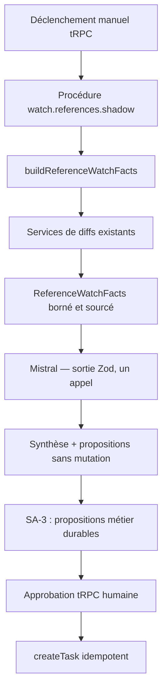

# Plan d'exécution — Socle Agentique vertical-first

## 1. Statut et autorité

| Élément | Valeur |
| --- | --- |
| Statut | Plan canonique révisé ; implémentation non commencée |
| Date de révision | 2026-08-14, Europe/Paris |
| Périmètre | POC personnel, gratuit, local et interruptible |
| Architecture | `docs/architecture-cible-cir-cockpit.md` |
| Index | `docs/IA_AGENTIQUE/README.md` |
| ADR | `docs/IA_AGENTIQUE/0001-*` à `0004-*` |
| Revue | `docs/IA_AGENTIQUE/audit-et-proposition-socle-agentique.md` |
| Suivi GitHub | [Programme #23](https://github.com/Nono8Six/CIR-Cockpit/issues/23) |
| Progression | Une tranche verticale, preuves, puis GO/NO-GO |

Ce plan remplace le chemin commençant par un dispatcher
`invokeCapability(context, name, input)`. Le POC compose les services typés
existants et n'extrait une abstraction commune qu'après un second besoin réel.
Valider ce document n'autorise ni code, dépendance, migration, déploiement,
commit ni push.

## 2. Destination

Le premier parcours surveille un run de changements de référentiels déjà
calculé :

1. le domaine produit des faits déterministes et leur provenance ;
2. une projection `ReferenceWatchFacts` borne les faits utiles ;
3. Mistral génère une synthèse structurée en un appel ;
4. `shadow` ne produit aucun effet métier ;
5. `supervised` persiste zéro à plusieurs propositions puis attend les décisions
   humaines ;
6. chaque proposition approuvée peut créer une tâche idempotente, interne ou
   liée à un Tier ;
7. une veille périodique et l'autonomie viennent seulement après ces preuves.

Le modèle ne calcule aucun fait, ne reçoit aucun SQL général et ne décide jamais
de son autonomie à partir d'un score de confiance qu'il s'attribue.

## 3. État de départ prouvé

- backend unique Deno/Hono/tRPC sur Supabase Edge Functions ;
- adaptateur Mistral, réservations IA, quotas, coûts, cache et traces existants ;
- tRPC et les outils IA appellent déjà directement les mêmes services typés de
  référentiels : imports, summary, list et aggregate de diffs ;
- les diffs portent `before`, `after`, labels, lignes sources et sévérité
  déterministe ;
- `createTask` est idempotent car `idempotency_key` devient `tasks.id`, mais
  ne possède aucun mode de prévisualisation ;
- le contrat IA de la Brique 3 Tâches est actuellement vide ;
- l'assistant historique conserve une boucle jusqu'à 12 tours, un timeout de
  180 secondes et un outil SQL de lecture transitoire ;
- `pg_cron` existe déjà pour d'autres usages ; aucun `pgmq`, outbox agentique
  ou worker séparé n'existe.

Les volumes, versions et limites runtime sont revérifiés avant chaque preuve.
Le nombre historique de 7 659 diffs n'est pas traité comme une mesure actuelle.

## 4. Décisions verrouillées

| Réf | Décision |
| --- | --- |
| SA-D01 | Architecture, ADR et plan précèdent l'implémentation. |
| SA-D02 | POC gratuit, interruptible, sans Docker ni nouvel abonnement. |
| SA-D03 | Le backend Deno existant porte le POC ; aucun second runtime. |
| SA-D04 | Les services typés existants sont composés directement ; aucun dispatcher générique au premier vertical. |
| SA-D05 | Le premier contrat est `ReferenceWatchFacts`, pas un `ContextPack` universel. |
| SA-D06 | Le nouveau parcours n'offre au modèle ni SQL général ni Supabase MCP. |
| SA-D07 | L'assistant historique et son SQL ne sont pas modifiés avant parité. |
| SA-D08 | Le premier appel modèle est one-shot, structuré et borné. |
| SA-D09 | AI SDK n'est spiké que pour supprimer un plumbing concret. |
| SA-D10 | `ai_request_reservations` reste technique ; une proposition métier aura son propre état. |
| SA-D11 | Le contrat IA Tâches est rouvert pour zéro à plusieurs propositions, internes ou liées à un Tier. |
| SA-D12 | Progression `manual` → `shadow` → `supervised` → `autonomous`. |
| SA-D13 | Une commande autonome initiale se limite aux catégories de tâches déjà éprouvées en supervised. |
| SA-D14 | Toute donnée de production rouvre un gate provider et conformité. |
| SA-D15 | Le premier réveil périodique utilise `pg_cron` + `pg_net` + Vault. |
| SA-D16 | `pgmq` exige un besoin mesuré de livraison, visibilité ou reprise. |
| SA-D17 | Workflow SDK, Node adjacent, Temporal, MCP runtime et multi-agent restent hors chemin critique. |

## 5. Architecture du premier vertical

### 5.1 Projection de faits

`ReferenceWatchFacts` reste spécifique aux référentiels. Il lit un run déjà
calculé, sélectionne totaux et top changements dans des bornes mesurées et
distingue :

- `fact` : valeur déterministe avec source ;
- `missing` : donnée absente ou brique non livrée ;
- `ambiguous` : plusieurs interprétations sans arbitrage métier.

Chaque entrée pointe vers les identifiants réels du run, des snapshots et des
objets concernés. Aucun contrat anticipé pour devis, commandes, mails ou appels
n'entre dans le premier vertical.

### 5.2 Shadow

Une nouvelle procédure isolée du broker historique charge le paquet puis appelle
Mistral une fois. Sa sortie Zod contient résumé sourcé, priorités,
`proposed_tasks` borné et éléments non résolus. Elle ne reçoit ni SQL, ni
catalogue d'outils, ni droit d'écriture.

Le rejeu avec la même clé retourne la réponse réservée lorsqu'elle existe ; il
ne dépend pas d'une régénération LLM textuellement identique.

### 5.3 Supervised

SA-3 modélise chaque proposition métier séparément des réservations IA. Son
schéma physique n'est décidé qu'après revue des tables et autorisation de
migration. L'approbation et le refus sont des commandes tRPC distinctes.
L'identité, l'agence, les droits, la fraîcheur du run et la clé d'idempotence
sont réévalués avant `createTask`.

### 5.4 Provider et framework

Mistral reste le chemin de référence. AI SDK Core est un candidat, pas un
prérequis. Un spike est autorisé seulement si une boucle, un second provider ou
du plumbing dupliqué apparaît ; il doit supprimer du code, passer sous Deno dans
le bundle `api` et conserver toute la gouvernance CIR.

## 6. Plan phase-gated

| Tranche | Issue | Objet | Sortie |
| --- | --- | --- | --- |
| SA-0 | [#24](https://github.com/Nono8Six/CIR-Cockpit/issues/24) | Verrous produit | périmètre Tâches et identité manuelle décidés |
| SA-1 | [#25](https://github.com/Nono8Six/CIR-Cockpit/issues/25) | Paquet de faits | JSON retraçable sans modèle |
| SA-2 | [#26](https://github.com/Nono8Six/CIR-Cockpit/issues/26) | Shadow one-shot | synthèse structurée, zéro mutation |
| SA-3 | [#27](https://github.com/Nono8Six/CIR-Cockpit/issues/27) | Supervised | propositions durables, une tâche par approbation |
| SA-4 | [#28](https://github.com/Nono8Six/CIR-Cockpit/issues/28) | Veille courte | réveil direct observable et rejouable |
| SA-5 | [#29](https://github.com/Nono8Six/CIR-Cockpit/issues/29) | Autonomie limitée | tâches éprouvées sous politique déterministe |
| SA-6a | [#30](https://github.com/Nono8Six/CIR-Cockpit/issues/30) | Convergence chat | paquet de faits partagé, SQL conservé |
| SA-6b | [#31](https://github.com/Nono8Six/CIR-Cockpit/issues/31) | Retrait SQL | parité prouvée, broker réduit |
| SA-7 | [#32](https://github.com/Nono8Six/CIR-Cockpit/issues/32) | Gate production | runtime durable réévalué sur mesures |

### SA-0 — Verrous produit

- [x] Rouvrir le contrat IA Brique 3 pour autoriser zéro à plusieurs
      propositions de tâches internes ou liées à un Tier.
- [x] Ne pas poser d'interdiction générale sur les futures propositions
      Activité, mail, devis ou commande ; leur exécution attendra le contrat de
      leur brique et un GO distinct.
- [x] Fixer le mode manuel : acteur et agence viennent de l'utilisateur connecté.
- [x] Reporter l'identité automatique du job périodique à SA-4 ; elle ne bloque
      ni le paquet de faits ni le shadow manuel.
- [x] Sélectionner au début de SA-1 le dernier run complet disponible et
      recompter son volume.
- [ ] Décision `GO/NO-GO SA-1`.

### SA-1 — Paquet de faits

- [ ] Écrire les tests sur corpus simple, incomplet, ambigu, volumineux et hostile.
- [ ] Implémenter `buildReferenceWatchFacts` par imports typés directs.
- [ ] Lire uniquement un run déjà calculé ; ne jamais recalculer dans l'appel IA.
- [ ] Borner lignes, octets et top changements à partir de mesures.
- [ ] Prouver chaque fait, absence et ambiguïté depuis le JSON source.
- [ ] N'ajouter ni dépendance, table, route publique ni schéma universel.
- [ ] Gate QA et décision `GO/NO-GO SA-2`.

### SA-2 — Shadow one-shot

- [ ] Ajouter une procédure isolée du broker historique.
- [ ] Utiliser l'adaptateur Mistral et la gouvernance existants.
- [ ] Valider une sortie Zod sourcée en un appel, deux au maximum si réparation.
- [ ] Interdire SQL, outils d'écriture et données hors paquet.
- [ ] Prouver zéro mutation et rejeu sans second coût pour la même réservation.
- [ ] Mesurer bundle, CPU, wall-clock, tokens, coût et taille de réponse.
- [ ] Tester au moins dix cas, dont trois injections indirectes.
- [ ] Spiker AI SDK seulement si un obstacle concret est documenté.
- [ ] Gate QA et décision `GO/NO-GO SA-3`.

### SA-3 — Supervised

- [ ] Concevoir le schéma minimal de proposition et ses RLS d'agence.
- [ ] Obtenir une autorisation séparée avant migration.
- [ ] Persister séparément chaque proposition avec charge utile bornée, preuves,
      version, expiration et clé métier.
- [ ] Garder `proposed`, `approved`, `rejected` comme décisions minimales ;
      représenter expiration et tâche créée par leurs colonnes.
- [ ] Implémenter `approve` et `reject` comme commandes tRPC distinctes.
- [ ] Dériver une clé de tâche stable par proposition depuis le run, l'objet et
      l'action.
- [ ] Créer au plus une tâche par proposition approuvée.
- [ ] Tester plusieurs propositions, approbations partielles, double clic,
      concurrence et crash avant/après chaque effet.
- [ ] Gate QA et décision `GO/NO-GO SA-4`.

### SA-4 — Veille courte

- [ ] Conserver le déclenchement manuel comme fallback.
- [ ] Trancher identité `system`, agence, responsable et grant du job.
- [ ] Utiliser d'abord `pg_cron` → `pg_net` → Edge avec secret Vault.
- [ ] Relire le dernier run calculé, exécuter SA-2/SA-3 puis terminer.
- [ ] Mesurer pertes, recouvrements, reprises et indisponibilités.
- [ ] Ajouter `pgmq` uniquement si ces mesures démontrent le besoin.
- [ ] Gate QA et décision `GO/NO-GO SA-5`.

### SA-5 — Autonomie limitée

- [ ] Autoriser seulement les catégories de tâches internes ou liées à un Tier
      déjà éprouvées en supervised.
- [ ] Décider par code selon preuve, sévérité, fraîcheur, droits et impact.
- [ ] Forcer `supervised` pour toute ambiguïté ou preuve incomplète.
- [ ] Exiger un contrat IA et un GO distinct avant toute exécution d'Activité,
      mail, devis, commande ou autre action externe.
- [ ] Mesurer faux positifs, coût, refus, latence et duplications.
- [ ] Gate QA et décision `GO/NO-GO SA-6`.

### SA-6a — Convergence du chat Référentiels

- [ ] Faire consommer `ReferenceWatchFacts` au chat Référentiels.
- [ ] Préserver les comportements publics et mesurer la parité Référentiels.
- [ ] Inventorier exhaustivement les usages SQL restant hors parité.
- [ ] Extraire une abstraction de capacité uniquement après un second cas réel.
- [ ] Gate QA et décision `GO/NO-GO SA-6b`.

### SA-6b — Retrait contrôlé du SQL

- [ ] Rejouer l'inventaire des usages SQL et vérifier leur parité.
- [ ] Migrer les usages couverts par petits groupes, sans big bang.
- [ ] Retirer catalogue, description de schéma et SQL généré seulement lorsque
      leurs usages sont couverts.
- [ ] Réduire le broker sans modifier les réponses publiques non concernées.
- [ ] Garder explicitement tout usage non couvert et produire un NO-GO partiel.
- [ ] Gate QA et décision `GO/NO-GO SA-7`.

### SA-7 — Gate production

- [ ] Rejouer les critères sur volumes et durées représentatifs.
- [ ] Revalider providers, données, sauvegarde, supervision et rollback.
- [ ] Vérifier si un besoin réel exige attente longue ou coordination externe.
- [ ] Comparer alors seulement Workflow SDK, Temporal, `pgmq` ou autre runtime.
- [ ] Décider maintien du monolithe ou runtime durable.
- [ ] Recette finale et décision « POC TERMINÉ / GO PRODUCTION » ou arrêt.

## 7. Preuves d'acceptation

Le POC est accepté lorsque :

1. chaque fait de Référentiels est retraçable sans modèle ;
2. absence et ambiguïté ne deviennent jamais zéro ou certitude ;
3. `shadow` produit une sortie structurée sans mutation ;
4. le nouveau parcours ne peut appeler ni SQL ni commande non autorisée ;
5. plusieurs propositions peuvent survivre à la requête et recevoir des
   décisions indépendantes ;
6. approbation, retry, crash et concurrence créent au plus une tâche par
   proposition approuvée ;
7. l'autonomie ne dépend d'aucun score de confiance LLM ;
8. les limites Edge sont mesurées, pas supposées ;
9. le parcours fonctionne sans Node, Docker ni moteur de workflow.

## 8. Risques

| Risque | Réponse |
| --- | --- |
| Projection devient un contexte universel | contrat Référentiels uniquement |
| Calcul + modèle dépassent Edge | lire un run déjà calculé, mesurer SA-2 |
| Retry régénère et repaie | réservation et réponse persistée |
| Proposition détourne les réservations | objet métier séparé en SA-3 |
| Cron agit sans identité | décision explicite avant SA-4 |
| Dépendance moderne duplique le code | aucun spike sans problème concret |
| SQL historique reste indéfiniment | retrait suivi après parité SA-6 |
| Autonomie devance les preuves | gates shadow et supervised obligatoires |

## 9. Règles d'arrêt et journal

- Une case reste vide sans preuve réellement exécutée.
- Le programme GitHub #23 et les issues #24 à #32 suivent les mêmes gates ; une
  issue fermée ne remplace jamais la preuve dans ce plan.
- Aucun code ne commence sans clôture de SA-0 et `GO SA-1` explicite.
- Toute dépendance, migration, déploiement, commit ou push exige son
  autorisation courante.
- Une tranche ne démarre pas avant la décision de sortie de la précédente.
- Une donnée manquante reste manquante.

| Date | Décision ou preuve | Sortie |
| --- | --- | --- |
| 2026-08-13 | Première architecture puis revues Claude et Gemini. | Runtime durable retiré du POC |
| 2026-08-14 | Revue AI SDK, Supabase et CompAI. | Gouvernance et supervision précisées |
| 2026-08-14 | Audit Grok confronté au code et aux docs primaires. | Dispatcher, spikes obligatoires et contexte universel retirés ; plan vertical-first |
| 2026-08-14 | Arbitrage PO du périmètre SA-0. | Propositions multiples, tâches internes ou Tier ; acteur manuel connecté ; run complet courant recompté |
| 2026-08-14 | Programme GitHub #23 et tickets #24 à #32 publiés blockers-first. | Prompts de démarrage, clôture `completed` et handoff vers une nouvelle conversation définis |

Décision attendue dans [#24](https://github.com/Nono8Six/CIR-Cockpit/issues/24) :
clôturer SA-0, puis **GO/NO-GO SA-1**. Aucun démarrage
automatique de SA-1.

## 10. Références techniques

- [Limites Supabase Edge Functions](https://supabase.com/docs/guides/functions/limits)
- [Planifier une Edge Function](https://supabase.com/docs/guides/functions/schedule-functions)
- [Supabase Queues](https://supabase.com/docs/guides/queues)
- [AI SDK — compatibilité des environnements](https://ai-sdk.dev/docs/getting-started/navigating-the-library)
- [AI SDK — sorties structurées](https://ai-sdk.dev/docs/ai-sdk-core/generating-structured-data)
- [AI SDK — outils et approbations](https://ai-sdk.dev/docs/ai-sdk-core/tools-and-tool-calling)
- [CompAI CRM — doctrine de preuve](https://github.com/trycompai/crm#what-this-is)
- [OWASP — excessive agency](https://genai.owasp.org/llmrisk/llm062025-excessive-agency/)
