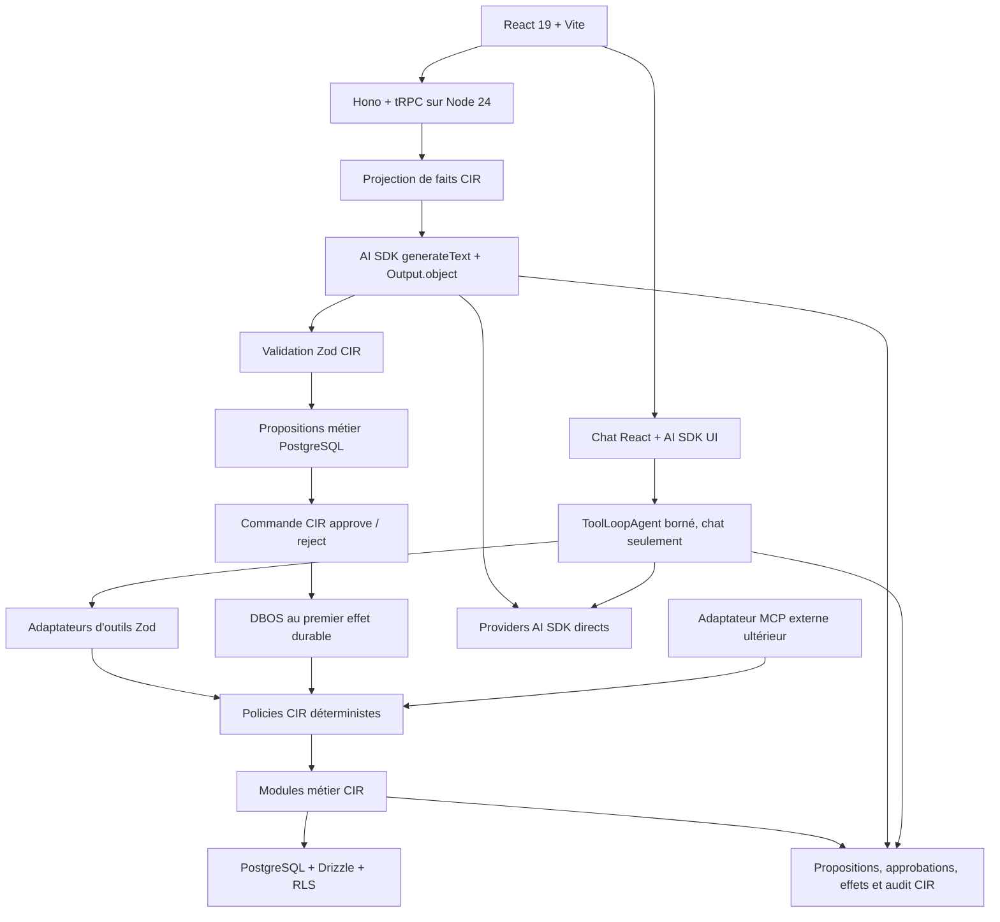

# Stack cible IA agentique et comparatif avec l'existant

## 1. Statut de la décision

| Élément | Valeur |
| --- | --- |
| Statut | **Cible technique agentique validée par le PO** |
| Date | 2026-08-15, Europe/Paris |
| Portée | Architecture technique du socle IA agentique de CIR Cockpit |
| Frontend | **React 19 + Vite conservés ; Next.js explicitement exclu** |
| Migration | Coupe franche : une seule architecture canonique subsiste à chaque étape |
| Plan d'exécution | [`plan-refonte-agentic-first.md`](./plan-refonte-agentic-first.md) |
| Autorisation | Ce document n'autorise ni dépendance, migration, déploiement, commit ni push |

Ce document fixe la destination technique issue des audits contradictoires
Claude Code, Gemini, Grok et Codex. Il compare cette destination à l'état du
dépôt au 2026-08-15. Il est la décision technique canonique du socle agentique ;
son exécution appartient au plan de refonte.

Les règles métier, de sécurité et d'autonomie de
[`architecture-cible-cir-cockpit.md`](../architecture-cible-cir-cockpit.md)
restent applicables. La présente décision change surtout le **runtime cible** et
la **mécanique d'exécution durable**.

## 2. Décision exécutive

La cible retenue est un **monolithe modulaire TypeScript sur Node.js 24 LTS** :

- frontend SPA **React 19 + Vite** ;
- API métier **Hono + tRPC + Zod 4** ;
- accès PostgreSQL via **Drizzle** ;
- appels modèles, sorties structurées, outils et streaming via **AI SDK 7** ;
- workflows métier durables et transactions exactement une fois via **DBOS** ;
- gouvernance CIR déterministe pour les droits, budgets, propositions,
  approbations et niveaux d'autonomie ;
- PostgreSQL reste la source de vérité métier ;
- MCP et A2A restent des adaptateurs externes ultérieurs.

Le résultat recherché n'est pas un agent qui possède le CRM. Le modèle choisit
et compose des capacités bornées ; le domaine autorise, calcule et exécute.



## 3. Responsabilité de chaque brique cible

### 3.1 React et Vite

React demeure la surface produit. Aucune migration vers Next.js n'est prévue.
Vite continue de construire la SPA et TanStack Router reste responsable de la
navigation.

AI SDK UI est ajouté comme bibliothèque React pour :

- streamer texte, états et résultats d'outils ;
- afficher les demandes d'approbation ;
- reconnecter une surface utilisateur à un run ;
- alimenter des cartes métier typées, pas seulement une bulle de chat.

AI SDK UI est framework-agnostic et possède un support React ; Next.js n'est
donc pas un prérequis.

### 3.2 Node.js 24 LTS

Node 24 devient le runtime backend cible, et remplace l'API Deno entière. Un
microservice IA Node adjacent n'est pas retenu :

- Hono, tRPC, Zod et Drizzle fonctionnent déjà dans l'écosystème Node ;
- un seul runtime évite deux configurations, deux modèles de tests et deux
  chemins d'accès aux services métier ;
- DBOS exige un processus applicatif capable de reprendre des workflows ;
- les limites CPU et wall-clock des Edge Functions ne gouvernent plus les runs
  agentiques.

Le backend Node est construit puis mis en service ; le backend Deno est
supprimé dans le même mouvement. Aucun dual-run, aucune fenêtre de
cohabitation, aucun routage partiel entre les deux runtimes. Git porte la
récupération.

Fenêtre LTS vérifiée le 2026-08-15 sur le calendrier officiel : Node 24 est
Active LTS depuis le 2025-10-28, entre en maintenance le 2026-10-20 et est
supporté jusqu'au 2028-04-30. Node 26 devient LTS le 2026-10-28. Node 24 est
donc le LTS correct aujourd'hui ; le passage à Node 26 sera un simple saut de
version après sa promotion, pas une décision d'architecture.

### 3.3 AI SDK 7

AI SDK devient l'interface unique avec les modèles. Version publiée vérifiée le
2026-08-15 : `ai` en `7.0.66`. `generateObject` est déprécié au profit de
`generateText` + `Output.object`. Il porte :

- providers directs OpenAI, Anthropic, Google, Mistral, xAI, Groq et autres ;
- providers OpenAI-compatible et modèles locaux, dont Ollama selon les
  capacités réelles du modèle ;
- `generateText` et `streamText` ;
- sorties structurées avec `Output.object` et validation Zod ;
- `ToolLoopAgent`, outils typés, approbations et conditions d'arrêt ;
- timeouts, usage, callbacks et instrumentation OpenTelemetry ;
- protocole de streaming compatible avec AI SDK UI.

AI SDK ne remplace pas la gouvernance CIR. Quotas, coûts, permissions,
propositions, idempotence et audit métier restent des modules CIR.

Le chemin par défaut n'est pas `ToolLoopAgent` :

- `runStructured` utilise `generateText` avec `Output.object`, sans catalogue
  d'outils, pour les projections Référentiels et les parcours one-shot ;
- `streamInteractive` utilise `ToolLoopAgent` uniquement pour le chat, avec un
  catalogue borné, `stopWhen`, budgets et timeouts stricts.

Les approbations d'outils AI SDK servent à suspendre une interaction de chat.
Elles ne constituent ni l'inbox métier ni la preuve d'autorisation CIR. Une
approbation métier reste une ligne PostgreSQL et une commande CIR qui réévalue
identité, agence, droits, fraîcheur et idempotence.

Une petite interface `AgentRuntime` isole les types AI SDK du domaine :

```ts
interface AgentRuntime {
  runStructured(input: StructuredRunInput): Promise<StructuredRunResult>;
  streamInteractive(input: InteractiveRunInput): AgentEventStream;
}
```

Cette interface est un seam réel : elle possède au moins un adaptateur AI SDK
de production et un adaptateur déterministe de test.

#### Providers directs par défaut

Les strings de modèle globales comme `"openai/..."` ou `"xai/..."` utilisent
AI Gateway par défaut. Elles ne sont pas le style autorisé par défaut dans CIR.
Chaque adapter construit explicitement le provider direct :

```ts
import { anthropic } from "@ai-sdk/anthropic";
import { mistral } from "@ai-sdk/mistral";
import { openai } from "@ai-sdk/openai";

const models = {
  mistral: mistral("mistral-large-latest"),
  openai: openai("model-id-valide"),
  anthropic: anthropic("model-id-valide"),
};
```

Les identifiants exacts sont validés au moment de l'implémentation et stockés
dans le registre CIR. Ce registre peut exposer ses propres identifiants sous
forme de strings sans passer par une gateway. Une gateway reste une option
d'exploitation ultérieure pour failover ou facturation consolidée ; elle n'est
ni le registre de production ni une dépendance implicite.

### 3.4 DBOS

DBOS porte les workflows métier durables, pas la conversation ordinaire. Il est
introduit lorsqu'un parcours doit survivre à un crash, attendre une approbation,
être planifié ou garantir une mutation exactement une fois.

Il n'est surtout pas introduit au premier token. Le premier vertical Node reste
une lecture sans effet métier :

```text
ReferenceWatchFacts
→ generateText + Output.object
→ validation Zod CIR
→ synthèse rendue à l'utilisateur, aucune mutation
```

DBOS apparaît au premier effet durable autorisé, initialement
`approve → createTask`. Avant cela, la réservation IA et l'idempotence de la
lecture suffisent ; ajouter un worker DBOS ne résoudrait aucune douleur réelle.

DBOS est préféré comme moteur durable principal parce que ses datasources
PostgreSQL/Drizzle peuvent committer atomiquement :

1. la mutation métier ;
2. le journal d'effet CIR ;
3. le checkpoint transactionnel DBOS.

La proposition approuvée et la tâche créée ne peuvent ainsi pas diverger après
une reprise. Le journal DBOS reste technique ; les statuts compréhensibles par
l'utilisateur restent dans les tables métier CIR.

`WorkflowAgent` n'est pas le choix par défaut. Il pourra être évalué si une
boucle LLM dynamique doit elle-même être durable. Les processus CIR prévisibles
restent des workflows DBOS explicites qui appellent AI SDK dans des étapes
bornées.

### 3.5 PostgreSQL, Drizzle et RLS

PostgreSQL conserve :

- les données métier ;
- les configurations providers et modèles ;
- les réservations et événements d'usage ;
- les propositions et décisions d'approbation ;
- les tentatives d'effets et leurs clés d'idempotence ;
- l'état DBOS dans un schéma séparé ;
- l'outbox des événements métier lorsqu'elle devient nécessaire.

Drizzle reste l'adapter d'accès SQL, étendu par `@dbos-inc/drizzle-datasource`
au moment du premier workflow durable. Les exemples officiels de cette
datasource utilisent `NodePgDatabase` alors que le backend actuel utilise le
driver `postgres` ; le choix de driver fait partie du spike DBOS et n'est pas
supposé acquis. Les RLS restent une défense en profondeur,
mais chaque commande réévalue aussi les permissions métier dans le contexte de
l'utilisateur.

L'authentification n'est pas remplacée automatiquement. Supabase Auth reste
compatible avec le POC et les RLS actuelles. Better Auth pourra faire l'objet
d'un ADR séparé si l'indépendance complète vis-à-vis de Supabase apporte un
bénéfice prouvé ; le refactoring lourd est accepté, le refactoring sans gain ne
l'est pas.

#### Connexion DBOS à Supabase

La documentation d'intégration DBOS/Supabase recommande, pour un worker Node
persistant :

1. la connexion PostgreSQL directe sur le port `5432` si l'IPv6 est disponible ;
2. sinon Supavisor en mode Session sur le port `5432`.

Supabase réserve le mode Transaction sur le port `6543` aux clients éphémères
et précise qu'il ne supporte pas les prepared statements. Le mécanisme parfois
invoqué de « verrous sur prepared statements » n'est pas établi par les sources
officielles et n'est donc pas retenu. Une configuration sans prepared
statements peut être techniquement possible, mais elle sort du chemin DBOS
documenté et n'est pas supposée fonctionner sans preuve.

Le bootstrap du schéma DBOS, les privilèges, le pool, les limites de connexions
et les transactions Drizzle sont donc un **gate bloquant** sur une base isolée.
Aucune migration DBOS ne touche le projet Supabase distant avant que ce spike
soit vert.

## 4. État actuel prouvé dans le dépôt

### 4.1 Frontend actuel

Le frontend est déjà très proche de la cible :

- React `19.2.8` et React DOM `19.2.8` ;
- Vite `7.3.6` ;
- TypeScript `5.9.3` ;
- Tailwind CSS `4.3.3` ;
- TanStack Router, Query et Table ;
- tRPC `11.18.0` ;
- Zod `4.4.3` ;
- shared contracts ESM.

Preuves : [`frontend/package.json`](../../frontend/package.json),
[`frontend/vite.config.ts`](../../frontend/vite.config.ts) et
[`stack.md`](../stack.md).

Le frontend est toutefois hybride : auth, Realtime et certaines données passent
directement par Supabase, tandis que d'autres opérations utilisent tRPC. La
cible conserve l'accès Supabase direct pour les primitives qui le justifient,
mais fait converger les commandes métier et les capacités agentiques vers
tRPC/Node.

### 4.2 Backend actuel

L'API actuelle est le package workspace `@cir-cockpit/backend` :

- runtime Node.js 24 ESM ;
- entrée `backend/src/index.ts` via `@hono/node-server` ;
- Hono `4.13.0` ;
- tRPC `11.18.0` ;
- Drizzle `0.45.2` ;
- driver `postgres` `3.4.8` ;
- Supabase Auth/JWT ;
- configuration Zod centralisée ;
- routes `/trpc/*` et `/health`.

Preuves : [`backend/package.json`](../../backend/package.json),
[`backend/src/index.ts`](../../backend/src/index.ts) et
[`backend/src/app.ts`](../../backend/src/app.ts).

Le cutover Deno vers Node est terminé. Le contrat généré expose 96 procédures,
dont `pricing.references.watch.summarize`. Le runtime Deno, ses import maps,
son wrapper Edge Function et ses scripts de déploiement ont été retirés.

### 4.3 IA actuelle

Le socle existant contient déjà des actifs importants :

- configuration providers et modèles en base ;
- quotas, coûts et historique d'usage ;
- versions de prompts ;
- accès IA par utilisateur/agence ;
- `ReferenceWatchFacts` borné et sourcé, avec 12 tests déterministes.

Preuves principales :

- [`aiGovernance.ts`](../../backend/src/services/ai/aiGovernance.ts) ;
- [`aiAccess.ts`](../../backend/src/services/ai/aiAccess.ts) ;
- [`referenceWatchFacts.ts`](../../backend/src/services/pricing/references/referenceWatchFacts.ts).

Le shadow one-shot construit au-dessus de cette projection a été retiré le
2026-08-15 : son transport, ses contrats tRPC et son UI appartenaient à
l'ancienne trajectoire Deno. Son unique mesure live reste exploitable comme
baseline — deux appels Mistral, 46 292 tokens d'entrée, 61,5 secondes de
latence, sortie encore invalide après réparation. Ce constat justifie un
transport moderne avec sorties structurées ; il ne remet en cause ni la
projection de faits ni la gouvernance.

Le broker, les adapters providers maison, le parsing/réparation JSON, le SQL
génératif, les routes assistant et leurs consommateurs frontend ont été
supprimés. AI SDK 7 est présent (`ai@7.0.66`, `@ai-sdk/mistral@4.0.29`) derrière
`AgentRuntime.runStructured`. AI SDK UI et DBOS restent absents. Le schéma
partagé limite encore les providers de gouvernance à `mistral` et `openrouter` ;
seul Mistral est enregistré comme provider direct du runtime. Preuves :
[`ai.schema.ts`](../../shared/schemas/ai.schema.ts),
[`agentRuntime.ts`](../../backend/src/services/ai/runtime/agentRuntime.ts),
[`referenceWatchSummarize.ts`](../../backend/src/services/ai/watch/referenceWatchSummarize.ts).

## 5. Comparatif actuel / cible

| Domaine | État actuel | Cible validée | Nature du changement |
| --- | --- | --- | --- |
| Frontend | React 19 + Vite 7 | React 19 + Vite | **Conserver** |
| Navigation | TanStack Router | TanStack Router | **Conserver** |
| Data UI | TanStack Query/Table | Identique + AI SDK UI | Étendre |
| État URL | TanStack Router search params | Identique ; nuqs seulement sur gain prouvé | Conserver |
| API | Hono + tRPC dans Node 24 | Identique | **Conserver** |
| Backend | Monolithe modulaire Node | Node web/API + worker durable lorsque DBOS est introduit | Étendre plus tard |
| Configuration | Module Zod centralisé | Configuration injectée et validée | Consolider |
| Contrats | Zod partagé + tRPC généré | Identique | **Conserver** |
| Base | Supabase PostgreSQL + RLS | PostgreSQL + RLS | **Conserver** |
| Auth | Supabase Auth/JWT | Supabase Auth conservé par défaut | Conserver |
| ORM | Drizzle | Drizzle + datasource DBOS | Étendre |
| Providers | Registre CIR + Mistral direct | Providers AI SDK directs | **Étendre** |
| Modèles | Gouvernance DB + adapter AI SDK | Registre CIR + adaptateurs AI SDK | **Conserver** |
| Sortie structurée | `generateText` + `Output.object` + Zod | `Output.object` + Zod | **Conserver** |
| Boucle agent | Absente | `ToolLoopAgent` derrière `AgentRuntime`, chat seulement | Ajouter plus tard |
| Faits métier | `ReferenceWatchFacts` spécifique | Projections verticales sourcées | **Conserver** |
| SQL modèle | Aucun SQL général | Aucun SQL général | **Conserver l'interdit** |
| Gouvernance | Quotas, réservations, coûts, traces | Modules CIR conservés autour d'AI SDK | **Conserver** |
| Propositions | Absentes | Propositions durables indépendantes | Ajouter |
| Approbations | Commandes séparées prévues | État métier + signal DBOS | Ajouter |
| Durabilité | Aucune reprise de workflow | DBOS sur PostgreSQL | **Ajouter** |
| Scheduling | `pg_cron`, futur `pg_net` | DBOS schedules ; `pg_cron` reste pour DB pur | Rationaliser |
| Streaming agent | Réponse tRPC classique | AI SDK UI stream + reconnexion | Ajouter |
| Observabilité | Tables usage/réservation et traces CIR | Identique + OpenTelemetry | Étendre |
| MCP | Hors runtime | Adapter externe après stabilisation | Différer |
| A2A/multi-agent | Absent | Absent tant qu'aucun besoin réel | Différer |

## 6. Ce qui doit être conservé

Le refactoring ne doit pas détruire les actifs suivants :

1. **Les modules métier typés** : ils deviennent le seam entre UI, agent et MCP.
2. **Les projections de faits sourcées** : le modèle argumente sur ces faits.
3. **Les contrats Zod partagés** : réutilisés par tRPC et les adaptateurs IA.
4. **La gouvernance IA** : quotas, réservations, coûts, prompts et accès.
5. **Les clés d'idempotence** et les erreurs publiques stables.
6. **PostgreSQL, Drizzle, RLS et Supabase Auth** tant qu'un remplacement ne
   prouve pas un gain supérieur au risque.
7. **Le frontend React/Vite et l'écosystème TanStack**.
8. **Les tests métier et les évaluations déterministes**.

## 7. Ce qui doit être refactoré ou remplacé

### 7.1 Refactoring structurel

Le workspace Node ESM, la configuration centralisée, Hono/tRPC, l'auth et
Drizzle sont en place. Les procédures IA historiques et leurs consommateurs ont
été retirés. Les changements structurels restants sont :

- ajouter `AgentRuntime` et son adapter AI SDK à l'étape 4 ;
- ajouter DBOS et sa datasource Drizzle lorsque le premier workflow durable est
  autorisé à l'étape 5.

La commande `createTask` constitue un bon premier candidat de transaction DBOS :
elle réévalue déjà l'autorisation et possède une idempotence métier. Le spike
doit démontrer l'atomicité entre proposition approuvée, tâche, audit et
checkpoint sans modifier son contrat public.

Le parser Excel peut être CPU-bound sur de gros fichiers, mais un Worker Thread
n'est pas imposé sur hypothèse. La première isolation est le processus DBOS
`worker`, distinct du serveur HTTP seulement après mesure. Un Worker Thread ou
un runner supplémentaire n'est ajouté que si un benchmark montre un blocage de
l'event loop, une pression mémoire ou une concurrence incompatible avec les SLO.

### 7.2 Retraits

L'entrypoint `Deno.serve`, les import maps Deno, le parsing provider maison, le
broker historique et le SQL général offert au modèle ont été retirés au
cutover. Les mécanismes `pg_cron + pg_net` ne seront remplacés par DBOS que pour
un workflow durable prouvé ; les jobs strictement internes à PostgreSQL restent
hors de ce remplacement.

Un retrait est précédé d'une recherche réelle de consommateurs, pas d'une
procédure de retour arrière : Git est le filet.

## 8. Arborescence cible indicative

Cette arborescence exprime les seams ; elle ne prescrit pas un déplacement
immédiat de chaque fichier.

```text
apps/
  web/                     React + Vite
  server/                  Node 24, Hono, tRPC, streaming agent
  worker/                  entrée DBOS, éventuellement même déploiement
packages/
  domain/                  modules métier CIR
  contracts/               Zod réellement partagé
  database/                Drizzle, migrations, adapters
  ai-runtime/              AgentRuntime + adapter AI SDK
  ai-governance/           providers, modèles, budgets, usage
  workflows/               DBOS explicite par parcours métier
  observability/           audit CIR + OTel
```

Le POC peut exécuter `server` et `worker` dans un seul processus Node. La
séparation en deux processus ne devient nécessaire qu'après mesure de charge ou
besoin d'isolation. Les packages ne doivent pas devenir des pass-throughs : un
module n'est extrait que s'il concentre une complexité réelle derrière une
interface plus petite.

## 9. Séquence de refonte

Les étapes ordonnent le travail ; elles ne décrivent pas des runtimes qui
cohabitent. L'exécution détaillée appartient à
[`plan-refonte-agentic-first.md`](./plan-refonte-agentic-first.md).

1. **Ménage** — arborescence, dépendances et frontières de modules assainies
   avant toute création de workspace.
2. **Cutover Node** — workspace Node 24 ESM, configuration injectée, Hono,
   procédures tRPC métier, auth, erreurs et Drizzle portés ; l'API Deno, le
   broker, les routes IA, les consommateurs assistant et les outils SQL
   historiques sont supprimés dans le même mouvement, sans portage temporaire.
3. **AI SDK 7** — `AgentRuntime`, providers directs, `generateText` +
   `Output.object` ; les adaptateurs et le parsing maison disparaissent avec le
   chemin qu'ils servaient.
4. **DBOS** — propositions, approbations et tentatives d'effet modélisées, puis
   `approve → createTask` transactionnel.
5. **Chat agentique** — une nouvelle surface interactive est construite sur les
   mêmes projections, outils et policies ; aucun broker historique n'est migré.
   MCP et multi-agent sont évalués ensuite.

## 10. Gates non négociables

Chaque étape prouve, sur le chemin qu'elle modifie :

- contrats tRPC publics conformes au contrat généré ;
- identité, agence et permissions identiques ou plus restrictives ;
- absence de double effet après crash/retry ;
- coûts et tokens comptabilisés dans les tables CIR ;
- prompts, outils et modèles versionnés ;
- aucune donnée manquante transformée en zéro ;
- aucune capacité SQL générale offerte au modèle ;
- tests d'injection indirecte et de contenu hostile ;
- limites de temps, étapes, tokens, coût et concurrence ;
- frontend React inchangé hors ajout des surfaces agentiques nécessaires.

## 11. Risques et décisions à valider avant implémentation

| Sujet | Risque | Preuve attendue |
| --- | --- | --- |
| DBOS sur le PostgreSQL Supabase actuel | droits de création de schéma, connexions et contention | spike local sur une base isolée, sans migration distante |
| Mode de connexion DBOS | le mode Transaction `6543` ne supporte pas les prepared statements | direct ou Session `5432` privilégié ; matrice de connexion et reprise testée |
| Cutover Deno vers Node | divergence auth/CORS/erreurs ou consommateur oublié lors du retrait des routes IA | contrat régénéré sur la surface conservée, recherche de consommateurs et tests d'auth ciblés sur Node |
| AI SDK 7 récent | changements de version et différences providers | versions épinglées + tests contractuels par provider |
| Intégration Zod 4 | AI SDK 7 accepte Zod `4.4.3`, mais les refinements, transforms ou conversions propres à CIR peuvent diverger selon le provider | typecheck et smoke runtime sur les schémas CIR réels ; `drizzle-zod` non requis par défaut |
| ToolLoopAgent | boucle trop autonome ou coûteuse | `stopWhen`, budgets et catalogue d'outils par intention |
| Sorties structurées | support variable selon modèles | matrice de capacités et corpus d'évaluation |
| Streaming React | reprise réseau et état UI | test déconnexion/reconnexion et approbation expirée |
| Imports Excel lourds | blocage de l'event loop ou mémoire excessive | benchmark avant choix processus séparé, Worker Thread ou runner dédié |
| Recherche hybride | embeddings ajoutés sans gain sur les références exactes | `pg_trgm` + filtres SQL d'abord ; `pgvector` seulement après évaluation |
| Better Auth éventuel | rupture RLS, Realtime et sessions | ADR séparé ; aucun remplacement implicite |
| Ménage lourd | suppression d'un consommateur caché | recherche de consommateurs par imports, routes et tests avant chaque retrait |

## 12. Conséquence sur l'ancien plan agentique

L'ancien plan SA-0…SA-7 a été construit autour d'un POC Deno volontairement
minimal, dont la décision structurante était « aucun second runtime, aucun
moteur durable ». La présente cible contredit frontalement cette décision. Le
plan SA, ses ADR et son audit ont donc été supprimés le 2026-08-15, et le
chantier SA-2 arrêté.

Ce qui survit et a été repris dans
[`plan-refonte-agentic-first.md`](./plan-refonte-agentic-first.md) :

- `ReferenceWatchFacts` reste la bonne projection, avec ses tests déterministes ;
- la doctrine de preuve `fact` / `missing` / `ambiguous` reste obligatoire ;
- le corpus hostile et les tests d'injection indirecte restent requis ;
- le live Mistral constitue une baseline chiffrée ;
- les propositions supervisées et l'autonomie déterministe restent la
  progression métier visée.

## 13. Sources techniques primaires

- [Node.js — calendrier des versions LTS](https://nodejs.org/en/about/previous-releases)
- [AI SDK 7 — annonce de disponibilité](https://vercel.com/changelog/ai-sdk-7)
- [AI SDK — providers et modèles](https://ai-sdk.dev/docs/foundations/providers-and-models)
- [AI SDK — choisir un provider direct](https://ai-sdk.dev/docs/getting-started/choosing-a-provider)
- [AI SDK — registre de providers](https://ai-sdk.dev/docs/reference/ai-sdk-core/provider-registry)
- [AI SDK — sorties structurées](https://ai-sdk.dev/docs/reference/ai-sdk-core/output)
- [AI SDK — outils, approbations et conditions d'arrêt](https://ai-sdk.dev/docs/ai-sdk-core/tools-and-tool-calling)
- [AI SDK UI — référence](https://ai-sdk.dev/docs/reference/ai-sdk-ui)
- [DBOS — workflows TypeScript](https://docs.dbos.dev/typescript/tutorials/workflow-tutorial)
- [DBOS — transactions et datasources](https://docs.dbos.dev/typescript/tutorials/transaction-tutorial)
- [DBOS — communication avec les workflows](https://docs.dbos.dev/typescript/tutorials/workflow-communication)
- [DBOS — intégration Supabase](https://docs.dbos.dev/integrations/supabase)
- [Drizzle — Row-Level Security](https://orm.drizzle.team/docs/rls)
- [Supabase — connexions directes, Session et Transaction](https://supabase.com/docs/guides/database/connecting-to-postgres)
- [Supabase — désactiver les prepared statements en mode Transaction](https://supabase.com/docs/guides/troubleshooting/disabling-prepared-statements-qL8lEL)
- [Node.js — Worker Threads](https://nodejs.org/api/worker_threads.html)
- [PostgreSQL — extension pg_trgm](https://www.postgresql.org/docs/current/pgtrgm.html)
- [Supabase — recherche hybride avec pgvector](https://supabase.com/docs/guides/ai/hybrid-search)
- [MCP — spécification 2026-07-28](https://modelcontextprotocol.io/specification/2026-07-28)
- [OWASP — sécurité des agents IA](https://cheatsheetseries.owasp.org/cheatsheets/AI_Agent_Security_Cheat_Sheet.html)
