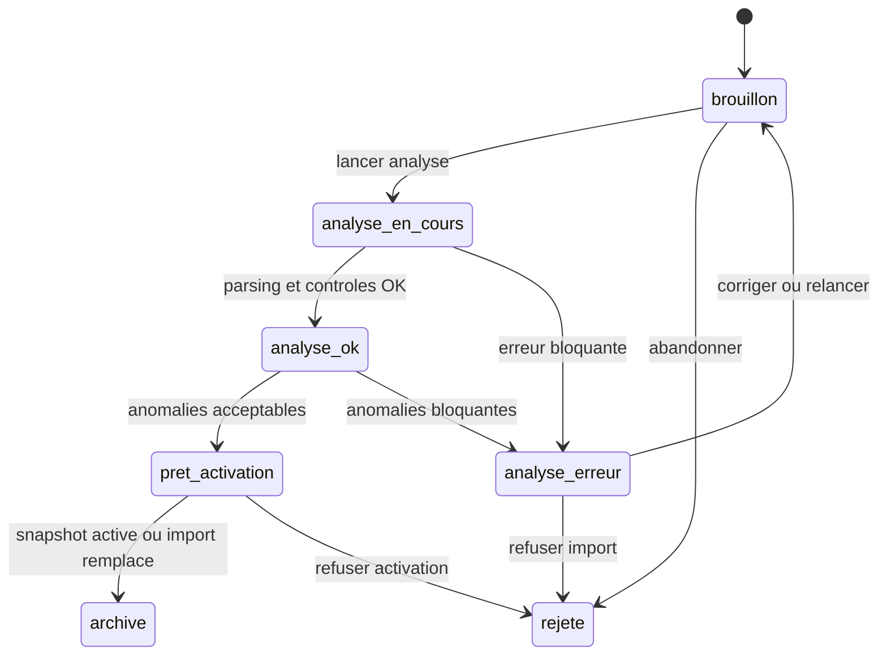
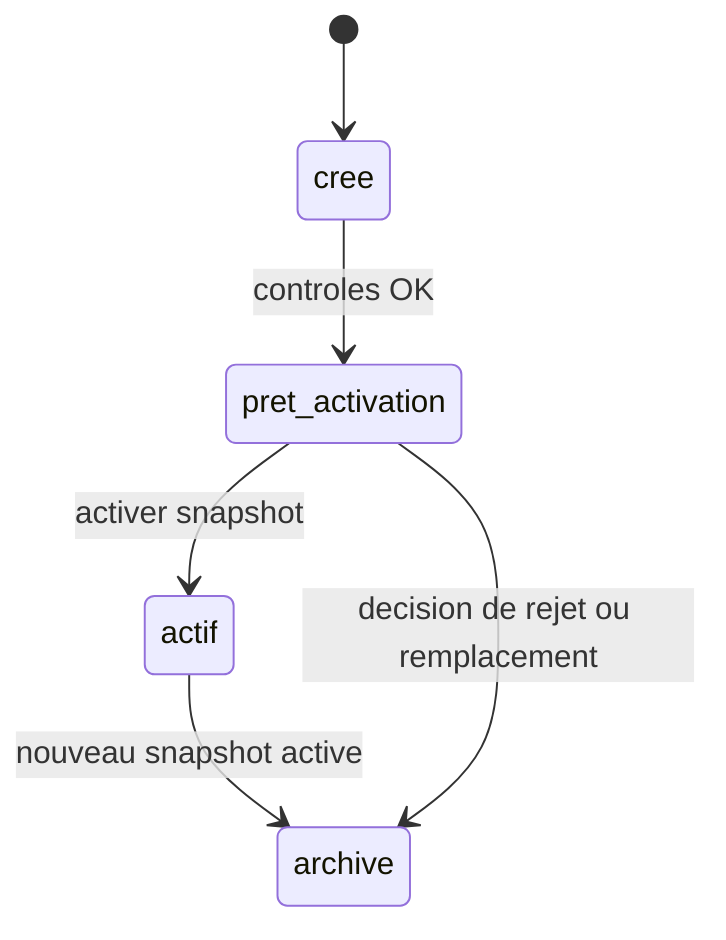

# Plan socle referentiels CIR

> Statut: plan de cadrage avant implementation  
> Perimetre: classification CIR, segments fabricant CIR, liaisons, imports, historique, anomalies  
> Date de cadrage: 2026-06-21  
> Decision principale: commencer par un socle backend-first des referentiels, pas par les tarifs fabricant ni par l'IA

## 0. Plan d'execution par tranches

> Objectif: avancer sans melanger referentiel, import fabricant, IA et moteur de remise.  
> Regle: une tranche est cochee seulement quand elle est implementee, testee et relue.

### Tranche 0 - Verrouiller le socle metier

- [x] Valider les objets metier definitifs: classification CIR, segment fabricant, liaison, grille achat, snapshot, anomalie.
- [x] Valider les colonnes obligatoires des exports CIR actuels.
- [x] Definir les regles minimales de qualite: doublons, lignes vides, classification absente, liaison ambigue.
- [x] Confirmer que les fichiers CIR importes sont des snapshots versionnes, jamais des donnees ecrasees directement.
- [x] Decider les statuts d'import: brouillon, analyse, valide, active, rejete, archive.

#### Decisions tranche 0 verrouillees

Date de verrouillage: 2026-06-21.

Perimetre verrouille:

- decision documentaire et metier uniquement
- aucune table Supabase creee
- aucune API creee
- aucune UI creee
- aucune logique IA ou tarif fabricant lancee

##### Objets metier definitifs

Les objets metier de base sont verrouilles comme suit:

| Objet | Definition verrouillee | Cle metier / relation principale |
| --- | --- | --- |
| `ImportReferentiel` | Operation de chargement des fichiers sources CIR. | Porte les fichiers source, le hash, le statut d'analyse et le rapport. |
| `SnapshotReferentiel` | Version coherentisee et historisee des referentiels issus d'un import. | Produit par un import; un seul snapshot actif pour ce domaine. |
| `ClassificationCir` | Ligne de classification interne CIR. | `MEGA + FAM + SFA`. |
| `SegmentFabricantCir` | Identite stable d'un segment fabricant CIR. | `SEGMENT + IDNUMERIQUE + MARQUE + CAT_FAB`. |
| `LiaisonSegmentCir` | Rattachement d'un segment fabricant a une classification CIR. | Relie un `SegmentFabricantCir` a une cle `MEGA + FAM + SFA`. |
| `GrilleAchatSegment` | Ligne de condition achat rattachee a un segment fabricant. | Plusieurs lignes possibles pour un meme segment. |
| `AnomalieReferentiel` | Probleme detecte pendant l'import, la normalisation ou la comparaison. | Liee a un import, un snapshot, une ligne source et un objet cible si identifiable. |
| `DiffReferentiel` | Comparaison entre deux snapshots. | Compare classification, segments, liaisons et grilles. |

Decision importante:

`SegmentFabricantCir` et `GrilleAchatSegment` restent deux objets distincts. Les doublons apparents de `SEGMENT + IDNUMERIQUE + MARQUE + CAT_FAB` dans `SEG_GRI_HA` ne sont donc pas automatiquement des erreurs: ils peuvent representer plusieurs lignes de grille achat pour la meme identite segment.

##### Colonnes obligatoires des exports CIR

Export classification CIR:

| Colonne | Statut | Regle valeur |
| --- | --- | --- |
| `MEGA` | obligatoire | non vide |
| `FAM` | obligatoire | non vide |
| `SFA` | obligatoire | non vide |
| `MEGA_LIB` | obligatoire | non vide |
| `FAM_LIB` | obligatoire | non vide |
| `SFA_LIB` | obligatoire | non vide |

Constat sur le fichier du 2026-04-08:

- 497 lignes lues
- 6 colonnes attendues presentes
- 0 cle CIR dupliquee
- 0 ligne avec champ obligatoire vide

Export segments / grille achat CIR:

| Groupe | Colonnes obligatoires a reconnaitre | Regle valeur |
| --- | --- | --- |
| Identite segment | `SEGMENT`, `IDNUMERIQUE`, `MARQUE`, `CAT_FAB` | non vide |
| Libelle segment | `CAT_FAB_L` | colonne obligatoire; valeur vide toleree avec anomalie faible |
| Marqueurs CIR | `STRATEGIQ`, `CODIF_FAIR`, `TARIF_FAB` | colonne obligatoire; valeur vide toleree selon champ |
| Grille achat | `NUM_FOUR`, `REMISE_HA`, `COL_HA`, `PRIORITE`, `TYPE_GRILL`, `DATE_DEBUT`, `DATE_FIN`, `BORNE_ACHA`, `COEF_RETRO`, `COEF_HA`, `COEF_MAJVTE` | valeur vide toleree avec anomalie de grille si la ligne est exploitable |
| Liaison classification | `MEGA_FAMILLE`, `FAMILLE`, `SOUS_FAMILLE`, `MEGA_LIBELLE`, `FAMILLE_LIBELLE`, `SFAM_LIBELLE` | valeur vide ou partielle toleree avec anomalie de liaison |

Constat sur le fichier du 2026-04-08:

- 12635 lignes lues
- 25 colonnes attendues presentes
- 0 ligne avec identite segment obligatoire incomplete
- 499 lignes avec classification CIR incomplete
- 500 lignes dont la cle CIR n'est pas validee contre l'export classification
- 101 lignes avec au moins un champ grille achat manquant

##### Regles minimales de qualite

Les controles tranche 0 sont verrouilles comme regles metier minimales:

| Controle | Severite | Decision |
| --- | --- | --- |
| Fichier absent ou illisible | bloquante | l'import ne peut pas passer en analyse. |
| Colonne obligatoire absente | bloquante | l'import ne peut pas creer de snapshot. |
| Classification CIR vide | bloquante | aucun snapshot activable. |
| Cle `MEGA + FAM + SFA` vide dans la classification | bloquante | la ligne est rejetee et le snapshot n'est pas activable. |
| Doublon `MEGA + FAM + SFA` dans la classification | bloquante | la source CIR doit etre clarifiee avant activation. |
| Identite segment incomplete | bloquante | la ligne ne peut pas etre rattachee a un segment stable. |
| Doublon d'identite segment avec grilles differentes | non bloquante | attendu: cree plusieurs `GrilleAchatSegment`. |
| Classification segment absente | anomalie a traiter | la ligne est conservee, mais non exploitable pour le matching tarifaire automatique. |
| Classification segment partielle | anomalie a traiter | la ligne est conservee avec niveau de liaison `mega_seulement` ou `partielle`. |
| Cle CIR complete mais inconnue de la classification | anomalie haute | activation possible seulement si l'anomalie est explicitement acceptee. |
| Liaison ambigue pour une meme cle fabricant | anomalie haute | pas de correction automatique; revue humaine obligatoire. |
| Grille achat incomplete | anomalie moyenne | la grille est stockee si l'identite segment est valide. |
| Date ou nombre impossible a parser | anomalie haute | la valeur brute doit rester consultable. |

Regle de correction:

Le module ne corrige jamais directement la source CIR. Il importe, normalise, signale, historise et permet une decision humaine tracee.

##### Snapshots versionnes

Decision verrouillee:

- un import ne remplace jamais directement le referentiel actif
- chaque import valide cree un nouveau `SnapshotReferentiel`
- un snapshot actif est immutable
- toute modification passe par un nouvel import et une nouvelle activation
- un seul snapshot actif est autorise pour le domaine referentiels CIR
- les anciens snapshots restent consultables pour historique, diff et audit

##### Statuts verrouilles

Statuts d'un import:

| Statut | Sens |
| --- | --- |
| `brouillon` | import prepare, fichiers pas encore analyses |
| `analyse_en_cours` | parsing et controles en cours |
| `analyse_ok` | analyse terminee, rapport disponible |
| `analyse_erreur` | erreur bloquante detectee |
| `pret_activation` | snapshot cree et eligible a activation |
| `rejete` | import refuse par decision humaine ou erreur non acceptee |
| `archive` | import conserve pour historique, hors flux actif |

Statuts d'un snapshot:

| Statut | Sens |
| --- | --- |
| `cree` | snapshot issu d'un import analyse |
| `pret_activation` | snapshot valide pour activation |
| `actif` | snapshot actuellement utilise comme referentiel courant |
| `archive` | ancien snapshot conserve en lecture |

Les anomalies n'ont pas de statut de traitement dans CIR Cockpit.
Elles sont affichees comme erreurs detectees sur l'import; la correction se fait dans le fichier Excel source,
puis via un nouvel import.

### Tranche 1 - Backend referentiels CIR

- [x] Creer les tables Supabase pour les imports, snapshots, classifications, segments, liaisons, grilles et anomalies.
- [x] Ajouter les contraintes d'unicite sur les cles metier.
- [x] Ajouter les index de recherche et de jointure.
- [x] Ajouter les schemas Zod partages pour les payloads d'import et de lecture.
- [x] Ajouter les procedures API de lecture des referentiels.
- [x] Ajouter les procedures API de creation d'import sans activation automatique.

### Tranche 1 realisee - 2026-06-21

Resume:

- Socle SQL historise cree dans `backend/migrations/20260622041229_pricing_reference_foundation.sql`: imports, fichiers, snapshots, classification CIR, segments fabricant, liaisons, grilles achat, anomalies et table placeholder de diffs sans moteur de diff.
- Index FK complementaires ajoutes dans `backend/migrations/20260622041709_pricing_reference_fk_indexes.sql` apres avis Supabase Advisor.
- Bucket Storage prive `pricing-reference-sources` prevu par migration: fichiers `.xlsx`, limite 50 MB, pas de public permanent, metadata fichier persistees en base.
- Schemas Drizzle, relations, schemas Zod stricts, catalogue erreurs et contrats tRPC `pricing.references.*` ajoutes.
- Service backend d'analyse read-only ajoute pour parser les deux Excel, produire le rapport de sante, stocker les donnees snapshot-ready et conserver les anomalies exploitables.
- Compteurs valides sur les sources locales: classification `497` lignes, `6` colonnes, `0` doublon CIR, `0` obligatoire vide; SEG_GRI_HA `12635` lignes, `25` colonnes, `0` identite segment incomplete, `499` classifications incompletes, `500` cles CIR non validees, `101` lignes avec champ grille achat structurel manquant.

Fichiers touches principaux:

- `backend/migrations/20260622041229_pricing_reference_foundation.sql`
- `backend/migrations/20260622041709_pricing_reference_fk_indexes.sql`
- `scripts/check-repo-state.mjs`
- `backend/drizzle/schema.ts`
- `backend/drizzle/relations.ts`
- `backend/functions/api/services/pricing/references/referenceExcelParser.ts`
- `backend/functions/api/services/pricing/references/referenceImports.ts`
- `backend/functions/api/trpc/router.ts`
- `shared/api/trpc.ts`
- `shared/schemas/pricing/references.schema.ts`
- `shared/errors/types.ts`
- `shared/errors/catalog.ts`
- `backend/functions/api/services/pricing/references/*_test.ts`
- `backend/functions/api/trpc/pricingReferenceContracts_test.ts`
- `backend/deno.json`, `deno.json`, `backend/deno.lock`

Validations lancees:

- `pnpm run repo:check` -> PASS.
- Supabase MCP 2026-06-22: projet `rbjtrcorlezvocayluok` actif, migrations `20260622041229 pricing_reference_foundation` et `20260622041709 pricing_reference_fk_indexes` appliquees, bucket prive `pricing-reference-sources` cree, RLS forcee/policies/grants/indexes verifies.
- `pnpm run qa:docs` -> PASS.
- `deno lint backend/functions/api` -> PASS.
- `deno check --config backend/deno.json backend/functions/api/index.ts ...` -> PASS.
- `pnpm --dir frontend run typecheck` -> PASS.
- Tests cibles parser/contrats/Excel local -> PASS, `7` tests.
- Recherches `throw new Error(`, `console.error(`, `toast.error(` hors tests -> PASS; seul `toast.error` restant est le wrapper central `frontend/src/services/errors/notify.ts`.
- `pnpm run qa:fast` -> PASS: front `141` fichiers / `609` tests, backend `231` tests, `8` ignores.

Limites restantes:

- Supabase Advisor performance signale encore des `unused_index` informatifs sur des tables neuves sans trafic, sans alerte restante `unindexed_foreign_keys` sur le socle Tranche 1.
- Supabase Advisor security signale l'option Auth `Leaked Password Protection` non activee, hors perimetre fonctionnel Tranche 1.
- Aucune activation de snapshot.
- Aucune UI definitive.
- Aucun moteur de diff complet.
- Aucune IA.
- Aucun import tarif fabricant.

### Tranche 2 - Import des exports CIR

- [x] Parser le fichier classification CIR.
- [x] Parser le fichier segment/grille fabricant CIR.
- [x] Normaliser les champs texte, codes marque, categories fabricant et cles classification.
- [x] Detecter les lignes incompletes, doublons et liaisons impossibles.
- [x] Produire un rapport d'import avec compteurs, erreurs et avertissements.
- [x] Stocker chaque import comme snapshot historise.
- [x] Bloquer l'activation si des erreurs critiques existent.

### Tranche 2 realisee - 2026-06-22

Resume:

- Parser CIR complete pour les deux exports: classification et segments/grilles fabricant.
- Normalisation controlee ajoutee: texte trim/collapse, codes metier en majuscules, cles CIR/segments reconstruites depuis les valeurs normalisees.
- Valeurs brutes conservees separement dans `raw_values`; les lignes classification vides ou dupliquees sont signalees puis exclues des tables normalisees pour respecter les contraintes snapshot.
- Dates CIR de grille achat conservees en brut et normalisees quand le format est reconnu (`YYYY-MM-DD`, `1YYMMDD`, `0`/vide). Format inconnu signale en anomalie sans date inventee.
- Rapport d'import et anomalies exploitables maintenus; un import contenant une anomalie `bloquante` reste en `analyse_erreur` avec code `PRICING_REFERENCE_IMPORT_BLOCKING_ANOMALIES`.
- Snapshot historise cree non actif; aucune route d'activation ajoutee, aucun diff, aucune IA, aucun import tarif fabricant.

### Tranche 3 - Interface referentiels

- [x] Creer l'ecran referentiels CIR.
- [x] Ajouter les onglets: Classification CIR, Segments fabricant, Liaisons, Imports, Anomalies, Historique.
- [x] Ajouter les tableaux performants avec recherche, filtres, tri et pagination.
- [x] Ajouter une vue detail pour chaque segment fabricant et sa liaison CIR.
- [x] Ajouter l'upload d'exports CIR avec suivi d'etat.
- [x] Ajouter les etats vides, chargement, erreur et succes.

### Tranche 3 realisee - 2026-06-22

Resume:

- Ecran `/remises/referentiels` ajoute dans le shell CIR Cockpit avec navigation laterale `Referentiels CIR` et raccourci `F5`.
- Onglets Imports, Classification CIR, Segments fabricant, Liaisons, Anomalies et Historique ajoutes en lecture paginee.
- Upload d'un ou deux exports CIR via selection fichier ou glisser-deposer, preparation Storage signee, televersement et analyse backend existante avec reutilisation du dernier referentiel disponible pour le fichier non fourni.
- Tableaux avec recherche, filtres, tri serveur et pagination ajustable sans chargement massif.
- Detail segment fabricant ajoute avec statut de liaison CIR et compteur de grilles achat.
- Etats chargement, vide, succes et erreurs UI raccordes aux helpers applicatifs.
- Hors scope conserve: aucune activation snapshot, aucun diff complet, aucune IA, aucun import tarif fabricant.

### Tranche 3.1 - Assistant import et mapping de colonnes

- [x] Ajouter un assistant d'import separe pour `Classification produit CIR` et `Segments et grilles fabricant`.
- [x] Permettre l'import d'un seul referentiel a la fois, avec reutilisation du dernier referentiel disponible pour l'autre fichier lors de l'analyse.
- [x] Ajouter l'etape obligatoire `Previsualiser -> Mapper les colonnes -> Confirmer -> Analyser`.
- [x] Lire les onglets XLSX disponibles, afficher les colonnes detectees et un echantillon borne.
- [x] Proposer un mapping deterministe par nom exact, normalisation, alias sauvegardes et similarite deterministe.
- [x] Permettre le mapping manuel `champ canonique -> colonne source`.
- [x] Sauvegarder un mapping confirme comme profil par defaut par type de fichier.
- [x] Refuser l'analyse d'un fichier nouvellement importe tant que le mapping n'est pas confirme.
- [x] Adapter le parser Excel pour consommer le mapping confirme sans exiger les noms exacts.
- [x] Ajouter les contrats tRPC/Zod stricts `inspect` et `confirmMapping`.
- [x] Ajouter la table `pricing_reference_column_mapping_profiles` et les colonnes de mapping sur `pricing_reference_import_files`.
- [x] Ajouter une UI compacte avec zone glisser-deposer/selection, choix d'onglet, preview, rail sticky de mapping, et etats erreur/succes exploitables.

### Tranche 3.1 realisee - 2026-06-27

Resume:

- Assistant Imports remplace le panneau unique par deux parcours explicites: `Classification produit CIR` et `Segments et grilles fabricant`.
- Chaque parcours est autonome: un seul fichier peut etre importe, previsualise, mappe, confirme puis analyse.
- Le backend ajoute `pricing.references.imports.inspect` et `pricing.references.imports.confirmMapping`; `imports.analyze` reste sur `{ import_id }` et exige un mapping confirme pour les fichiers courants.
- Les mappings sont stockes sur les fichiers d'import et peuvent etre sauvegardes comme profils globaux par `file_kind`.
- Detection automatique deterministe sans IA: nom exact, normalisation casse/accents/espaces, alias, similarite.
- Parser XLSX adapte au mapping canonique, avec optimisation pour conserver l'analyse Edge sous limite de ressources.
- Migration Supabase appliquee: profils de mapping, colonnes de mapping fichier, RLS lecture authentifiee/ecriture super admin.
- Hors scope conserve: aucune activation snapshot, aucun diff complet, aucune IA, aucun import tarif fabricant, aucune application automatique de remise.

### Tranche 4 - Historique, diff et activation

- [ ] Comparer deux snapshots de classification CIR.
- [ ] Comparer deux snapshots de segments fabricant CIR.
- [ ] Afficher les ajouts, suppressions et modifications.
- [ ] Ajouter l'activation controlee d'un snapshot valide.
- [ ] Conserver l'historique complet des imports et activations.
- [ ] Ajouter la possibilite de consulter un ancien snapshot sans le reactiver.

### Tranche 5 - Preparation import tarifs fabricant

- [ ] Definir le format minimal attendu d'un tarif fabricant.
- [ ] Identifier les champs fabricant utiles: reference, marque, famille fabricant, designation, prix, conditionnement.
- [ ] Mapper une ligne tarif fabricant vers une marque et une categorie fabricant CIR.
- [ ] Detecter les references non reconnues ou mal classees.
- [ ] Produire une file de validation humaine avant toute integration tarifaire.
- [ ] Ne pas appliquer de remise automatiquement a cette etape.

### Tranche 6 - POC IA assiste

- [ ] Ajouter une analyse IA uniquement sur les lignes non reconnues ou ambigues.
- [ ] Exiger une justification et un score de confiance pour chaque proposition IA.
- [ ] Interdire l'activation automatique d'une proposition IA.
- [ ] Afficher les propositions IA dans une interface de validation humaine.
- [ ] Journaliser la decision humaine: accepte, corrige, rejete.
- [ ] Reutiliser les validations humaines pour ameliorer les prochains imports.

### Tranche 7 - Durcissement et exploitation

- [ ] Ajouter les tests backend des regles d'import.
- [ ] Ajouter les tests frontend des parcours principaux.
- [ ] Ajouter les controles de performance sur gros fichiers.
- [ ] Ajouter les logs exploitables et erreurs metier en francais.
- [ ] Ajouter une documentation d'exploitation pour reimporter les exports CIR.
- [ ] Valider le parcours complet sur les deux fichiers CIR fournis.

## 1. Resume executif

Le module remise CIR ne doit pas commencer par le moteur de remise client, ni par une interface IA, ni par un import fabricant complet.

La premiere tache doit etre le socle suivant:

**Importer, versionner, controler et afficher les referentiels CIR de base.**

Ces referentiels sont:

1. La classification interne CIR:
   - mega-famille
   - famille
   - sous-famille
2. Les segments fabricant CIR:
   - segment
   - identifiant numerique
   - marque
   - categorie fabricant `CAT_FAB`
   - libelle categorie fabricant
3. La liaison entre segment fabricant et classification CIR:
   - `MARQUE + CAT_FAB`
   - `MEGA_FAMILLE + FAMILLE + SOUS_FAMILLE`
4. Les lignes de grille achat associees aux segments:
   - fournisseur
   - remise achat
   - colonne achat
   - priorite
   - type de grille
   - dates
   - coefficients

Ces fichiers ne sont pas des fichiers ponctuels. Ils peuvent etre extraits regulierement du systeme CIR. Ils doivent donc etre geres comme des **snapshots versionnes**, avec historique, diff, anomalies et activation controlee.

La suite du projet depend de cette fondation:

```text
Tarif fabricant brut
  -> reference fabricant
  -> marque + categorie fabricant
  -> segment fabricant CIR
  -> classification CIR
  -> futur moteur tarifaire et remises
```

Si cette base est instable, l'import fabricant et l'IA compenseront des problemes de referentiel au lieu de les resoudre.

## 2. Sources analysees

### 2.1 Fichiers CIR actuels

Les deux fichiers locaux inspectes sont:

- `docs/LOGIQUE_REMISE_CIR/Classification_produit_08-04-2026_09-46-26.xlsx`
- `docs/LOGIQUE_REMISE_CIR/SEG_GRI_HA_08-04-2026_09-03-28.xlsx`

Ils sont actuellement non suivis par Git au moment du cadrage:

```text
?? docs/LOGIQUE_REMISE_CIR/Classification_produit_08-04-2026_09-46-26.xlsx
?? docs/LOGIQUE_REMISE_CIR/SEG_GRI_HA_08-04-2026_09-03-28.xlsx
```

Ils doivent etre consideres comme des exports de travail, pas comme des tables definitives.

### 2.2 Documentation existante du dossier LOGIQUE_REMISE_CIR

Les documents existants donnent le contexte metier large:

- `cahier-des-charges/METIER/02-hierarchie-produit.md`
- `cahier-des-charges/METIER/03-logique-tarification.md`
- `cahier-des-charges/TECHNIQUE/01-modele-donnees.md`
- `cahier-des-charges/TECHNIQUE/03-architecture-api.md`
- `cahier-des-charges/TECHNIQUE/05-import-export.md`
- `cahier-des-charges/TECHNIQUE/06-plan-livraison.md`
- `cahier-des-charges/DECISIONS/decisions-et-questions.md`

Ces documents restent utiles, mais le present plan traite uniquement de la premiere fondation: **referentiels et import historique**.

## 3. Constats verifies sur les fichiers

### 3.1 Classification CIR

Fichier:

```text
Classification_produit_08-04-2026_09-46-26.xlsx
```

Structure:

| Colonne | Sens |
| --- | --- |
| `MEGA` | Code mega-famille CIR |
| `FAM` | Code famille CIR |
| `SFA` | Code sous-famille CIR |
| `MEGA_LIB` | Libelle mega-famille |
| `FAM_LIB` | Libelle famille |
| `SFA_LIB` | Libelle sous-famille |

Compteurs verifies:

| Controle | Resultat |
| --- | ---: |
| Lignes | 497 |
| Cles CIR uniques `MEGA_FAM_SFA` | 497 |
| Mega-familles | 11 |
| Couples `MEGA + FAM` | 76 |
| Doublons de cle CIR | 0 |
| Colonnes vides obligatoires | 0 |

Conclusion:

La classification est propre. Elle peut servir de referentiel interne CIR, sous reserve de l'historiser par snapshot.

### 3.2 Segments, liaisons et grilles achat

Fichier:

```text
SEG_GRI_HA_08-04-2026_09-03-28.xlsx
```

Colonnes principales:

| Colonne | Sens |
| --- | --- |
| `SEGMENT` | Code segment CIR |
| `IDNUMERIQUE` | Identifiant numerique du segment |
| `MARQUE` | Marque/fabricant |
| `CAT_FAB` | Categorie fabricant |
| `CAT_FAB_L` | Libelle categorie fabricant |
| `STRATEGIQ` | Indicateur strategique |
| `CODIF_FAIR` | Codification FAIR quand presente |
| `TARIF_FAB` | Indicateur tarif fabricant |
| `NUM_FOUR` | Numero fournisseur |
| `REMISE_HA` | Remise achat |
| `COL_HA` | Colonne achat |
| `PRIORITE` | Priorite |
| `TYPE_GRILL` | Type de grille achat |
| `DATE_DEBUT` | Date debut de ligne |
| `DATE_FIN` | Date fin de ligne |
| `BORNE_ACHA` | Borne achat |
| `COEF_RETRO` | Coefficient retro |
| `MEGA_FAMILLE` | Code mega CIR lie |
| `FAMILLE` | Code famille CIR lie |
| `SOUS_FAMILLE` | Code sous-famille CIR lie |
| `MEGA_LIBELLE` | Libelle mega |
| `FAMILLE_LIBELLE` | Libelle famille |
| `SFAM_LIBELLE` | Libelle sous-famille |
| `COEF_HA` | Coefficient achat |
| `COEF_MAJVTE` | Coefficient majoration vente |

Compteurs verifies:

| Controle | Resultat |
| --- | ---: |
| Lignes brutes | 12 635 |
| Identites segment uniques | 9 248 |
| Couples `MARQUE + CAT_FAB` uniques | 9 239 |
| Codes `SEGMENT` uniques | 9 248 |
| `IDNUMERIQUE` uniques | 9 248 |
| Marques uniques | 140 |
| Cles CIR referencees | 332 |

Conclusion:

`SEG_GRI_HA` n'est pas une simple table de mapping. Il melange trois concepts:

1. Un referentiel de segments fabricant.
2. Une liaison entre segment fabricant et classification CIR.
3. Des lignes de grille achat liees au segment.

Il faut donc le separer conceptuellement dans le futur modele.

### 3.3 Anomalies initiales detectees

| Anomalie | Resultat |
| --- | ---: |
| Lignes sans cle CIR complete valide | 500 |
| Segments uniques concernes | 277 |
| Lignes avec classification totalement vide | 174 |
| Segments uniques avec classification totalement vide | 154 |
| Lignes avec seulement mega-famille | 325 |
| Segments uniques avec seulement mega-famille | 122 |
| Lignes avec cle `0_0_0` | 1 |
| Couples `MARQUE + CAT_FAB` ambigus | 2 |

Couples ambigus detectes:

| Couple | Cles CIR observees |
| --- | --- |
| `COVA + SX5` | `4_40_10`, `4_40_50` |
| `REXR + INF` | `3_30_40`, `3_99_90` |

Ces anomalies doivent etre visibles dans l'interface et historisees par import.

### 3.4 Multiplicite des lignes de grille

Un meme segment peut avoir plusieurs lignes:

| Controle | Resultat |
| --- | ---: |
| Segments avec plusieurs lignes de grille | 1 912 |
| Maximum de lignes pour une identite segment | 8 |

Cela confirme qu'il ne faut pas creer une seule table plate `segments`.

Le modele doit separer:

```text
SegmentFabricantCir
  -> identite stable du segment

LiaisonSegmentCir
  -> classification CIR rattachee

GrilleAchatSegment
  -> lignes variables de remise achat / fournisseur / type grille
```

### 3.5 Delta avec les anciens fichiers

Comparaison avec les anciens fichiers du dossier:

- `Classification_produits.xlsx`
- `SEGMENTS TARIFAIRES.xlsx`

Resultats:

| Controle | Ancien | Nouveau |
| --- | ---: | ---: |
| Lignes classification | 473 | 497 |
| Cles classification ajoutees | - | 54 |
| Cles classification supprimees | - | 30 |
| Lignes segments/mapping | 7 548 | 12 635 |
| Couples `MARQUE + CAT_FAB` uniques | 7 548 | 9 239 |
| Couples ajoutes | - | 3 474 |
| Couples retires | - | 1 783 |

Conclusion:

Les referentiels evoluent fortement. L'interface doit donc etre concue autour du changement:

- historique
- comparaison
- activation de version
- controle des suppressions
- anomalies a traiter

Une simple table mise a jour en place serait insuffisante.

## 4. Decision d'architecture

### 4.1 Backend-first obligatoire

La logique referentiel doit etre 100% backend-first.

Le frontend ne doit pas:

- parser definitivement les fichiers Excel
- calculer la verite metier
- determiner seul les anomalies
- activer seul un snapshot
- ecrire directement les donnees metier en base
- faire des jointures metier critiques cote client

Le frontend doit:

- uploader ou selectionner un fichier
- afficher les etats d'import
- afficher les tables et les filtres
- afficher les anomalies
- demander des actions au backend
- presenter les erreurs et details de facon claire

Le backend doit:

- recevoir les fichiers
- parser les fichiers
- valider les colonnes
- normaliser les lignes
- calculer les cles
- detecter les anomalies
- calculer les diffs
- stocker les snapshots
- gerer l'activation atomique
- exposer les lectures paginees
- exposer les erreurs avancees

### 4.2 Stack retenue

La stack actuelle du repo est deja adaptee:

| Couche | Stack retenue |
| --- | --- |
| Frontend | React 19, Vite 7, TypeScript 5.9 |
| UI | Tailwind CSS 4, Radix UI, shadcn/ui local, Lucide |
| Data frontend | TanStack Query |
| Routing | TanStack Router |
| Tables | TanStack Table + TanStack Virtual |
| API | tRPC 11 |
| Validation | Zod 4 |
| Backend | Supabase Edge Function `api` |
| HTTP backend | Hono |
| DB access | Drizzle ORM + `postgres` |
| Auth | Supabase Auth, `Authorization: Bearer <token>` |
| Erreurs | AppError shared + backend `httpError()` / `handleError()` |

Il ne faut pas lancer une mise a jour globale des dependances avant ce chantier.

Raison:

- Le repo est deja moderne.
- Les versions latest existent, mais cela cree un chantier transversal.
- Le besoin immediat est la solidite du module referentiel, pas une migration outillage.
- Une mise a jour dependances pourra etre planifiee ensuite, separement, avec gate QA dediee.

### 4.3 Verification backend Supabase

Verifications effectuees:

| Verification | Resultat |
| --- | --- |
| Projet lie CLI | `CIR_Cockpit` |
| Project ref | `rbjtrcorlezvocayluok` |
| Region | West Europe London |
| Edge Function | `api` |
| Statut Edge Function | ACTIVE |
| Version Edge Function | 80 |
| `verify_jwt` | `false`, auth geree dans le code backend |
| Migrations distantes | CLI connectee, liste accessible |

Limite constatee:

- Le MCP Supabase est configure et OAuth active dans `codex mcp list`.
- Dans ce tour, le tool Supabase n'etait pas injecte comme outil appelable.
- `supabase db dump --schema public --linked` a ete bloque par Docker non disponible sur la machine.

Consequence:

Avant implementation DB, refaire une verification live Supabase via MCP injecte ou via une commande SQL read-only disponible.

## 5. Modele conceptuel cible

### 5.1 Objets metier

#### ImportReferentiel

Un import represente un chargement de fichiers source CIR.

Attributs attendus:

- identifiant import
- type import
- date import
- utilisateur
- fichiers sources
- hash fichier
- statut
- nombre de lignes lues
- nombre de lignes acceptees
- nombre d'anomalies
- snapshot cree
- request id backend
- message d'erreur si echec

Actions:

- preparer import
- analyser import
- consulter rapport
- relancer analyse
- archiver import

#### SnapshotReferentiel

Un snapshot represente une version complete et coherentisee des referentiels.

Attributs attendus:

- identifiant snapshot
- version lisible
- statut
- date creation
- date activation
- utilisateur activateur
- import source
- compteurs de sante
- hash des donnees normalisees

Actions:

- consulter
- comparer
- activer
- archiver

Regle importante:

Un snapshot actif ne doit pas etre modifie en place. Toute modification passe par un nouvel import et une nouvelle activation.

#### ClassificationCir

Une ligne de classification CIR correspond a:

```text
MEGA + FAM + SFA
```

Attributs:

- code mega
- libelle mega
- code famille
- libelle famille
- code sous-famille
- libelle sous-famille
- cle CIR normalisee
- snapshot
- statut dans le diff

Actions:

- consulter
- filtrer
- voir segments rattaches
- voir historique

#### SegmentFabricantCir

Un segment fabricant CIR correspond a une identite stable de segment.

Attributs:

- segment
- id numerique
- marque
- cat fab
- libelle cat fab
- strategique
- codification FAIR
- tarif fab
- fournisseur principal si determinable
- snapshot

Cle de travail:

```text
SEGMENT + IDNUMERIQUE + MARQUE + CAT_FAB
```

Le couple `MARQUE + CAT_FAB` est utile pour le matching tarif fabricant, mais il ne suffit pas toujours comme cle unique absolue.

#### LiaisonSegmentCir

Une liaison associe un segment fabricant a une classification CIR.

Attributs:

- segment fabricant
- cle CIR cible
- niveau de completude
- source
- statut
- anomalie associee si besoin

Niveaux de completude:

- complete
- mega_seulement
- vide
- cle_inconnue
- ambigue

#### GrilleAchatSegment

Une grille achat est une ligne de condition achat rattachee au segment.

Attributs:

- segment fabricant
- numero fournisseur
- remise achat
- colonne achat
- priorite
- type grille
- date debut
- date fin
- borne achat
- coefficient retro
- coefficient achat
- coefficient majoration vente
- snapshot

Important:

Plusieurs lignes de grille peuvent exister pour un meme segment.

#### AnomalieReferentiel

Une anomalie est un probleme detecte pendant l'import ou la comparaison.

Types initiaux:

- classification_absente
- classification_partielle
- cle_cir_inconnue
- segment_ambigu
- segment_duplique
- grille_incomplete
- fournisseur_absent
- date_invalide
- valeur_numerique_invalide
- suppression_a_risque

Attributs:

- type anomalie
- severite
- statut
- fichier source
- ligne source
- colonnes concernees
- valeur brute
- valeur normalisee
- message utilisateur
- details techniques
- snapshot
- import

#### DiffReferentiel

Un diff compare deux snapshots.

Objets compares:

- classification
- segments
- liaisons
- grilles achat

Types de changement:

- ajoute
- modifie
- supprime
- inchange
- anomalie_apparue
- anomalie_disparue

## 6. Etats et transitions

### 6.1 Etats d'un import



### 6.2 Etats d'un snapshot



### 6.3 Anomalies

Une anomalie n'a pas de cycle de traitement dans CIR Cockpit.
Elle est detectee lors de l'analyse, affichee comme erreur exploitable, puis corrigee dans le fichier Excel source.
La disparition d'une anomalie est constatee uniquement via un nouvel import.

### 6.4 Regles d'activation

Un snapshot ne peut etre active que si:

- les fichiers attendus ont ete importes
- la classification a des cles uniques
- les colonnes obligatoires sont presentes
- les anomalies bloquantes sont absentes ou explicitement acceptees selon regle metier
- le diff a ete calcule
- l'activation est faite en transaction

Activation interdite si:

- classification vide
- doublon de cle CIR dans classification
- fichier segment absent
- erreur de parsing encore presente dans le dernier import
- snapshot deja archive
- import associe en echec

## 7. Modele backend a prevoir

### 7.1 Principe general

Le modele doit conserver:

1. La source brute.
2. La normalisation.
3. Le snapshot actif.
4. L'historique.
5. Les anomalies.
6. Les diffs.

Il ne faut pas seulement stocker l'etat courant.

### 7.2 Tables candidates

Noms proposes, a valider avant migration:

| Table | Role |
| --- | --- |
| `pricing_reference_imports` | Imports de fichiers referentiels |
| `pricing_reference_import_files` | Fichiers associes a un import |
| `pricing_reference_snapshots` | Versions coherentisees |
| `pricing_classification_cir` | Classification CIR par snapshot |
| `pricing_supplier_segments` | Segments fabricant CIR par snapshot |
| `pricing_segment_classification_links` | Liaison segment -> classification |
| `pricing_segment_purchase_grids` | Lignes de grille achat |
| `pricing_reference_anomalies` | Anomalies detectees |
| `pricing_reference_diffs` | Diffs entre snapshots |
| `pricing_reference_audit_events` | Journal d'evenements si `audit_logs` ne suffit pas |

Decision a trancher:

Utiliser uniquement `audit_logs` existant ou creer une table audit dediee au domaine referentiel.

Recommendation initiale:

- garder `audit_logs` pour les evenements applicatifs transverses
- creer des tables de details `pricing_reference_*` pour les imports, anomalies et diffs
- ne pas dupliquer le journal de securite inutilement

### 7.3 Contraintes principales

Contraintes attendues:

- une seule version active a la fois pour ce domaine
- unicite `snapshot_id + cir_key` dans classification
- unicite `snapshot_id + segment + idnumerique + marque + cat_fab` dans segments
- index sur `snapshot_id`
- index sur `marque`
- index sur `cat_fab`
- index compose `snapshot_id + marque + cat_fab`
- index sur `segment`
- index sur `idnumerique`
- index sur `anomaly_severity`
- index sur `anomaly_type`
- index sur `created_at`

### 7.4 Donnees brutes et donnees normalisees

Chaque import doit garder:

- nom du fichier
- hash du fichier
- date import
- nombre de lignes
- colonnes detectees
- echantillon de lignes invalides
- erreurs de parsing

Les tables normalisees ne doivent pas perdre:

- la ligne source
- le fichier source
- la valeur brute si elle differe de la valeur normalisee

Exemple:

```text
source_value: "0  "
normalized_value: "0"
column_name: "FAM"
source_row_number: 2
```

### 7.5 Gestion des dates CIR

Dans `SEG_GRI_HA`, les dates observees ne sont pas toutes des dates ISO.

Exemples observes:

- `0`
- `1260101`
- chaine vide
- `1250101`
- `1241009`
- `1240801`

La premiere implementation doit:

- stocker la valeur brute
- tenter une normalisation controlee
- declarer une anomalie si le format est inconnu
- ne pas inventer de date silencieusement

## 8. API cible

### 8.1 Namespace

Namespace propose:

```text
pricing.references
```

Routes tRPC candidates:

```text
pricing.references.imports.list
pricing.references.imports.get
pricing.references.imports.prepare
pricing.references.imports.analyze
pricing.references.imports.activate
pricing.references.snapshots.list
pricing.references.snapshots.active
pricing.references.classification.list
pricing.references.classification.tree
pricing.references.segments.list
pricing.references.segments.get
pricing.references.anomalies.list
pricing.references.anomalies.update
pricing.references.diffs.summary
pricing.references.diffs.list
pricing.references.health.get
```

### 8.2 Upload fichier

Decision verrouillee avant tranche 1:

Utiliser **Supabase Storage** pour conserver les fichiers Excel sources, mais uniquement dans les limites du plan gratuit Supabase.

Contraintes gratuites verifiees le 2026-06-21 sur la documentation officielle Supabase:

- quota Storage gratuit: 1 GB par organisation/projet selon le quota Storage applicable
- taille maximale d'un fichier sur projet gratuit: 50 MB
- egress gratuit limite: 10 GB de bande passante totale, dont 5 GB cached et 5 GB uncached
- aucune transformation image, CDN public ou usage volumineux non necessaire pour ces exports Excel

Sources a reverifier avant implementation si la politique Supabase change:

- `https://supabase.com/docs/guides/storage/pricing`
- `https://supabase.com/docs/guides/storage/uploads/file-limits`
- `https://supabase.com/docs/guides/storage/serving/bandwidth`

Garde-fous obligatoires:

- bucket Storage prive dedie aux imports referentiels
- refus backend si fichier > 50 MB
- refus backend si extension hors `.xlsx`
- conservation du hash, nom original, taille, content type et chemin Storage en DB
- suivi du volume total stocke pour rester sous 1 GB
- pas de lien public permanent; acces par service backend ou URL signee courte si necessaire
- suppression/archivage a prevoir si l'historique approche la limite gratuite

Constat sur les exports actuels:

| Fichier | Taille approx. |
| --- | ---: |
| `Classification_produit_08-04-2026_09-46-26.xlsx` | 0,03 MB |
| `SEG_GRI_HA_08-04-2026_09-03-28.xlsx` | 1,25 MB |

Ces tailles sont compatibles avec le plan gratuit au moment du cadrage.

#### Option A: upload via Edge Function

Le frontend envoie le fichier a une route Hono dediee.

Avantages:

- simple pour POC
- un seul backend
- controle direct des erreurs

Limites:

- taille fichier Edge Function
- temps de traitement
- timeout potentiel

#### Option B retenue: upload vers Supabase Storage puis analyse backend

Le frontend depose le fichier dans Storage avec URL signee, puis demande au backend de l'analyser.

Avantages:

- plus robuste pour gros fichiers
- meilleure separation upload/analyse
- utile si plusieurs imports volumineux

Limites:

- plus de pieces techniques
- permissions Storage a cadrer

Recommendation:

Commencer directement par Option B, car elle conserve les fichiers sources et prepare l'historique proprement. L'implementation doit rester sobre pour ne pas sortir du plan gratuit.

### 8.3 Forme des reponses

Toutes les reponses doivent suivre les schemas partages stricts.

Exemple logique:

```ts
{
  ok: true,
  data: {
    import_id: string,
    status: string,
    counters: {
      rows_read: number,
      rows_valid: number,
      anomalies_total: number
    }
  }
}
```

Les erreurs doivent passer par le pipeline existant:

```ts
{
  ok: false,
  code: "PRICING_REFERENCE_IMPORT_INVALID_COLUMNS",
  message: "Le fichier ne contient pas les colonnes attendues.",
  details: "...",
  request_id: "..."
}
```

## 9. UX cible

### 9.1 Route

Route proposee:

```text
/remises/referentiels
```

Alternative:

```text
/referentiels-cir
```

Recommendation:

Utiliser `/remises/referentiels`, car ces referentiels sont la fondation du futur module remises/tarifs.

### 9.2 Structure d'ecran

Onglets:

1. `Imports`
2. `Classification CIR`
3. `Segments fabricant`
4. `Liaisons`
5. `Anomalies`
6. `Diff`

Barre de sante en haut:

- version active
- date activation
- dernier import
- nombre segments
- nombre anomalies critiques
- nombre anomalies a traiter
- nombre ajouts depuis version precedente
- nombre suppressions depuis version precedente

### 9.3 Onglet Imports

Objectif:

Voir l'historique complet des imports.

Colonnes:

- statut
- date
- utilisateur
- fichiers
- lignes classification
- lignes segments
- anomalies
- snapshot cree
- version active
- actions

Actions:

- consulter rapport
- voir diff
- relancer analyse
- activer snapshot
- archiver

Etats:

- aucun import
- import en cours
- analyse en cours
- import echoue
- import pret a activer
- snapshot actif

### 9.4 Onglet Classification CIR

Objectif:

Explorer la classification interne CIR.

Vues:

- arbre `MEGA -> FAM -> SFA`
- table dense
- details d'une sous-famille

Filtres:

- mega
- famille
- sous-famille
- libelle
- statut diff
- utilise par segment oui/non

Colonnes table:

- cle CIR
- mega
- libelle mega
- famille
- libelle famille
- sous-famille
- libelle sous-famille
- nombre segments rattaches
- statut diff

### 9.5 Onglet Segments fabricant

Objectif:

Explorer les segments fabricant CIR.

Colonnes:

- segment
- id numerique
- marque
- cat fab
- libelle cat fab
- fournisseur
- remise achat principale
- priorite
- type grille
- cle CIR
- libelle CIR
- statut liaison
- anomalies

Filtres:

- marque
- cat fab
- fournisseur
- segment
- cle CIR
- anomalie oui/non
- type grille
- priorite

Performance:

- pagination serveur
- filtres serveur
- virtualisation frontend
- pas de rendu DOM de toutes les lignes

### 9.6 Onglet Liaisons

Objectif:

Verifier la liaison entre segment fabricant et classification CIR.

Vues:

- par segment
- par famille CIR
- par marque
- par anomalie

Cas critiques:

- segment sans classification
- segment seulement mega-famille
- couple marque/cat fab ambigu
- cle CIR absente de la classification active
- classification supprimee mais encore referencee

### 9.7 Onglet Anomalies

Objectif:

Traiter les problemes detectes.

Colonnes:

- severite
- type
- statut
- fichier
- ligne source
- marque
- cat fab
- segment
- cle CIR
- message
- action recommandee

Filtres:

- severite
- statut
- type
- marque
- import
- snapshot

Actions:

- marquer a traiter
- ignorer avec justification
- reouvrir
- lier a une correction source

Important:

Le POC ne doit pas forcement permettre de corriger la donnee dans l'app. Il peut seulement tracer que la correction doit etre faite dans le systeme source CIR puis reimportee.

### 9.8 Onglet Diff

Objectif:

Comparer deux imports/snapshots.

Types de diff:

- classification ajoutee
- classification supprimee
- classification modifiee
- segment ajoute
- segment supprime
- segment modifie
- liaison changee
- grille achat modifiee
- anomalie apparue
- anomalie disparue

UX:

- selector version A
- selector version B
- resume des compteurs
- table detaillee
- filtres par type de changement

## 10. Gestion des erreurs

### 10.1 Principes

Le module doit utiliser le systeme d'erreurs existant:

- `shared/errors`
- `createAppError()` cote frontend
- `httpError()` cote backend
- `handleError()`
- `reportError()`
- `notifyError()`

Interdits dans le futur code:

- `throw new Error()` direct
- `console.error()` direct
- `toast.error()` direct
- message utilisateur duplique dans plusieurs fichiers

### 10.2 Codes d'erreur candidats

Codes a ajouter si implementation:

```text
PRICING_REFERENCE_IMPORT_INVALID_FILE
PRICING_REFERENCE_IMPORT_INVALID_COLUMNS
PRICING_REFERENCE_IMPORT_PARSE_FAILED
PRICING_REFERENCE_IMPORT_TOO_LARGE
PRICING_REFERENCE_IMPORT_EMPTY
PRICING_REFERENCE_CLASSIFICATION_DUPLICATE_KEY
PRICING_REFERENCE_SEGMENT_DUPLICATE_KEY
PRICING_REFERENCE_SEGMENT_MISSING_CLASSIFICATION
PRICING_REFERENCE_SEGMENT_AMBIGUOUS_LINK
PRICING_REFERENCE_SNAPSHOT_NOT_FOUND
PRICING_REFERENCE_SNAPSHOT_ALREADY_ACTIVE
PRICING_REFERENCE_SNAPSHOT_ACTIVATION_BLOCKED
PRICING_REFERENCE_DIFF_FAILED
PRICING_REFERENCE_PERMISSION_DENIED
```

### 10.3 Details d'erreur attendus

Une erreur d'import doit contenir si possible:

- `request_id`
- `import_id`
- fichier
- onglet
- ligne source
- colonne source
- valeur brute
- code erreur
- message utilisateur
- details techniques limites

Exemple:

```text
Le fichier SEG_GRI_HA ne contient pas les colonnes attendues.
Colonne manquante: CAT_FAB.
Import: ref_import_...
Request: req_...
```

## 11. Performance et stabilite

### 11.1 Contraintes de volume

Volumes observes:

- 497 lignes classification
- 12 635 lignes segments/grilles
- 9 248 segments uniques
- evolutions fortes entre imports

Volumes futurs probables:

- plusieurs dizaines de milliers de lignes de grilles
- fichiers fabricant potentiellement beaucoup plus volumineux
- historique multi-imports

### 11.2 Regles de performance

Backend:

- parsing en batch
- transactions pour activation
- index sur toutes les cles de filtre
- pagination serveur
- tri serveur
- pas de chargement complet par defaut
- diff calcule cote backend

Frontend:

- TanStack Query pour cache et etats
- TanStack Table pour modeles de colonnes
- TanStack Virtual pour grandes listes
- skeletons et etats vides
- panneau de detail lazy
- pas de gros calcul metier en render

### 11.3 Requetes attendues

Les ecrans ne doivent jamais demander "tout" sans limite.

Chaque liste doit accepter:

- `snapshot_id`
- pagination
- tri
- filtres
- recherche texte
- statut anomalie

Exemple logique:

```ts
{
  snapshot_id: "active",
  page: 1,
  page_size: 100,
  search: "SKF",
  filters: {
    marque: "SKF",
    severity: "haute"
  },
  sort: {
    field: "marque",
    direction: "asc"
  }
}
```

## 12. Securite et permissions

### 12.1 Principe

Le module manipule des donnees structurantes pour le tarif.

Il faut distinguer:

- lecture referentiel
- lancement import
- analyse import
- activation snapshot
- gestion anomalies
- archivage

### 12.2 Roles probables

Mapping initial a confirmer:

| Action | TCS | Agency admin / ROI | Super admin / Direction |
| --- | --- | --- | --- |
| Voir snapshot actif | oui | oui | oui |
| Voir anomalies | oui lecture | oui | oui |
| Importer fichiers | non | peut-etre | oui |
| Analyser import | non | peut-etre | oui |
| Activer snapshot | non | non | oui |
| Ignorer anomalie | non | oui limite | oui |
| Archiver snapshot | non | non | oui |

Recommendation:

Pour le POC, limiter les actions d'import/activation a `super_admin`.

## 13. Ordre d'implementation recommande

### Tranche 0: document et decisions

Objectif:

Verrouiller le vocabulaire et le sens des objets.

Statut:

Realise le 2026-06-21.

Livrables realises:

- present document
- objets metier definitifs
- colonnes obligatoires des deux exports CIR
- regles minimales de qualite
- politique de snapshots versionnes
- statuts import, snapshot et anomalie

Decisions volontairement reportees:

- chemin UI final: tranche Interface referentiels
- roles et permissions fines: backend schema puis activation

### Tranche 1: backend schema et import read-only

Objectif:

Importer les deux fichiers dans une zone de staging, calculer un rapport de sante, sans UI complete.

Livrables:

- migrations initiales
- bucket Storage prive pour sources Excel, contraint au plan gratuit
- schemas Zod
- service backend parse/analyse
- tests backend sur les deux fichiers de reference
- rapport JSON des compteurs

Limites:

- aucune activation snapshot
- aucune UI definitive
- aucune action de revue d'anomalie
- aucune IA

Critere de succes:

Le backend retrouve les compteurs verifies dans ce document.

### Tranche 2: API tRPC de lecture

Objectif:

Exposer snapshot, classification, segments et anomalies.

Livrables:

- namespace `pricing.references`
- procedures paginees
- schemas input/output stricts
- tests contrats
- mapping erreurs

### Tranche 3: UI imports et rapport de sante

Objectif:

Afficher l'historique des imports et le rapport detaille.

Livrables:

- route `/remises/referentiels`
- onglet imports
- barre de sante
- etats loading/empty/error
- panneau rapport

### Tranche 4: UI classification et segments

Objectif:

Afficher les donnees normalisees de facon rapide et exploitable.

Livrables:

- table classification
- arbre classification
- table segments virtualisee
- filtres serveur
- panneau detail segment

### Tranche 5: anomalies et diff

Objectif:

Rendre visible ce qui change et ce qui doit etre traite.

Livrables:

- onglet anomalies
- statuts anomalies
- onglet diff
- comparaison snapshot A/B
- actions de revue

### Tranche 6: activation snapshot

Objectif:

Permettre d'activer une version comme referentiel courant.

Livrables:

- mutation activation
- transaction DB
- garde-fous anomalies bloquantes
- audit
- tests concurrence

### Tranche 7: branchement tarifs fabricant

Objectif:

Importer un fichier tarif fabricant et le rapprocher du referentiel actif.

Livrables:

- detection colonnes tarif
- matching `MARQUE + CAT_FAB`
- matching segment
- file des lignes non reconnues
- rapport de couverture

### Tranche 8: IA d'aide au mapping

Objectif:

Utiliser l'IA uniquement sur les cas non reconnus ou ambigus.

Regles:

- l'IA propose
- l'IA explique
- l'IA score
- l'humain valide
- aucune validation automatique en V1

## 14. Premiere tache concrete

La toute premiere tache d'implementation apres ce document doit etre:

**Creer le contrat backend du module referentiels CIR, sans UI definitive.**

Detail:

1. Creer les schemas Zod partages pour les objets referentiels.
2. Definir les payloads tRPC de lecture et d'import.
3. Definir les codes d'erreur.
4. Definir le bucket Storage prive et les metadonnees DB des fichiers sources.
5. Definir les tables candidates en migration.
6. Ajouter un service backend d'analyse read-only.
7. Tester sur les deux fichiers CIR.
8. Verifier que les limites du plan gratuit Supabase sont respectees.

La premiere tache UI vient seulement apres:

**Afficher le rapport de sante d'un import.**

## 15. Ce qui est volontairement exclu au depart

Exclusions de la premiere fondation:

- moteur complet de remise client
- conditions client/groupement
- prix marche
- derogations fournisseur
- BFA
- Centre Logistique
- synchro AS400
- IA automatique
- correction directe des donnees CIR source
- mise a jour globale de dependances

Ces sujets seront branches apres stabilisation du referentiel.

## 16. Questions restantes apres tranche 0

Questions fermees:

| Question | Decision |
| --- | --- |
| Comment corriger une anomalie ? | L'interface affiche les erreurs detectees; la correction ou l'acceptation metier se fait dans le fichier Excel source, puis par nouvel import. |
| Un segment peut-il avoir seulement une mega-famille ? | Oui, la ligne est conservee avec anomalie `classification_partielle`; elle n'est pas fiable pour un matching tarifaire automatique. |
| Plusieurs snapshots actifs sont-ils permis ? | Non, un seul snapshot actif pour le domaine referentiels CIR. |
| Les anomalies bloquent-elles l'activation ? | Les anomalies bloquantes bloquent toujours. Les autres anomalies restent visibles pour correction dans le fichier Excel source. |
| Les imports referentiels sont-ils reserves a `super_admin` ? | Oui pour creation, analyse et activation. La lecture reste ouverte aux roles internes autorises selon permissions existantes. |
| Faut-il conserver les fichiers sources dans Supabase Storage ? | Oui, dans un bucket prive, avec metadata DB, sans depasser le plan gratuit Supabase. |
| Tranche 1 doit-elle parser les Excel ? | Oui, parser/analyser en read-only pour retrouver les compteurs des deux fichiers, sans activation. |
| Activation snapshot dans tranche 1 ? | Non, la tranche 1 prepare les donnees et rapports; l'activation reste plus tard. |
| Anomalies ignorables des la tranche 1 ? | Le modele doit le prevoir, mais l'action de revue/ignore reste hors tranche 1. |
| Nom du module API ? | `pricing.references.*`. |

Questions encore ouvertes pour les tranches suivantes:

1. Le chemin UI final est-il bien `/remises/referentiels` ?
2. Les dates `1260101`, `1250101`, etc. suivent-elles un format AS400 stable ?
3. Le couple `MARQUE + CAT_FAB` est-il suffisant pour rapprocher un tarif fabricant, ou faut-il toujours preferer `SEGMENT + IDNUMERIQUE` quand disponible ?
4. Les lignes `TYPE_GRILL` agence doivent-elles etre exposees dans le POC, ou seulement stockees ?

## 17. Validation recommandee pour cette tache documentaire

Comme ce document ne modifie pas le code:

```bash
pnpm run qa:docs
```

Pas de validation frontend, backend ou Supabase runtime necessaire pour cette seule creation documentaire.

## 18. Decision finale

Le bon debut du chantier est:

```text
Socle referentiels CIR
  -> import et versioning des exports CIR
  -> controle qualite
  -> historique
  -> UI d'audit performante
  -> activation de snapshot
```

Puis seulement:

```text
Tarifs fabricant
  -> rapprochement sur referentiel actif
  -> lignes non reconnues
  -> IA d'aide au mapping
  -> validation humaine
```

Cette sequence evite de construire un import fabricant intelligent sur une base referentiel non auditee.
