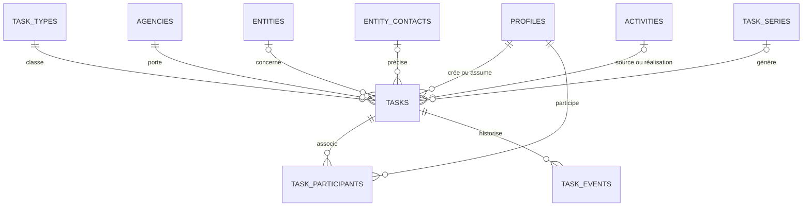

# Plan d'exécution — Brique 3 Tâches et relances

## 1. Statut et autorité

| Élément | Valeur |
| --- | --- |
| Statut du document | Plan canonique prêt à exécuter, implémentation non commencée |
| Brique | Brique 3 — Tâches et relances |
| Date de l'audit de départ | 2026-08-11, Europe/Paris |
| Autorité métier | Décisions PO prises pendant le cadrage Brique 3 |
| Autorité d'architecture | `docs/architecture-cible-cir-cockpit.md` |
| Prérequis livré | Brique 2 / TA-5, décision `GO Brique 3` |
| Vérité runtime | Projet Supabase `CIR_Cockpit` (`rbjtrcorlezvocayluok`) |
| Règle de progression | Une tranche ouverte à la fois, décision de sortie explicite avant la suivante |

Ce document remplace tout plan implicite de Brique 3. Il est conçu pour être
coché pendant l'exécution. Une case n'est cochée qu'après ajout de la preuve
réellement obtenue dans le journal d'exécution.

La Brique 3 doit créer un objet Tâche simple à utiliser seul, mais suffisamment
solide pour suivre une action individuelle ou collective dans la vision 360°
d'un Tier. Une relance est un type de tâche. Une activité reste un fait passé ;
elle ne sert plus de tâche future.

## 2. État actuel revérifié

### 2.1 Git et code local

- branche `main`, alignée sur `origin/main` au commit
  `52af1e19e7104d4820920827eb096b058dab5383` ;
- modification préexistante et hors périmètre : `AGENTS.md` ; elle doit rester
  intacte et ne doit jamais être incluse dans un commit de Brique 3 ;
- aucun fichier `plan-brique-3-taches-relances.md` n'existait avant ce plan ;
- `interactions.reminder_at` existe encore dans le schéma Drizzle, les types
  Supabase, les schémas partagés, les contrats tRPC, les services backend et de
  nombreuses surfaces frontend ;
- `activities` est le modèle canonique d'activité et `interactions` reste sa
  projection de compatibilité transactionnelle ;
- aucune table `tasks`, `task_types`, `task_participants`, `task_events` ou
  équivalente n'existe dans le schéma local actuel ;
- aucun fuseau horaire d'agence n'est actuellement modélisé.

### 2.2 Supabase distant

Contrôle en lecture seule du 2026-08-11 :

| Preuve | Valeur observée |
| --- | ---: |
| Projet | `CIR_Cockpit`, `ACTIVE_HEALTHY`, PostgreSQL 17.6 |
| Edge Function `api` | version 211, `ACTIVE` |
| Tables dédiées aux tâches | 0 |
| Tâches dédiées existantes | 0 |
| `interactions` | 8 |
| `activities` | 8, dont 0 archivée |
| Interactions avec `reminder_at` | 4 |
| Rappels échus | 4 |
| Événements `reminder_change` | 3 |
| Brouillons `interaction_drafts` | 1, contenant `reminder_at` |
| Fuseau PostgreSQL | `UTC` |

Conclusion : il n'y avait aucune tâche dédiée à supprimer lors de la rédaction
du plan. Les 8 activités/interactions, leurs dépendances et le brouillon sont
des données de création/test que le PO a explicitement autorisé à supprimer au
cutover. Ils ne doivent pas être convertis ni sauvegardés.

### 2.3 Dépendances actuelles à retirer

Le retrait de `reminder_at` doit couvrir au minimum :

- `backend/drizzle/schema.ts` et `shared/supabase.types.ts` ;
- schémas partagés Interaction, système et réponses API ;
- contrats/payloads tRPC générés ;
- service backend `dataInteractions.ts` et l'intégrité des interactions ;
- création et brouillons Activity/Cockpit ;
- détail Activity et construction de timeline ;
- Dashboard, compteurs, tris, actions rapides et recherche globale ;
- tests frontend, backend, intégration et E2E associés ;
- la classification historique `reminder_change`, qui ne doit pas devenir le
  journal des nouvelles tâches.

Le pont TA-5 entre `activities` et `interactions` reste en place pour les autres
champs de compatibilité. Brique 3 retire uniquement la responsabilité
« travail futur » de `interactions` ; elle ne supprime pas cette table.

## 3. Périmètre

### 3.1 Inclus

- création rapide d'une tâche personnelle ;
- création et suivi d'une tâche collective ;
- assignation à un responsable, plusieurs contributeurs et plusieurs suiveurs ;
- file d'agence temporaire sans responsable ;
- tâches liées à un Tier et facultativement à un contact ou une activité ;
- tâches internes CIR sans faux Tier ;
- référentiel global CIR de types de tâche administré par le super-admin ;
- échéance obligatoire, heure facultative, priorité et retard calculé ;
- cycle `à faire`, `en cours`, `terminée`, `annulée`, avec réouverture ;
- report explicite, historique structuré et concurrence optimiste ;
- récurrence simple facultative ;
- exécution d'une tâche client avec création atomique d'une activité ;
- espace principal Tâches et insertions contextuelles dans la vision 360° ;
- recherche structurée et pagination serveur ;
- retrait direct de `reminder_at` et nettoyage des données de test validées.

### 3.2 Exclus

- notifications email, SMS, push ou centre de notifications ;
- scoring IA, recommandation IA, embeddings ou recherche sémantique ;
- Opportunités, Devis et Commandes, qui restent Briques 4 et 5 ;
- écran complet « Ma journée » ou read model « Affaires », qui restent Brique 6 ;
- synchronisation calendrier externe ;
- pièces jointes propres aux tâches ;
- sous-tâches, dépendances entre tâches, checklists, temps passé ou facturation ;
- archivage métier des tâches fermées ;
- migration ou conservation des anciennes relances de test ;
- mécanisme de double écriture, de compatibilité ou de rollback pour
  `reminder_at`.

### 3.3 Contrat IA

Le contrat IA de la Brique 3 est vide. Aucun outil, prompt, routage ou accès IA
aux tâches n'est créé dans cette brique.

## 4. Décisions métier verrouillées

| ID | Décision |
| --- | --- |
| B3-D01 | Une tâche représente un travail futur ; une activité représente un fait passé. |
| B3-D02 | Une relance est un type de tâche, jamais une activité future. |
| B3-D03 | Une tâche n'a pas besoin d'être reliée à une opportunité. |
| B3-D04 | Les types de tâche sont un référentiel global CIR extensible ; seul le `super_admin` les administre. |
| B3-D05 | Un type utilisé n'est jamais supprimé : il peut être renommé, réordonné ou archivé. |
| B3-D06 | Une tâche « relation Tier » exige un Tier ; le contact et l'activité source sont facultatifs. |
| B3-D07 | Une tâche interne CIR exige une agence et ne crée pas de faux Tier. |
| B3-D08 | La création rapide demande seulement un titre, un type et une date ; le créateur devient responsable. |
| B3-D09 | Toute tâche a une date d'échéance. L'heure est facultative. |
| B3-D10 | Une tâche collective a un responsable principal, plusieurs contributeurs et éventuellement plusieurs suiveurs. |
| B3-D11 | Une même personne peut être créateur, responsable, contributeur et suiveur. |
| B3-D12 | Un responsable d'agence peut assigner ou réassigner à tout membre actif de son agence. |
| B3-D13 | Une tâche peut entrer dans une file d'agence, mais doit être réclamée/assignée avant de passer `en cours`. |
| B3-D14 | Les tâches liées à un Tier ne sont jamais privées ; les membres autorisés sur le Tier peuvent les lire. |
| B3-D15 | Une tâche interne peut être visible par l'agence ou restreinte à ses participants. |
| B3-D16 | États : `todo`, `in_progress`, `completed`, `canceled`. Le retard est calculé, ce n'est pas un état. |
| B3-D17 | Le passage direct `todo → completed` est autorisé. Une tâche fermée peut être rouverte vers `todo`. |
| B3-D18 | Une tâche fermée n'est pas archivée : elle disparaît des vues actives par filtre. |
| B3-D19 | Priorités : `normal` par défaut, `high`, `urgent`. Aucun retard ne change automatiquement la priorité. |
| B3-D20 | Le report exige une nouvelle date et historise ancienne valeur, nouvelle valeur, acteur et instant ; motif facultatif. |
| B3-D21 | Aucune date n'est reportée automatiquement. |
| B3-D22 | Pour une date seule, le retard commence le lendemain dans le fuseau de l'agence ; avec une heure, il commence après l'instant exact. |
| B3-D23 | Une activité exécutée côté client peut être créée et liée en même temps que la tâche est terminée, dans une transaction unique. |
| B3-D24 | Une tâche interne peut être terminée sans activité. Une tâche annulée ne crée pas d'activité. |
| B3-D25 | Après une activité, l'interface propose une prochaine tâche sans jamais l'imposer ni la créer silencieusement. |
| B3-D26 | La récurrence est facultative et avancée : tous les X jours, semaines ou mois. |
| B3-D27 | L'occurrence suivante naît uniquement à la clôture de l'occurrence courante, depuis sa date de complétion ; aucune pile d'occurrences. |
| B3-D28 | Pas de notifications dans cette brique ; l'échéance et les vues applicatives sont le rappel opérationnel. |
| B3-D29 | Chaque mutation utilise une version entière attendue et refuse une version périmée sans fusion silencieuse. |
| B3-D30 | Création, contenu, liens, assignations, échéance, priorité, statut, reports, récurrence et activité de réalisation sont historisés. |
| B3-D31 | Les données de test Activités/Interactions actuelles et le brouillon sont supprimés ; Tiers, contacts, utilisateurs, agences, référentiels et audit global sont conservés. |
| B3-D32 | `reminder_at` est supprimé directement au cutover. Pas de rollback ni de double écriture ; toute correction est forward-only. |

## 5. Modèle cible

### 5.1 Objets et relations



Relations futures prévues mais non créées en Brique 3 : `opportunity_id`,
`quote_id` et `order_id`. Elles seront de vraies clés étrangères ajoutées par
leurs briques, pas une paire générique `object_type/object_id`.

### 5.2 `task_types`

Référentiel global CIR :

| Colonne | Règle |
| --- | --- |
| `id` | UUID, clé primaire |
| `code` | identifiant technique stable, unique, non vide |
| `label` | libellé visible, unique sans tenir compte de la casse parmi les types actifs |
| `sort_order` | entier, ordre d'affichage |
| `is_active` | vrai par défaut |
| `created_by`, `updated_by` | profils auteurs |
| `created_at`, `updated_at`, `archived_at` | audit temporel |

Règles : lecture par tous les utilisateurs authentifiés ; création, renommage,
réordonnancement et archivage par `super_admin` seulement ; aucune suppression
normale ; un type archivé reste lisible sur l'historique et devient indisponible
à la création.

### 5.3 `tasks`

| Groupe | Colonnes et règles |
| --- | --- |
| Identité | `id uuid`, `agency_id uuid`, `version integer >= 1` |
| Contenu | `title text` obligatoire et borné, `description text` facultative |
| Classification | `task_type_id uuid` obligatoire, `planned_channel` facultatif et distinct du type |
| Portée | `scope = tier_relation | internal_cir` |
| Relation 360° | `organization_id`, `contact_id`, `source_activity_id`, `completion_activity_id`, tous facultatifs selon la portée |
| Création | `created_by` obligatoire |
| Affectation | `responsible_id` facultatif uniquement pour la file d'agence |
| État | `status = todo | in_progress | completed | canceled` |
| Priorité | `priority = normal | high | urgent` |
| Échéance | `due_date date` obligatoire, `due_time time` facultative, `due_timezone text` obligatoire |
| Visibilité | `visibility = tier | agency | restricted` |
| Clôture | `completed_at/by`, `canceled_at/by`, `cancel_reason` facultatif |
| Récurrence | `series_id` et `previous_task_id` facultatifs |
| Audit | `created_at`, `updated_at` |

Contraintes structurantes :

- `scope = tier_relation` impose `organization_id` et `visibility = tier` ;
- `scope = internal_cir` impose `organization_id`, `contact_id`,
  `source_activity_id` et `completion_activity_id` à `null`, avec visibilité
  `agency` ou `restricted` ;
- si `contact_id` est renseigné, une FK composite garantit son appartenance à
  `organization_id` ;
- activité source et activité de réalisation doivent appartenir à la même
  agence et au même Tier que la tâche ;
- `in_progress` interdit `responsible_id is null` ;
- `completed` exige `completed_at/by`, `canceled` exige `canceled_at/by`, et les
  états ouverts interdisent ces marqueurs ;
- la version est incrémentée exactement une fois par mutation métier ;
- aucune suppression physique via l'API courante.

`due_timezone` est copié depuis le fuseau de l'agence à la création afin que le
calcul historique d'une échéance reste stable si le paramètre de l'agence
change ensuite.

### 5.4 Fuseau des agences

Ajouter `agencies.timezone` : texte IANA non vide. Les agences existantes sont
initialisées à `Europe/Paris`, valeur CIR validée pour le démarrage, puis le
champ devient obligatoire. Le backend valide la valeur avec les primitives
IANA du runtime. PostgreSQL reste en UTC ; les instants stockés restent UTC.

### 5.5 `task_participants`

Table compacte pour les rôles secondaires :

- `task_id`, `agency_id`, `profile_id` ;
- `participant_role = contributor | follower` ;
- `added_by`, `created_at` ;
- unicité `(task_id, profile_id, participant_role)`.

Le responsable reste sur `tasks.responsible_id`. Une personne peut cumuler les
rôles : les contraintes n'interdisent donc pas qu'elle soit créateur,
responsable, contributeur et suiveur.

### 5.6 `task_events`

Journal métier append-only :

- identité, tâche, agence, ordre monotone par tâche ;
- `event_type` strict ;
- acteur utilisateur ou système explicite ;
- date UTC ;
- version de tâche produite ;
- données structurées `previous_value`, `new_value` et métadonnées bornées ;
- note ou motif facultatif.

Événements minimaux : `created`, `content_changed`, `type_changed`,
`link_changed`, `responsible_changed`, `participant_added`,
`participant_removed`, `due_changed`, `priority_changed`, `status_changed`,
`reopened`, `note_added`, `series_attached`, `series_stopped`,
`next_occurrence_created`, `completion_activity_created`.

Les anciens événements `reminder_change` sont supprimés avec les données de
test. Ils ne sont ni recopiés ni interprétés comme événements de tâche.

### 5.7 `task_series`

Support minimal de la récurrence avancée :

- `id`, `agency_id` ;
- `interval_value integer > 0` ;
- `interval_unit = day | week | month` ;
- `is_active`, `created_by/at`, `stopped_by/at` ;
- instantané des paramètres à recopier sur l'occurrence suivante.

Une contrainte d'unicité sur `tasks.previous_task_id` empêche deux occurrences
suivantes. La création de la suivante et la clôture de la courante se font dans
la même transaction. Un retry idempotent retourne l'occurrence déjà créée.

### 5.8 Index attendus

- toutes les clés étrangères ;
- `(agency_id, status, due_date, due_time)` pour les listes actives ;
- `(responsible_id, status, due_date, due_time)` pour « Mes tâches » ;
- `(organization_id, status, due_date)` pour la fiche Tier ;
- `(contact_id, status, due_date)` et `(source_activity_id)` ;
- `(task_type_id, status)` et `(priority, status, due_date)` ;
- `(task_id, event_order)` unique ;
- `(profile_id, participant_role, task_id)` ;
- index partiels sur les tâches ouvertes et sur la file d'agence
  (`responsible_id is null`), après preuve `EXPLAIN`.

## 6. Permissions

### 6.1 Lecture

| Acteur | Relation Tier | Interne agence | Interne restreinte |
| --- | --- | --- | --- |
| `tcs` membre de l'agence | lecture | lecture | lecture seulement s'il est créateur, responsable, contributeur ou suiveur |
| `agency_admin` de l'agence | lecture | lecture | lecture |
| `super_admin` | lecture globale | lecture globale | lecture globale |

### 6.2 Mutation

- créateur : contenu, liens et affectation tant que la tâche est ouverte ;
- responsable : exécution, échéance, priorité, statut et participants ;
- contributeur : notes et activités de réalisation, sans clôture autonome ;
- suiveur : lecture et note ;
- autre TCS autorisé sur le Tier : lecture et possibilité de réclamer une tâche
  de la file de son agence ;
- `agency_admin` : administration complète des tâches de ses agences ;
- `super_admin` : administration globale et suppression technique
  exceptionnelle, jamais exposée comme action normale ;
- système : uniquement règles explicites, idempotentes et historisées, comme la
  prochaine occurrence.

Les RLS assurent l'isolation et la visibilité. Le service backend assure les
droits au niveau des champs et transitions. Les deux couches sont testées ;
aucune confiance n'est accordée aux champs d'identité envoyés par le frontend.

## 7. Contrats backend

### 7.1 Schémas partagés

Créer des schémas Zod stricts et réutilisés par API/frontend pour :

- types, statuts, priorités, portées, visibilités et rôles de participant ;
- création rapide et création avancée ;
- lecture détail et ligne de liste ;
- filtres, tri, pagination et curseur/page ;
- patchs discriminés par action ;
- exécution avec ou sans création d'activité ;
- événements et conflits de version ;
- administration des types ;
- récurrence.

Les dates civiles restent `YYYY-MM-DD`, les heures locales `HH:mm` et les
instants `timestamptz` ISO. Le client ne calcule jamais seul le retard faisant
autorité.

### 7.2 Services et routes tRPC

Contrats recommandés :

- `task-types.list` ;
- `task-types.admin` avec actions `create`, `rename`, `reorder`, `archive` ;
- `tasks.create` ;
- `tasks.get` ;
- `tasks.list` ;
- `tasks.update-content` ;
- `tasks.update-assignment` ;
- `tasks.reschedule` ;
- `tasks.change-priority` ;
- `tasks.change-status` ;
- `tasks.add-note` ;
- `tasks.execute-with-activity` ;
- `tasks.recurrence` avec actions `configure`, `stop`.

Chaque mutation reçoit `task_id`, `expected_version` et une clé de requête
idempotente lorsque l'opération peut créer plusieurs lignes. Une version
périmée renvoie l'erreur CIR de concurrence existante avec action de
rechargement, sans écraser les données.

### 7.3 Liste et recherche

- pagination serveur, 50 lignes par défaut, maximum borné ;
- recherche structurée sur titre, type, Tier, contact, responsable et
  contributeur ;
- filtres : état, type, priorité, échéance, responsable, contributeur, agence ;
- raccourcis : en retard, aujourd'hui, cette semaine, mes tâches, mes
  contributions, file d'agence, terminées, annulées ;
- tri par défaut : retard, échéance, priorité `urgent/high/normal`, création ;
- calcul du retard au backend selon `due_date`, `due_time` et `due_timezone` ;
- requête SQL paramétrée, pas de chargement global suivi d'un filtre navigateur.

### 7.4 Transaction d'exécution

Pour une tâche client exécutée avec interaction réelle :

1. verrouiller la tâche par `id + expected_version` ;
2. vérifier droits, état ouvert, Tier/contact et agence ;
3. créer l'Activity v2 et ses participants/sources avec le service canonique ;
4. laisser le pont TA-5 produire la projection `interactions` sans
   `reminder_at` ;
5. relier `completion_activity_id` ;
6. terminer la tâche et écrire ses événements ;
7. créer au plus une prochaine occurrence si la série est active ;
8. valider ou annuler toute la transaction.

Une tâche interne est terminée sans activité. Une annulation n'appelle jamais
le service Activity.

## 8. Expérience utilisateur

### 8.1 Création rapide

Premier écran ou popover :

- titre ;
- type ;
- date obligatoire ;
- action « Créer » immédiatement disponible quand ces trois champs sont
  valides.

Valeurs implicites : créateur responsable, priorité normale, état `todo`,
agence active, visibilité issue du contexte. Les champs heure, canal prévu,
description, contributeurs, suiveurs, visibilité interne et récurrence sont
rangés sous « Plus d'options ».

### 8.2 Espace Tâches

Vues principales :

- Mes tâches ;
- Mes contributions ;
- File d'agence ;
- Toutes les tâches autorisées ;
- Terminées et annulées via filtres.

Chaque ligne montre au minimum titre, type, Tier ou mention interne,
responsable/file, échéance, retard éventuel, priorité et état. Les actions
rapides restent limitées : prendre, commencer, terminer, reporter, ouvrir.

### 8.3 Vision 360°

- onglet/section Tâches sur la fiche Tier ;
- tâches liées au contact dans son contexte ;
- tâche source et tâche de réalisation visibles sur le détail Activity ;
- création préremplie depuis Tier, contact ou Activity ;
- après enregistrement d'une activité, proposition non bloquante « Planifier la
  prochaine action » ;
- les futures Opportunités, Devis et Commandes se brancheront sur le même objet
  sans rendre ces liens obligatoires.

### 8.4 Signaux sans notifications

Le produit affiche badges et filtres « en retard », « aujourd'hui » et « cette
semaine ». Il n'envoie aucun message hors application et ne crée aucune table de
notification.

## 9. Stratégie de données et cutover direct

### 9.1 Données à supprimer

Au dernier contrôle avant migration, les compteurs attendus sont : 8
`activities`, 8 `interactions`, 13 participants, 8 sources, 24 événements, 0
pièce jointe, 0 correction et 1 brouillon. La migration doit s'arrêter si ces
compteurs diffèrent, afin de ne pas supprimer silencieusement une nouvelle
donnée créée après l'audit.

Ordre de suppression compatible avec les FK actuelles :

1. supprimer le brouillon de test `interaction_drafts` concerné ;
2. supprimer les 8 `activities` ; les tables participantes/sources/historique
   sont supprimées par cascade ;
3. supprimer les 8 `interactions` après disparition des FK
   `activities.legacy_interaction_id` ;
4. prouver les compteurs à zéro et l'absence d'orphelin ;
5. conserver intégralement Tiers, contacts, utilisateurs, agences,
   référentiels et `audit_logs`.

Il n'y a aucun backfill vers `tasks` et aucune sauvegarde de ces données de
test.

### 9.2 Retrait de `reminder_at`

Le retrait est coordonné dans une seule tranche de cutover :

- code backend et frontend prêt sans lecture/écriture de `reminder_at` ;
- tests ciblés et build locaux verts avant l'écriture distante ;
- migration distante supprimant index et colonne ;
- mise à jour immédiate de Drizzle et des types générés depuis le distant ;
- déploiement API, puis livraison frontend ;
- probes réels Tâches et Activités ;
- recherche finale `rg reminder_at` limitée, le cas échéant, aux migrations
  historiques immuables et à la documentation historique explicitement
  annotée.

Décision PO spécifique : aucun rollback de données, aucune colonne de secours,
aucune double écriture et aucun chemin legacy de relance. Un défaut après
cutover est corrigé par une nouvelle migration ou un correctif forward-only.

## 10. Plan d'exécution coché par preuves

### 10.1 Protocole de reprise et suivi GitHub

GitHub Issues est la surface de coordination ; ce document reste l'autorité sur
le périmètre, les décisions, les cases et les preuves. La Brique 3 utilise une
issue programme et une issue autonome pour chaque tranche B3-1 à B3-7.

| Tranche | Issue GitHub | Modèle conseillé | Effort | Condition de démarrage |
| --- | --- | --- | --- | --- |
| Programme Brique 3 | [#14](https://github.com/Nono8Six/CIR-Cockpit/issues/14) | `gpt-5.6-terra` | `medium` | suivi seulement, aucune implémentation directe |
| B3-1 | [#15](https://github.com/Nono8Six/CIR-Cockpit/issues/15) | `gpt-5.6-sol` | `medium` | validation B3-0 et autorisation de migration |
| B3-2 | [#16](https://github.com/Nono8Six/CIR-Cockpit/issues/16) | `gpt-5.6-terra` | `high` | issue B3-1 clôturée `completed` |
| B3-3 | [#17](https://github.com/Nono8Six/CIR-Cockpit/issues/17) | `gpt-5.6-terra` | `medium` | issue B3-2 clôturée `completed` |
| B3-4 | [#18](https://github.com/Nono8Six/CIR-Cockpit/issues/18) | `gpt-5.6-sol` | `medium` | issue B3-3 clôturée `completed` |
| B3-5 | [#19](https://github.com/Nono8Six/CIR-Cockpit/issues/19) | `gpt-5.6-terra` | `high` | issue B3-4 clôturée `completed` |
| B3-6 | [#20](https://github.com/Nono8Six/CIR-Cockpit/issues/20) | `gpt-5.6-sol` | `high` | issue B3-5 clôturée et SQL destructif validé |
| B3-7 | [#21](https://github.com/Nono8Six/CIR-Cockpit/issues/21) | `gpt-5.6-sol` | `medium` | issue B3-6 clôturée `completed` |

Politique provisoire fondée sur le risque : Terra réalise les tranches déjà
spécifiées sans décision d'architecture sensible ; Sol prend les migrations,
l'atomicité transverse, le cutover destructif et l'audit final. Le niveau peut
être relevé seulement après un premier passage insuffisant et documenté.

Chaque issue contient un prompt de démarrage stable et autonome. Ce prompt ne
fige pas les faits susceptibles de changer. Au passage de frontière entre deux
tranches :

1. terminer la tranche courante et obtenir ses preuves ;
2. cocher ce document et compléter son journal ;
3. commenter l'issue avec les preuves exactes et la décision de sortie ;
4. fermer l'issue avec la raison GitHub `completed` uniquement si toutes ses
   cases, preuves et critères de sortie sont satisfaits ;
5. laisser l'issue ouverte en cas d'échec, de preuve manquante ou de décision
   `NO-GO` ;
6. revérifier Git, le distant Supabase et le runtime nécessaires à la tranche
   suivante ;
7. générer avec `cir-cockpit-handoff-prompt` le prompt final actualisé, puis le
   déposer en commentaire de l'issue suivante ;
8. ouvrir une nouvelle conversation avec ce prompt et la configuration de
   modèle indiquée dans le tableau.

L'issue programme ne se ferme qu'après clôture `completed` de B3-1 à B3-7,
recette finale verte, journal à jour et décision explicite « Brique 3
TERMINÉE ». La création des issues n'autorise pas leur exécution, une migration,
un déploiement, un commit, un push ni le démarrage de Brique 4.

Enveloppe stable présente dans chaque issue :

```text
Travaille dans C:\GitHub\CIR_Cockpit\CIR-Cockpit.

Objectif
Exécuter uniquement la tranche indiquée par cette issue jusqu'à ses preuves de sortie.

État de départ
Revérifie les faits découvrables ; ne considère pas les compteurs, versions ou migrations de l'issue comme actuels sans preuve.

Périmètre autorisé
La tranche de cette issue et aucun travail de la tranche suivante.

Limites
Préserve le worktree non lié. Respecte les autorisations distinctes de migration, déploiement et publication. Ne ferme pas l'issue avant preuves complètes.

Sources à relire
AGENTS.md déjà chargé ; docs/PLAN/plan-brique-3-taches-relances.md ; sections explicitement citées dans l'issue.

Preuves de fin
Toutes les cases de l'issue, les preuves de sortie du plan, le journal mis à jour, le diff contrôlé et la QA proportionnée.

Exécution
Vérifie l'état actuel, exécute blockers-first, reste dans le périmètre, puis commente l'issue avec les preuves. Ferme-la avec `completed` seulement si la décision de sortie est GO. Prépare alors le prompt actualisé de l'issue suivante sans commencer cette dernière.
```

### B3-0 — Spécification et état de départ

Objectif : rendre le plan exécutable et figer la preuve de départ.

- [x] Charger les règles `ask-matt`, le routeur CIR Cockpit et la QA documentaire.
- [x] Relever Git, le worktree et le commit distant.
- [x] Lire l'architecture Tâche/Activité et le checkpoint TA-5.
- [x] Auditer schéma Drizzle, migrations TA-4/TA-5, services et consommateurs de `reminder_at`.
- [x] Contrôler le projet Supabase, les tables, les compteurs et l'Edge Function.
- [x] Confirmer qu'aucune tâche dédiée n'existe et qu'aucune suppression de tâche n'est à exécuter.
- [x] Consolider les décisions métier B3-D01 à B3-D32.
- [x] Faire valider ce plan par le PO avant toute migration ou implémentation.

Preuves de sortie : présent document, `pnpm run qa:docs`, diff limité à ce
fichier et statut Git préservant `AGENTS.md`.

Décision de sortie attendue : `GO B3-1 / B3-1 non commencée`.

### B3-1 — Fondation SQL, RLS et contrats de domaine

Objectif : créer le modèle additif des tâches sans toucher encore à
`reminder_at` ni aux données Activity de test.

Conseil d'exécution : nouvelle conversation, `gpt-5.6-sol`, effort `medium`.

- [x] Revérifier compteurs, migrations distantes et absence de tables Tâches.
- [x] Préparer la migration SQL complète : fuseau agence, types, tâches, participants, événements, séries, contraintes, index, RLS, ACL et audit.
- [x] Charger `supabase-postgres-best-practices`, `cir-cockpit-api-contracts`, `cir-error-handling` et `drizzle-orm` selon le routeur.
- [x] Écrire d'abord les tests de contraintes, transitions et permissions attendues.
- [x] Faire relire le SQL complet et les requêtes de preuve avant exécution.
- [x] Obtenir l'autorisation PO spécifique d'appliquer la migration.
- [x] Appliquer une seule fois la migration via MCP Supabase.
- [x] Extraire le SQL distant exact dans `backend/migrations/` sans modifier une migration appliquée.
- [x] Mettre à jour Drizzle et générer les types Supabase depuis le distant.
- [x] Vérifier RLS forcée, grants minimaux, FK, contraintes et index.
- [x] Prouver lecture agence, refus inter-agence, visibilité restreinte et accès super-admin.
- [x] Prouver que seul le super-admin administre les types.
- [x] Prouver création rapide, file d'agence et conflit de version dans une transaction de test annulée/nettoyée.
- [x] Exécuter advisors sécurité/performance et traiter les alertes de la tranche.
- [x] Lancer tests ciblés, `pnpm run repo:check`, puis la gate QA choisie.

Preuves de sortie : parité migration local/distant, empreinte SQL, types générés,
tests RLS/contraintes/concurrence, advisors et absence de résidu de probe.

Décision de sortie attendue : `GO B3-2 / B3-2 non commencée`.

### B3-2 — API de base et administration des types

Objectif : rendre les tâches manipulables par contrats stricts, sans UI finale.

Conseil d'exécution : nouvelle conversation, `gpt-5.6-terra`, effort `high`.

- [x] Créer les schémas Zod stricts et tests de payloads invalides.
- [x] Créer les services de lecture/écriture et le routeur tRPC canonique.
- [x] Implémenter création rapide et avancée.
- [x] Implémenter détail, liste paginée, recherche et filtres serveur.
- [x] Implémenter administration super-admin des types sans suppression physique.
- [x] Implémenter droits de champs et d'assignation en plus des RLS.
- [x] Implémenter version attendue, erreur de conflit CIR et idempotence.
- [x] Générer et vérifier le contrat tRPC partagé.
- [x] Tester personnel, collectif, file, relation Tier, interne agence et interne restreinte.
- [x] Tester Tier/contact/agence incohérents et profils archivés/inactifs.
- [x] Déployer l'Edge Function après autorisation PO de la tranche.
- [x] Prouver les routes avec identités TCS, agency-admin et super-admin.
- [x] Lancer QA backend/contrats/intégration proportionnée.

Preuves de sortie : tests unitaires, contrats générés frais, probes authentifiés,
version Edge Function et zéro écriture non autorisée.

Décision de sortie attendue : `GO B3-3 / B3-3 non commencée`.

### B3-3 — Cycle de vie, collaboration et historique

Objectif : couvrir le suivi individuel et collectif complet.

Conseil d'exécution : nouvelle conversation, `gpt-5.6-terra`, effort `medium`.

- [x] Implémenter transitions d'état et réouverture historisée.
- [x] Implémenter responsable, contributeurs, suiveurs et réassignation.
- [x] Implémenter prise d'une tâche depuis la file d'agence.
- [x] Implémenter report explicite avec date obligatoire et motif facultatif.
- [x] Implémenter priorités sans mutation automatique liée au retard.
- [x] Implémenter notes selon les rôles.
- [x] Écrire chaque événement métier dans `task_events` dans la transaction de mutation.
- [x] Prouver localement qu'un contributeur ne clôture pas seul et qu'un suiveur ne modifie pas l'exécution.
- [x] Prouver localement qu'une tâche Tier n'est pas rendue privée.
- [x] Prouver localement qu'une version périmée ne fusionne ni n'écrase.
- [x] Lancer tests ciblés et gate backend/contrats ; intégration réseau différée sans déploiement autorisé.

Preuves de sortie : matrice de permissions exécutée, historique ordonné,
invariants d'état et concurrence prouvés.

Décision de sortie attendue : `GO B3-4 / B3-4 non commencée`.

### B3-4 — Activité de réalisation et récurrence

Objectif : relier correctement futur et passé sans automatisme opaque.

Conseil d'exécution : nouvelle conversation, `gpt-5.6-sol`, effort `medium`.

- [ ] Implémenter la transaction tâche client → Activity v2 → tâche terminée.
- [ ] Prouver l'annulation totale si la création Activity échoue.
- [ ] Prouver qu'une tâche interne se termine sans Activity.
- [ ] Prouver qu'une tâche annulée ne crée aucune Activity.
- [ ] Implémenter configuration et arrêt d'une série.
- [ ] Créer la prochaine occurrence seulement après complétion.
- [ ] Calculer l'échéance suivante depuis la date de complétion.
- [ ] Prouver l'absence de pile lorsque la tâche reste ouverte ou en retard.
- [ ] Prouver l'idempotence : un retry ne crée pas deux activités ni deux occurrences.
- [ ] Vérifier le pont Activity v2 → `interactions` sans nouvelle relance legacy.
- [ ] Lancer tests transactionnels, intégration distante et QA proportionnée.

Preuves de sortie : corrélation tâche/activité, rollback transactionnel interne
de l'opération, série sans doublon et compteurs de probe nettoyés.

Décision de sortie attendue : `GO B3-5 / B3-5 non commencée`.

### B3-5 — Interface Tâches et vision 360°

Objectif : livrer un parcours rapide, compréhensible et utilisable seul.

Conseil d'exécution : nouvelle conversation, `gpt-5.6-terra`, effort `high`.

- [ ] Charger le skill design CIR et les règles React via le routeur.
- [ ] Ajouter l'entrée de navigation et l'espace principal Tâches.
- [ ] Créer le formulaire rapide à trois champs obligatoires.
- [ ] Ajouter les options avancées sans alourdir le premier niveau.
- [ ] Créer liste dense, filtres, pagination, tri et états vides/erreurs.
- [ ] Ajouter actions rapides prendre/commencer/terminer/reporter.
- [ ] Ajouter détail, historique, participants et réouverture.
- [ ] Ajouter les tâches aux contextes Tier, contact et Activity.
- [ ] Ajouter la proposition facultative de prochaine action après Activity.
- [ ] Ajouter l'administration des types aux paramètres super-admin.
- [ ] Retirer de la future UX toute notion de tâche sans échéance.
- [ ] Vérifier clavier, responsive, accessibilité et absence de jargon CRM inutile.
- [ ] Tester le parcours personnel minimal et le parcours collectif.
- [ ] Tester les permissions visuelles sans les considérer comme sécurité suffisante.
- [ ] Lancer `qa:front`, tests d'accessibilité et E2E ciblés.

Preuves de sortie : parcours navigateur desktop/mobile/clavier, captures ou
traces E2E, accessibilité, temps de création sans étapes inutiles et API réelle.

Décision de sortie attendue : `GO B3-6 / B3-6 non commencée`.

### B3-6 — Cutover direct et nettoyage de la base test

Objectif : basculer définitivement du rappel legacy vers Tâches.

Conseil d'exécution : nouvelle conversation, `gpt-5.6-sol`, effort `high`.

- [ ] Interdire les nouvelles écritures `reminder_at` dans le code prêt au déploiement.
- [ ] Revérifier les compteurs exacts de données test et arrêter si divergence.
- [ ] Préparer la migration de nettoyage et suppression de colonne, sans sauvegarde ni rollback.
- [ ] Faire valider le SQL destructif exact par le PO.
- [ ] Supprimer le brouillon, les 8 activités et les 8 interactions de test dans l'ordre FK.
- [ ] Supprimer l'index de rappel puis `interactions.reminder_at`.
- [ ] Préserver toutes les données explicitement hors suppression.
- [ ] Appliquer la migration via MCP et extraire son SQL distant exact localement.
- [ ] Regénérer types, Drizzle et contrat tRPC.
- [ ] Déployer immédiatement l'API prête, puis livrer le frontend prêt.
- [ ] Prouver zéro Activity/Interaction de test, zéro dépendance orpheline et zéro tâche de probe.
- [ ] Prouver création Activity neuve et création/exécution Tâche neuve.
- [ ] Prouver qu'aucun runtime ne lit ou n'écrit `reminder_at`.
- [ ] Exécuter advisors et QA complète.

Preuves de sortie : migration distante/localement identique, compteurs avant et
après, absence d'orphelin, API active, E2E réel et scan de dépendances résiduelles.

Décision de sortie attendue : `GO B3-7 / B3-7 non commencée`.

### B3-7 — Recette finale et clôture

Objectif : décider explicitement si Brique 3 est terminée, sans commencer
Brique 4.

Conseil d'exécution : nouvelle conversation, `gpt-5.6-sol`, effort `medium`.

- [ ] Exécuter les scénarios de recette du §11.
- [ ] Exécuter `pnpm run qa` et `pnpm run qa:docs`.
- [ ] Exécuter `git diff --check` et contrôler tous les fichiers modifiés.
- [ ] Vérifier migration locale/distante, version API et état runtime.
- [ ] Vérifier absence de données de probe et de TODO/hardcode/mock introduit.
- [ ] Vérifier que les Opportunités, Devis/Commandes, Pilotage et IA n'ont pas été commencés.
- [ ] Mettre à jour architecture et journal avec les seules preuves réellement obtenues.
- [ ] Obtenir la décision PO finale.

Preuves de sortie : QA complète, recette, runtime, diff et journal final.

Décision finale possible : `Brique 3 TERMINÉE / GO PLANIFICATION Brique 4`, ou
`NO-GO` avec défauts précis. Aucun travail Brique 4 ne démarre dans cette tranche.

## 11. Scénarios de recette obligatoires

- [ ] R1 — Un TCS crée en quelques actions une tâche personnelle avec titre, type et date ; il en est responsable.
- [ ] R2 — La création sans date est refusée ; l'heure reste facultative.
- [ ] R3 — Un responsable assigne une tâche à une personne et plusieurs contributeurs/suiveurs actifs.
- [ ] R4 — Le créateur cumule responsable, contributeur et suiveur sans doublon incohérent.
- [ ] R5 — Une tâche de file d'agence est visible et réclamable, mais ne passe pas `in_progress` sans responsable.
- [ ] R6 — Une tâche Tier est visible aux membres autorisés et ne peut pas devenir privée.
- [ ] R7 — Une tâche interne restreinte est invisible à un TCS non participant mais visible à l'admin d'agence.
- [ ] R8 — Un contact d'un autre Tier ou une activité d'une autre agence est refusé.
- [ ] R9 — Une tâche passe directement de `todo` à `completed` et peut être rouverte vers `todo`, avec historique.
- [ ] R10 — Une tâche annulée ne crée pas d'activité et reste consultable via filtre.
- [ ] R11 — Un report remplace la date et conserve ancien/nouveau/acteur/instant ; aucune tâche n'est reportée automatiquement.
- [ ] R12 — Une date seule devient en retard le lendemain dans le fuseau capturé ; une date+heure après l'instant exact.
- [ ] R13 — Le retard n'altère ni l'état ni la priorité.
- [ ] R14 — L'exécution d'une tâche client crée une Activity liée et clôt la tâche atomiquement.
- [ ] R15 — L'échec Activity laisse la tâche ouverte et ne laisse aucune ligne partielle.
- [ ] R16 — Une tâche interne se termine sans Activity.
- [ ] R17 — Une série ne crée sa prochaine occurrence qu'à la clôture, une seule fois, calculée depuis la complétion.
- [ ] R18 — Deux modifications concurrentes avec la même version produisent un succès et un conflit explicite.
- [ ] R19 — Seul le super-admin crée/renomme/réordonne/archive un type ; un type archivé reste visible historiquement.
- [ ] R20 — La recherche paginée filtre correctement titre, type, Tier, contact, responsable et contributeur.
- [ ] R21 — Les raccourcis en retard/aujourd'hui/semaine/mes tâches/contributions/file retournent les mêmes résultats que les filtres détaillés.
- [ ] R22 — Après Activity, la prochaine tâche est proposée mais jamais créée sans confirmation.
- [ ] R23 — Aucune notification externe ou centre de notifications n'est déclenché.
- [ ] R24 — Après cutover, `reminder_at` n'existe plus au distant et aucun code actif ne le consomme.
- [ ] R25 — Les données test ciblées sont à zéro ; Tiers, contacts, utilisateurs, agences, référentiels et audit global sont inchangés.

## 12. Matrice minimale de validation technique

| Risque | Test minimal | Preuve attendue |
| --- | --- | --- |
| Perte hors périmètre | compteurs avant/après par table conservée | égalité stricte |
| Isolation agence | TCS agence A lit/mute A, pas B | succès/refus authentifiés |
| Visibilité restreinte | participant, non-participant, admin | matrice 3 identités |
| Droits de rôle | créateur, responsable, contributeur, suiveur | mutations autorisées/refusées |
| Concurrence | deux writes même version | 1 succès, 1 conflit |
| Atomicité Activity | défaut injecté en cours de transaction | zéro ligne partielle |
| Récurrence | double retry de clôture | une seule occurrence |
| Échéance/fuseau | date seule et date+heure autour de minuit/heure limite | calcul backend déterministe |
| Recherche | jeu de données contrôlé > 50 lignes en transaction de test | pages sans doublon/manque |
| Type archivé | historique + nouvelle création | visible/refusé |
| RLS/ACL | accès direct authentifié | mêmes limites que l'API |
| Cutover | scan code + introspection DB + E2E | aucun consommateur actif |

## 13. Fichiers et surfaces probablement touchés

Cette liste est un inventaire, pas une autorisation de modifier tout le dépôt :

- `backend/migrations/` pour deux migrations nouvelles au maximum : fondation,
  puis cutover/nettoyage ;
- `backend/drizzle/schema.ts` ;
- `shared/supabase.types.ts` généré ;
- `shared/schemas/task/` et exports partagés ;
- routeur tRPC canonique, services `tasks` et tests backend ;
- contrat tRPC généré ;
- services frontend, hooks, cache/invalidation et tests ;
- navigation, espace Tâches, fiche Tier/contact/Activity et paramètres types ;
- consommateurs historiques de `reminder_at` listés au §2.3 ;
- ce plan et, à la clôture seulement, le checkpoint de l'architecture globale.

Avant chaque commit autorisé, comparer la liste du diff à la tranche ouverte et
exclure explicitement `AGENTS.md` et tout changement concurrent.

## 14. Règles d'arrêt

Arrêter la tranche et journaliser le motif si :

- les compteurs destructifs diffèrent de la preuve attendue ;
- une donnée non test apparaît dans le périmètre de suppression ;
- une migration distante ne peut pas être extraite localement à l'identique ;
- une politique RLS ouvre une autre agence ou masque un cas autorisé ;
- l'atomicité tâche/activité ou l'idempotence de récurrence n'est pas prouvée ;
- un consommateur runtime de `reminder_at` subsiste au cutover ;
- le worktree contient un chevauchement non attribuable dans les fichiers de la
  tranche ;
- la QA requise échoue.

Un arrêt n'autorise ni rollback de données ni restauration de `reminder_at`.
La correction est préparée comme changement forward-only et soumise au gate de
la tranche.

## 15. Journal d'exécution

Règle : une ligne par action significative. `Preuve` contient une commande, un
test, un identifiant de migration/version ou un résultat chiffré. Ne jamais
écrire `PASS` sans exécution réelle.

| Date/heure Europe/Paris | Tranche | Action | Résultat | Preuve | Décision / suite |
| --- | --- | --- | --- | --- | --- |
| 2026-08-11 | B3-0 | Chargement `ask-matt`, routeur CIR, Supabase et QA | Terminé | Skills lus intégralement | Rédiger la spécification exécutable |
| 2026-08-11 | B3-0 | Réconciliation Git | Terminé | `main = origin/main = 52af1e19...`; seul `AGENTS.md` est modifié avant tranche | Préserver ce fichier |
| 2026-08-11 | B3-0 | Audit backend local | Terminé | aucune table Tâche ; `reminder_at` présent du schéma jusqu'aux surfaces UI | Prévoir fondation puis cutover coordonné |
| 2026-08-11 | B3-0 | Audit Supabase en lecture seule | Terminé | projet sain, API v211, 0 table Tâche, 8 interactions, 8 activités, 4 rappels échus, 3 événements, 1 brouillon | Rien à supprimer comme tâche dédiée ; données legacy à nettoyer au cutover |
| 2026-08-11 | B3-0 | Consolidation des décisions PO | Terminé | B3-D01 à B3-D32 | Soumettre plan à validation documentaire |
| 2026-08-11 06:17 | B3-0 | `pnpm run qa:docs` | Terminé | contrat tRPC à jour, `Repo state check passed`, `git diff --check` sans erreur sur le plan | B3-0 attend uniquement la validation PO |
| 2026-08-11 08:57 | B3-0 | Publication du suivi GitHub | Terminé | programme [#14](https://github.com/Nono8Six/CIR-Cockpit/issues/14), tranches [#15](https://github.com/Nono8Six/CIR-Cockpit/issues/15) à [#21](https://github.com/Nono8Six/CIR-Cockpit/issues/21), toutes ouvertes | Exécuter une seule tranche à la fois et clôturer `completed` après preuves |
| 2026-08-11 08:58 | B3-0 | Validation du plan et des issues | Terminé | `pnpm run qa:docs` vert ; #14 à #21 ouvertes, labellisées `codex`/`enhancement`, règles de clôture présentes, prompts présents sur #15 à #21, dépendances textuelles vérifiées | Attendre le GO explicite B3-1 |
| 2026-08-11 09:12 | B3-1 | Réconciliation Git et Supabase en lecture seule | Terminé | `HEAD = origin/main = 52af1e19e7104d4820920827eb096b058dab5383` ; dernière migration `20260809043926_ta5_activity_correction_reason` ; 0 table Tâche ; 8 interactions, 8 activités, 4 rappels et 1 brouillon | Préserver `AGENTS.md`, `reminder_at` et les données Activity |
| 2026-08-11 09:34 | B3-1 | Fondation locale SQL, RLS, ACL, Drizzle et contrats | Terminé localement | migration brouillon analysée par PostgreSQL (`96 statements`) ; probes SQL (`20 statements`) ; Vitest ciblé `4 passed` ; `deno check` Drizzle vert | Attendre l'autorisation spécifique avant `apply_migration` |
| 2026-08-11 09:35 | B3-1 | Contrôle du contrat généré et du dépôt local | Terminé | `contract:trpc:generate` ne modifie que l'empreinte source ; `pnpm run repo:check:local` : `Canonical tRPC declaration is up to date`, `Repo state check passed` ; `git diff --check` sans erreur | Ne pas démarrer B3-2 |
| 2026-08-11 09:48 | B3-1 | Application MCP Supabase autorisée par le PO | Terminé | `apply_migration` exécuté une fois : `success=true`, version `20260811075102`, nom `b3_1_tasks_foundation` | Extraire la vérité distante |
| 2026-08-11 09:50 | B3-1 | Parité et types générés | Terminé | SQL distant/local normalisé identique, SHA-256 `062401e507469c387eb330491b63ac1c3eb4a82ecdeac34ef08f9d8ebdfe7439` ; SQL extrait dans `backend/migrations/20260811075102_b3_1_tasks_foundation.sql` ; types Supabase régénérés depuis le distant | Exécuter les probes |
| 2026-08-11 09:54 | B3-1 | Probes RLS, ACL, contraintes, transitions et concurrence | Terminé | transaction distante annulée ; lecture agence/restricted/super-admin, refus inter-agence, administration types, création file, append-only et versions prouvés ; 5 tables RLS forcée, 38 CHECK, 8 policies, 0 FK sans index | Vérifier résidus et advisors |
| 2026-08-11 09:55 | B3-1 | Contrôle post-probe et advisors | Terminé | 0 ligne dans les 5 tables Tâches ; 0 agence/entité/utilisateur/type de probe ; baseline inchangée : 8 interactions, 8 activités, 4 rappels, 1 brouillon ; 0 alerte sécurité B3 ; 29 `unused_index|INFO` B3 attendus sur tables vides | Lancer la gate finale |
| 2026-08-11 10:05 | B3-1 | Gate finale | Terminé | `pnpm run qa` PASS : frontend 914/914, backend 605/605, intégration 10/10 et 8 scénarios optionnels ignorés ; build, lint, typecheck et `repo:check` verts ; E2E non lancé car aucune UI modifiée | `GO B3-2 / B3-2 non commencée` |
| 2026-08-11 10:25 | B3-2 | Contrats, services et routeur locaux | Terminé localement | `task-api.schema.ts`, service Tâches et routes `task-types.*`/`tasks.*` ; créations rapide-avancée, détail, liste paginée/recherche, administration super-admin, contrôle de champs, conflit de version et création idempotente ; aucun changement UI, migration ou `reminder_at` | Attendre l'autorisation de déployer l’Edge Function avant probes tRPC authentifiés |
| 2026-08-11 10:25 | B3-2 | Gate backend et contrats | Terminé localement | `pnpm run qa:back` PASS ; `repo:check`, contrat tRPC frais, lint, Deno check et tests backend verts ; Vitest ciblé des payloads invalides : 3/3 | Les probes TCS/agency-admin/super-admin et l’intégration des nouvelles routes restent impossibles sans déploiement autorisé |
| 2026-08-11 10:25 | B3-2 | Réconciliation distante de départ | Partiel, lecture seule | migration distante `20260811075102_b3_1_tasks_foundation` présente ; 0 ligne dans chacune des 5 tables Tâches ; 8 Activities, 8 Interactions et 4 `reminder_at` ; API v211 `ACTIVE` | Version/nom prouvés ; l’empreinte normalisée historique `062401…` n’est pas reproduite par un SHA-256 local normalisé naïf (`6a503c…`), donc ne pas la requalifier sans l’extracteur SQL distant |
| 2026-08-11 10:56 | B3-2 | Déploiement, probes authentifiés et nettoyage | Terminé | Edge `api` v216 `ACTIVE` ; preflight CORS des 6 routes à 200 ; probe TCS/agency-admin/super-admin : création personnelle, collective, file, Tier/contact/Activity, visibilité restricted/tier, recherche, payload invalide, inter-agence, profil archivé, conflit et idempotence ; 5 tables Tâches et 0 compte probe après nettoyage | `GO B3-3 / B3-3 non commencée` |
| 2026-08-11 10:56 | B3-2 | Gate finale backend/contrats/intégration | Terminé | `pnpm run contract:trpc:generate`, `pnpm run qa:back`, Vitest `task-api.schema.test.ts` (3/3), Deno service (3/3) et probe réseau exécutés ; `git diff --check` sans erreur | Préparer le prompt B3-3 sans démarrer la tranche |
| 2026-08-11 11:32 | B3-3 | Cycle de vie, collaboration et historique locaux | Terminé localement | routes `tasks.update-assignment`, `reschedule`, `change-priority`, `change-status`, `add-note` ; version CAS, transitions autorisées/refusées, file, droits de champs et événements ordonnés dans la transaction ; aucun changement UI, migration, Activity ou `reminder_at` | Déploiement Edge et probes authentifiés restent interdits sans autorisation |
| 2026-08-11 11:32 | B3-3 | Contrats et QA backend | Terminé localement | Vitest schémas Tâches 8/8 ; Deno service 6/6 ; `contract:trpc:generate` puis `contract:trpc:check` ; `pnpm run qa:back` vert (`repo:check`, lint, Deno check et tests backend ; intégrations réseau ignorées) ; `git diff --check` sans erreur | Pas de preuve runtime des 5 nouvelles routes sans déploiement autorisé |
| 2026-08-11 11:33 | B3-3 | Commentaire de l'issue #17 | Bloqué | `gh issue comment 17` refusé : `Resource not accessible by personal access token (addComment)` | Issue laissée ouverte ; publier les preuves après autorisation GitHub adaptée |
| 2026-08-11 11:45 | B3-3 | Déploiement Edge autorisé et probes runtime | Terminé avec corrections | `api` v217 puis v219 `ACTIVE` ; probes authentifiés cycle/réouverture/priorité/report/note/historique 1..6 et file/prise/participants/historique 1..4 ; deux défauts corrigés puis redéployés : réouverture d'une tâche fermée, file avancée explicite (`responsible_id = null`) | B3-4 non commencée ; matrice réseau exhaustive TCS/agency-admin à rejouer dans une recette dédiée si exigée |
| 2026-08-11 11:46 | B3-3 | Nettoyage post-probes et contrôle distant | Terminé | 0 `tasks`, `task_events`, `task_participants`, `task_types` ; 0 profil B3-2 de probe ; baseline conservée : 8 Activities, 8 Interactions, 4 `reminder_at` non nuls | Aucune migration ni modification de données métier |

### Modèle de nouvelle entrée

```text
| AAAA-MM-JJ HH:mm | B3-n | action exacte | Terminé/Échec/Bloqué | preuve exacte | décision ou prochaine action |
```

## 16. Décision courante

**État : B3-3 déployé et probes runtime ciblées terminées ; B3-4 non commencée.**

La sortie B3-3 n'autorise aucune migration supplémentaire, modification de
`reminder_at`, commit, push ni démarrage implicite de B3-4. La matrice réseau
exhaustive TCS/agency-admin reste une recette complémentaire si elle est
requise avant une décision formelle `GO B3-4`.
