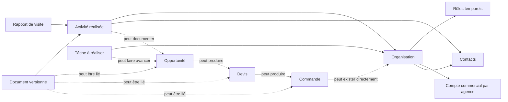
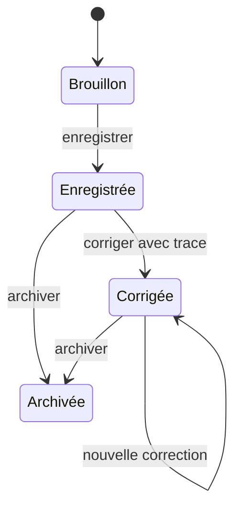
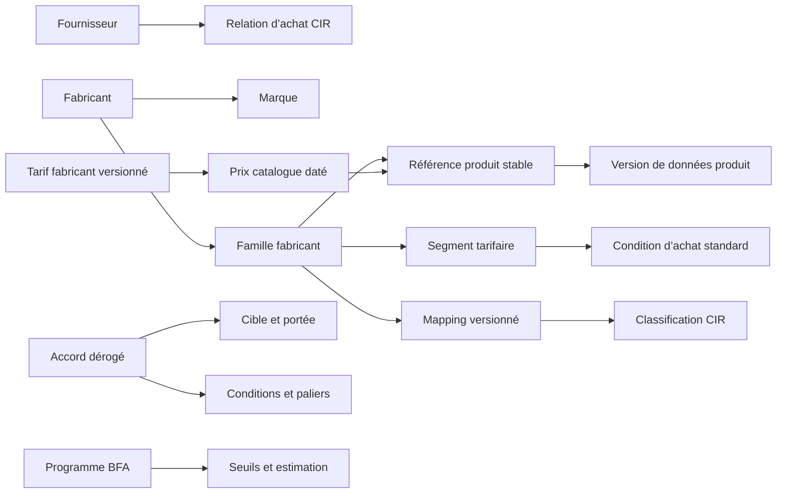

# Architecture directrice CIR Cockpit

> Socle produit, métier, données et IA pour construire CIR Cockpit par briques cohérentes.

| Métadonnée | Valeur |
| --- | --- |
| Statut | Référence directrice active v1.0 — décisions ouvertes conservées explicitement |
| Date | 2026-07-17 |
| Périmètre | Produit, modèle métier, données, backend, frontend, imports, recherche et assistant IA |
| Application | Application locale avec backend Supabase distant lié |
| Autorité | Ce document fixe la cible et les règles de cohérence. Il ne décrit pas à lui seul l’état actuellement déployé. |

## 0. Comment utiliser ce document

Ce document est la référence à relire avant toute décision non triviale concernant :

- un nouvel objet métier ou une nouvelle table ;
- une évolution de `entities`, `interactions` ou du Pilotage ;
- les clients, prospects, fournisseurs, fabricants ou contacts ;
- les activités, relances, tâches, opportunités, devis ou commandes ;
- les catalogues, produits, tarifs, dérogations, paliers ou BFA ;
- un import massif, un historique, un diff ou une activation ;
- un nouvel outil, une nouvelle donnée ou une nouvelle capacité de l’assistant IA ;
- une décision d’architecture backend, frontend, API, recherche ou sécurité.

Il distingue quatre niveaux de décision :

| Marqueur | Signification |
| --- | --- |
| **VERROUILLÉ** | Règle directrice applicable à toutes les briques. |
| **CIBLE** | Direction retenue pour l’architecture, à traduire en plan de migration avant codage. |
| **À VALIDER** | Décision métier ou technique encore ouverte. Aucun agent ne doit la trancher silencieusement. |
| **EXISTANT** | Constat sur le système actuel, qui peut évoluer. |

Ordre d’autorité documentaire :

1. `AGENTS.md` fixe les règles opérationnelles des agents.
2. Le présent document fixe la doctrine produit et l’architecture cible.
3. `docs/ASSISTANT_IA/plan-mistral-assistant-transversal.md` est l’unique plan d’exécution IA actif.
4. Les cahiers métier conservés décrivent des besoins et hypothèses à réconcilier avec cette architecture avant implémentation.
5. Le code, les migrations et le backend distant décrivent l’état réel à un instant donné.

En cas de conflit, il ne faut ni suivre aveuglément un ancien plan ni modifier automatiquement le code. Le conflit doit être nommé, l’état réel vérifié, puis une migration explicite doit être proposée.

### Doctrine globale des migrations Supabase

Le projet suit un flux **MCP-first** commun à toutes les briques et à tous les
schémas. Toute écriture de schéma sur le projet lié passe par
`apply_migration` du MCP Supabase après autorisation explicite. Le projet
distant fait foi pour l'état runtime; chaque migration appliquée est ensuite
extraite sans transcription manuelle et conservée sous sa version distante dans
`backend/migrations/`, qui constitue l'historique SQL durable et
reconstructible.

Une migration n'est complète que si sa version, son nom et son SQL concordent
entre l'historique distant et le fichier local. Cette règle interdit les
historiques `remote-only`, les miroirs propres à une brique et les voies
d'écriture concurrentes telles que `supabase db push` ou le SQL Editor. La
procédure opérationnelle unique est définie dans `AGENTS.md` et
`backend/migrations/README.md`.

## 1. Décision exécutive

### 1.1 La prochaine étape

La prochaine étape est de **valider ce socle directeur**, puis de réaliser une cartographie de consolidation pré-import du noyau `Tiers → Activités`.

**Correctif autorisé immédiatement, hors séquence de briques —** bascule du provider de l’assistant Référentiels vers Mistral La Plateforme en contrat direct, conformément à la décision du 2026-07-16. Critère de fin : une première réponse sourcée est réellement affichée dans l’interface utilisateur. Ce correctif ne modifie ni `entities`, ni `interactions`, ni les frontières métier définies dans ce document et n’attend donc pas le Socle 1.

La prochaine étape n’est pas :

- de refaire tout le backend ;
- de refaire tout le frontend ;
- de poursuivre immédiatement la refonte Pilotage actuelle ;
- d’ajouter Opportunités, Devis, Commandes et Catalogue dans `interactions` ;
- de rendre l’IA capable d’interroger arbitrairement toutes les tables ;
- de créer toutes les tables cibles en une seule migration.

### 1.2 Position retenue

**VERROUILLÉ — CIR Cockpit sera construit comme un monolithe modulaire, par briques verticales.**

Une brique est complète lorsqu’elle possède son vocabulaire, son modèle, ses données, ses contrats API, ses permissions, son interface, sa décision explicite d’exposition IA — qui peut être « aucune exposition pour l’instant » —, ses tests, sa télémétrie et sa stratégie de migration. Le backend et le frontend sont donc consolidés ensemble, à l’intérieur de chaque brique.

**VERROUILLÉ — Il n’y aura pas de réécriture globale.** Les fondations fiables sont conservées ; les responsabilités ambiguës sont extraites progressivement derrière des contrats stables.

**VERROUILLÉ — L’IA est centrale dans l’expérience utilisateur, mais elle n’est jamais la source de vérité métier.** Elle comprend, recherche, synthétise, prépare et explique. Les droits, calculs, états, prix, activations et écritures sensibles restent déterministes.

**VERROUILLÉ — La base transactionnelle ne sera pas déformée pour le LLM.** Lorsqu’une brique expose un usage IA réel, elle fournit une surface sémantique et des outils explicites, fiables, peu coûteux et respectueux des permissions.

## 2. Vision du produit

CIR Cockpit n’est pas un simple CRM. La cible est une plateforme opérationnelle pour un distributeur industriel B2B, au croisement de plusieurs univers :

- gestion des tiers et de leurs interlocuteurs ;
- suivi des échanges et du travail commercial ;
- opportunités, devis, commandes et dossiers ;
- catalogue industriel de très grande taille ;
- classification produit interne CIR ;
- tarifs fabricants et conditions d’achat ;
- dérogations, groupements clients, paliers de quantité et BFA ;
- imports Excel hétérogènes et récurrents ;
- documents, comptes rendus, rapports et connaissances non structurées ;
- assistant IA transversal.

État actuel et ordres de grandeur anticipés :

- **EXISTANT — aucun client n’est encore importé dans la base.** L’outil doit être consolidé et validé avant tout import client ;
- plus de 12 000 clients à importer ultérieurement ;
- environ 50 à 100 fournisseurs ou fabricants selon le périmètre retenu ;
- des centaines de familles fabricant par acteur ;
- des centaines à des centaines de milliers de références par catalogue ;
- une à plusieurs mises à jour tarifaires par an et par fabricant ;
- un historique qui peut dépasser largement le volume du catalogue actif.

Ces volumes sont compatibles avec PostgreSQL si les objets sont normalisés, les accès indexés, les imports asynchrones et les historiques maîtrisés. Ils ne justifient ni microservices immédiats, ni vectorisation générale, ni partitionnement prématuré.

## 3. Pourquoi consolider l’existant

### 3.1 Ce qui est déjà solide et doit être conservé

Le projet possède des fondations utiles :

- PostgreSQL, Auth, RLS, Storage et Edge Function via Supabase ;
- React, tRPC, Zod partagé et TanStack Query ;
- contrôles d’accès par agence ;
- contrats stricts et système d’erreurs applicatif ;
- import des référentiels CIR ;
- snapshots, anomalies, diff et activation ;
- outils IA bornés, traces d’outils et premiers tests d’évaluation ;
- interfaces Clients et Fournisseurs déjà livrées ;
- système de configuration d’agence et brouillons d’interaction.

L’objectif n’est donc pas de repartir de zéro, mais de préserver ces acquis derrière des frontières métier plus justes.

### 3.2 Les faiblesses structurelles à corriger

| Zone actuelle | Problème | Conséquence si l’on continue sans consolidation |
| --- | --- | --- |
| `entities.entity_type` | L’identité d’une organisation est confondue avec ses rôles client, prospect ou fournisseur. | Duplication et impossibilité de représenter proprement plusieurs rôles simultanés ou historiques. |
| `interactions` | Une même ligne porte un échange, un statut de dossier, un montant, une étape, une date de devis, une référence de commande, une relance et une timeline. | Chaque nouvelle fonction renforce une table fourre-tout et rend les règles, l’UI et l’IA ambiguës. |
| `interactions.timeline` | L’historique métier est principalement embarqué dans un tableau JSONB. | Requêtes, audit, concurrence, recherche et relations deviennent difficiles à fiabiliser. |
| Création d’interaction | Le formulaire doit décider trop tôt du type de tiers, du type de suivi et de champs conditionnels issus de plusieurs concepts. | Parcours complexe, validations fragiles et réutilisation difficile. |
| Vue « Affaires » | Les anciens plans supposent encore en partie qu’une interaction est une affaire. | Opportunité, devis, commande et activité finissent fusionnés artificiellement. |
| Catalogue produit | Les référentiels de familles et de conditions existent, mais pas encore l’identité de chaque référence produit dans un modèle canonique complet. | Les futurs imports tarifaires risquent de mélanger identité produit, description, prix et version de catalogue. |
| Assistant IA | Le socle actuel est fortement orienté référentiels/pricing et conserve un fallback SQL généraliste. | L’assistant ne dispose pas encore d’un contrat transversal stable par domaine. |
| Documents de planification | Plusieurs plans ont été écrits avant la clarification du modèle global. | Ils peuvent être techniquement bons mais reposer sur une frontière métier devenue invalide. |

### 3.3 Ce qui doit être refait, ou non

| Décision | Éléments concernés |
| --- | --- |
| **Conserver** | Stack, auth, RLS, tRPC, Zod, erreurs, snapshots, diff, anomalies, audit et composants UI fiables. |
| **Consolider sans refaire l’UI immédiatement** | Identité des tiers, rôles, rattachement aux agences, identifiants et relations. |
| **Refactorer par migration progressive** | `interactions`, timeline JSONB, relances, étapes commerciales et références devis/commandes. |
| **Rebaser sur le nouveau modèle** | Refonte Pilotage V3 et architecture IA « contexte universel ». |
| **Concevoir avant d’implémenter** | Références produit, catalogues versionnés, accords d’achat, paliers, BFA, opportunités, devis et commandes. |
| **Ne pas faire** | Réécriture globale, microservices précoces, table universelle, EAV généraliste, embeddings partout ou accès SQL libre comme architecture IA principale. |

## 4. Principes non négociables

### 4.1 Métier et données

1. **Un objet, une responsabilité.** Une activité n’est pas une opportunité ; une tâche n’est pas une activité ; un devis n’est pas une commande.
2. **Une identité peut porter plusieurs rôles.** Une organisation existe indépendamment de son rôle de client, prospect, fournisseur ou fabricant.
3. **Les rôles et relations importants sont temporels.** Les dates d’effet, de fin et l’historique sont conservés.
4. **Les documents transactionnels gardent leur identité.** Un devis ou une commande peut exister sans opportunité.
5. **Aucune suppression silencieuse.** Les objets métier sont archivés, désactivés ou remplacés ; les suppressions physiques sont exceptionnelles et gouvernées.
6. **Toute donnée critique a une provenance.** Import, fichier, ligne source, utilisateur, règle ou système d’origine doivent pouvoir être retrouvés.
7. **Les calculs sont explicables.** Un prix, une marge ou une priorité appliquée produit une trace déterministe.
8. **L’historique ne vit pas uniquement dans du JSONB.** Le JSONB est réservé aux données réellement variables ou brutes, avec index ciblé si elles sont requêtées.
9. **Les imports sont idempotents et réversibles.** Le même fichier ne crée pas de doublons, une activation est atomique et un retour arrière est possible.
10. **Le catalogue actif n’est jamais écrasé directement par un fichier entrant.**

### 4.2 Architecture

11. **Monolithe modulaire avant microservices.** Les frontières sont explicites dans le code et les contrats, sans multiplier les déploiements.
12. **Contrats partagés et stricts.** Les entrées/sorties externes sont validées ; la base n’est pas exposée directement au frontend.
13. **RLS et permissions de domaine.** L’accès est vérifié à la fois par les politiques de données et les règles métier.
14. **Traitements lourds hors requête interactive.** Import, diff massif, indexation et enrichissement s’exécutent comme jobs observables et reprenables.
15. **Pagination par curseur sur les grands ensembles.** Les références produit et historiques ne reposent pas sur des offsets profonds.
16. **Index conçus depuis les accès réels.** Clés étrangères, filtres RLS et recherches fréquentes sont indexés ; les index composites suivent les requêtes.
17. **Partitionnement uniquement sur preuve.** Il sera envisagé pour les historiques dépassant réellement les seuils utiles, pas par anticipation.
18. **Compatibilité de migration explicite.** Une brique peut temporairement lire l’ancien modèle, mais la date et les conditions de retrait sont écrites.

### 4.3 IA

19. **L’IA ne décide pas des faits.** Elle appelle des outils qui appliquent les règles.
20. **Pas d’accès général à la base comme voie principale.** Les outils métier typés remplacent progressivement le SQL généraliste.
21. **Contexte minimal.** Seuls les objets, champs et extraits nécessaires quittent le moteur applicatif.
22. **Réponse sourcée.** Toute affirmation sur les données CIR indique les objets, dates, sources et calculs utilisés.
23. **Écriture sous contrôle.** Une action sensible préparée par l’IA reste un brouillon jusqu’à confirmation explicite.
24. **Le modèle est remplaçable.** La logique métier, les outils et les évaluations ne dépendent pas d’un fournisseur IA unique.
25. **Coût proportionnel à la demande.** Une requête déterministe ne doit pas appeler un grand modèle.

## 5. Contextes métier et briques

Chaque contexte possède ses objets et ses règles. Il peut lire les autres contextes via des contrats, mais ne doit pas écrire directement dans leurs tables.

| Contexte | Responsabilité | Objets principaux | Ne doit pas absorber |
| --- | --- | --- | --- |
| Identités et tiers | Décrire qui existe et dans quels rôles | Organisation, personne, contact, rôle, compte d’agence | Activités, opportunités, prix |
| Activités | Enregistrer ce qui s’est réellement passé | Activité, participant, canal, compte rendu, pièce jointe | Travail futur, étape de vente, commande |
| Travail collaboratif | Organiser ce qui reste à faire | Tâche, assignation, échéance, suivi | Historique d’un échange terminé |
| Développement commercial | Suivre un besoin ou potentiel | Opportunité, étape, participant, produit concerné, décision | Devis/commande comme simples champs |
| Transactions | Représenter les documents commerciaux | Devis, ligne de devis, commande, ligne de commande | Opportunité obligatoire |
| Documents et rapports | Conserver les sources et contenus | Document, version, rapport de visite, pièce jointe | Données structurées dupliquées |
| Produit | Décrire l’offre industrielle | Fabricant, fournisseur, marque, famille fabricant, référence, attribut | Prix courant directement dans l’identité produit |
| Classification CIR | Relier le langage fabricant au langage CIR | Méga-famille, famille, sous-famille, mapping, exception | Identité d’une référence ou condition d’achat |
| Tarification achat | Calculer le coût facturé et économique | Tarif, condition standard, accord dérogé, palier, BFA | Politique de prix de vente client |
| Import et qualité | Transformer des sources hétérogènes en versions activables | Fichier source, lot, mapping, staging, anomalie, diff, snapshot | Écriture directe dans les données actives |
| Assistant IA | Comprendre une intention et orchestrer des outils autorisés | Session, contexte, outil, trace, preuve, évaluation | Règle de prix, permission ou état métier autonome |
| Gouvernance | Paramétrer, auditer et observer | Agence, utilisateur, rôle système, configuration, audit, job | Logique métier spécifique dupliquée |

## 6. Vocabulaire canonique

### 6.1 Termes retenus

| Terme canonique | Définition |
| --- | --- |
| **Organisation** | Identité stable d’une entreprise, administration ou structure externe. |
| **Rôle d’organisation** | Qualité temporelle d’une organisation : client, prospect, fournisseur, fabricant ou autre rôle futur. |
| **Compte commercial** | Relation d’une organisation avec CIR ou une agence : numéro, type de compte, responsable, statut et conditions locales. |
| **Contact** | Personne rattachée à une organisation, avec fonction et moyens de contact. |
| **Activité** | Fait daté déjà réalisé : appel, email, visite, passage comptoir, réunion, note interne ou autre échange. |
| **Tâche** | Action future attendue, assignable, avec état et échéance. |
| **Opportunité** | Besoin ou potentiel commercial qui mérite un suivi structuré. Elle est facultative. |
| **Devis** | Proposition commerciale identifiable, éventuellement liée à une opportunité. |
| **Commande** | Engagement transactionnel identifiable, éventuellement issu d’un devis ou directement créé. |
| **Affaires** | Projection de pilotage réunissant les opportunités, devis, commandes et tâches qui nécessitent une attention. Ce n’est pas un objet fourre-tout. |
| **Fabricant** | Organisation qui fabrique ou porte la responsabilité industrielle d’un produit. |
| **Fournisseur** | Organisation auprès de laquelle CIR achète. Elle peut aussi être fabricant, mais ce n’est pas obligatoire. |
| **Marque** | Identité commerciale portée par un fabricant ou un groupe. |
| **Famille fabricant** | Regroupement produit défini par le fabricant, par exemple `CAT_FAB`. |
| **Segment tarifaire** | Périmètre fabricant utilisé pour exprimer une condition d’achat. |
| **Référence produit** | Identité stable d’un article dans un catalogue fabricant. |
| **Classification CIR** | Hiérarchie interne CIR utilisée pour organiser et comparer l’offre. |
| **Tarif fabricant** | Version datée d’un ensemble de prix catalogue. |
| **Condition d’achat** | Règle standard qui transforme un tarif en prix d’achat facturé. |
| **Accord dérogé** | Accord limité par une cible, une portée et une validité, donnant un prix net ou une remise particulière. |
| **Palier de quantité** | Condition applicable à un intervalle de quantité et à une unité explicites. |
| **Programme BFA** | Accord différé dont la valeur dépend d’une période, de critères et éventuellement de seuils. |
| **Lot d’import** | Exécution regroupant un ou plusieurs fichiers sources pour produire une version candidate. |
| **Snapshot actif** | Version validée utilisée par les services métier. |

### 6.2 Le terme « interaction »

**CIBLE — `Activité` devient le nom conceptuel du fait enregistré.**

Le mot « interaction » peut rester temporairement visible dans l’interface pendant la migration, mais il ne doit plus désigner simultanément un échange, un dossier commercial, une relance et une affaire. Avant implémentation, le PO devra confirmer si l’interface utilisateur adopte aussi le terme « Activité ».

## 7. Modèle conceptuel transversal

Ce diagramme décrit des objets métier, pas des tables SQL définitives.



Règles de relation :

- une activité peut ne concerner aucune opportunité ;
- une opportunité peut comporter plusieurs activités, tâches, contacts, devis et commandes ;
- un devis ou une commande peut exister sans opportunité ;
- une commande peut provenir d’un devis ou être directe ;
- une visite peut faire émerger zéro, une ou plusieurs opportunités ;
- les liens sont explicites et historisés, pas encodés dans une note ou un tableau JSON.

## 8. Objets commerciaux et temporalité

### 8.1 Organisation, rôles et comptes

L’organisation est stable. Ses rôles et sa relation commerciale avec CIR évoluent.

Exemples :

- une entreprise peut être prospect puis cliente sans changer d’identité ;
- une organisation peut être à la fois fournisseur et fabricant ;
- un client peut être rattaché à plusieurs agences avec des responsables ou statuts différents ;
- le passage prospect → client crée un changement de rôle ou d’état, pas une nouvelle organisation.

**À VALIDER — portée des comptes :** confirmer si les numéros client, conditions de paiement, commerciaux et statuts sont globaux CIR ou spécifiques à une agence.

### 8.2 Activité

Une activité décrit un fait : qui, quand, par quel canal, avec quels participants, quel objet, quel compte rendu et quelles sources.

Elle ne porte pas directement :

- l’étape d’une opportunité ;
- le montant global d’une affaire ;
- la date d’envoi d’un devis ;
- une référence de commande comme simple texte ;
- une tâche future comme simple date de rappel.

Ces informations appartiennent à des objets dédiés, reliés à l’activité lorsque nécessaire.

Cycle cible :



Une correction conserve l’auteur, la date et la précédente valeur lorsque l’information a une conséquence métier.

### 8.3 Tâche et relance

Une relance est une tâche, pas une activité future. Quand la relance est exécutée, elle peut produire une activité liée puis la tâche passe à l’état terminé.

États minimaux : `à faire`, `en cours`, `terminée`, `annulée`. Les assignations, échéances, priorités et changements d’état sont historisés.

### 8.4 Opportunité

L’opportunité est facultative. Elle structure un potentiel commercial suffisamment important pour nécessiter un suivi : contexte, valeur estimée, étape, probabilité éventuelle, participants, produits, concurrence, prochaines actions et résultat.

Le détail exact des étapes est **À VALIDER** avec les utilisateurs avant création du workflow. Une liste d’étapes copiée d’un CRM générique ne doit pas être imposée.

### 8.5 Devis et commande

Devis et commande sont des documents transactionnels avec en-tête, lignes, montants, dates, statuts, source et identifiant du système d’origine.

**À VALIDER — système source :** confirmer le rôle futur de l’AS400 ou de tout ERP dans la création, la synchronisation et l’autorité des devis, commandes, clients et prix.

### 8.6 « Affaires »

La vue « Affaires » est un read model de pilotage. Elle peut réunir :

- opportunités ouvertes ;
- devis à relancer ;
- commandes à surveiller ;
- tâches commerciales échues ou proches ;
- dossiers sans activité récente.

Chaque ligne garde le type et l’identifiant de son véritable objet. Aucune table `affaires` générique n’est créée uniquement pour simplifier l’écran.

### 8.7 Pilotage et « Ma journée »

Les intentions utiles de l’ancien chantier Pilotage sont conservées sans reprendre son modèle technique obsolète :

- une vue dense et paginée des dossiers commerciaux à suivre ;
- des vues sauvegardées, filtres, tags et suiveurs lorsque leur portée métier est validée ;
- une vue personnelle « Ma journée » fondée sur les tâches, relances, échéances et activités réelles ;
- une priorisation explicable, dont chaque élément indique pourquoi il est présenté ;
- un accès contextuel à l’assistant seulement après exposition des capacités IA de la brique concernée.

Ces surfaces sont des projections construites après stabilisation des objets Tâche, Opportunité, Devis et Commande. Le seuil historique de 600 €, les règles de score, la palette de tags et les raccourcis proposés ne sont pas des décisions directrices : ils devront être validés avec les utilisateurs au moment de la Brique 6.

## 9. Catalogue, import et tarification

### 9.1 Séparation des objets produit



Principes :

- le catalogue, les marques, les familles fabricant, les CAT_FAB et la classification produit constituent des référentiels communs à toute la CIR ; ils ne portent pas d’`agency_id` ;
- une future condition, disponibilité ou organisation propre à une agence est modélisée comme une portée métier distincte et ne modifie jamais l’identité du référentiel produit ;
- l’identité d’une référence est stable ;
- ses descriptions, attributs, statuts et rattachements peuvent être versionnés ;
- un prix appartient à un tarif et à une période, pas directement à l’identité produit ;
- une condition d’achat est distincte du prix catalogue ;
- le mapping entre vocabulaire fabricant et classification CIR est versionné et peut comporter des exceptions ;
- les ambiguïtés réelles ne sont pas forcées dans une relation supposée `1:1`.

### 9.2 Pipeline d’import


Le pipeline accepte notamment :

- un fichier unique avec tarif et remise ;
- un fichier tarif plus un fichier de conditions ;
- des prix nets ;
- des remises par famille fabricant ;
- des remises par référence ;
- des colonnes de quantité ;
- des références ajoutées, modifiées, absentes ou réactivées.

**CIBLE — un catalogue annoncé comme complet utilise une sémantique de remplacement contrôlé.** Une référence absente devient une désactivation présumée à valider, jamais une suppression physique automatique.

Les imports massifs seront exécutés par jobs : progression, logs, reprise, erreurs par ligne, annulation sûre et détection de doublon. L’API interactive ne gardera pas une connexion ouverte pendant le traitement complet.

### 9.3 Unités et paliers

Les colonnes fabricant sont normalisées en lignes de conditions. Un palier précise au minimum :

- quantité minimale et maximale éventuelle ;
- unité de calcul ;
- unité de vente ;
- conditionnement ;
- minimum de commande ;
- multiple de commande ;
- type de valeur : prix net, remise, remise complémentaire ou coefficient ;
- valeur, devise et arrondi ;
- période de validité ;
- portée du cumul : ligne, document ou période.

Il ne doit jamais exister d’ambiguïté entre « 10 pièces » et « 10 boîtes de 10 ».

### 9.4 Accords dérogés et groupes clients

Un accord dérogé possède :

- un fabricant ou fournisseur concerné ;
- un bénéficiaire : global CIR, agence, client, groupe de clients ou opportunité ;
- une portée produit : référence, liste de références, famille fabricant, segment ou autre portée validée ;
- une méthode : prix net, remise totale, remise complémentaire ou coefficient ;
- des paliers éventuels ;
- une validité ;
- une priorité explicite ;
- une source documentaire ;
- un statut et un historique de validation.

L’appartenance d’un client à un groupe est temporelle. Elle ne doit pas réécrire les calculs historiques antérieurs à son entrée.

### 9.5 BFA

Une BFA est séparée d’une dérogation facturée. La cible distingue :

- programme BFA ;
- critères et périmètre ;
- paliers ;
- progression réalisée ;
- estimation à date ;
- niveau de fiabilité ;
- règlement ou avoir effectivement reçu.

Le coût facturé et le coût économique estimé restent visibles séparément.

### 9.6 Preuve de calcul

Le moteur de prix doit retourner un résultat et sa preuve :

```text
Référence et quantité demandées
→ tarif fabricant et version
→ condition standard applicable
→ accord dérogé et palier retenus
→ prix d’achat facturé
→ BFA confirmée ou estimée
→ coût économique
→ règles, dates, priorités et sources utilisées
```

Cette preuve sert à l’utilisateur, à l’audit, aux tests et à l’explication par l’IA.

## 10. Architecture IA cible

### 10.1 Principe

L’assistant doit reproduire le bon aspect d’un accès MCP : il ne « connaît » pas toute la base dans son prompt. Il dispose d’un catalogue d’outils stables, découvre le contexte utile, appelle les services autorisés puis raisonne sur un résultat réduit et sourcé.

```mermaid
flowchart LR
    USER["Question utilisateur"] --> CTX["Contexte de page et objet courant"]
    CTX --> POLICY["Identité, agence, permissions et politique de données"]
    POLICY --> ROUTER["Routage d’intention et budget"]
    ROUTER --> TOOLS["Catalogue d’outils métier typés"]
    TOOLS --> SERVICES["Services déterministes par domaine"]
    SERVICES --> READ["Vues sémantiques, recherche et index"]
    SERVICES --> RULES["Moteurs métier et calculs"]
    READ --> EVIDENCE["Résultats minimaux et preuves"]
    RULES --> EVIDENCE
    EVIDENCE --> MODEL["Modèle de langage si nécessaire"]
    MODEL --> ANSWER["Réponse sourcée ou brouillon à confirmer"]
    ANSWER --> EVAL["Coût, latence, traces et évaluation"]
```



### 10.2 Décision d’exposition et contrat IA par brique

L’obligation porte sur la **décision**, pas sur la création artificielle d’une capacité IA. Une brique peut déclarer explicitement : `aucun outil IA exposé pour l’instant`. Dans ce cas, elle documente seulement la raison et le signal qui justifierait une réévaluation. Elle n’a pas à créer de vue, d’outil, d’évaluation ou de budget LLM sans usage réel.

Lorsqu’une brique expose effectivement une capacité IA, elle définit :

1. ses objets et son vocabulaire canonique ;
2. les champs recherchables et les champs sensibles ;
3. ses vues de lecture sémantiques ;
4. ses outils de lecture typés ;
5. ses actions préparables par l’IA et leur confirmation ;
6. le format des preuves et sources ;
7. ses règles de permission et de minimisation ;
8. ses cas d’évaluation faciles, ambigus et complexes ;
9. ses budgets de lignes, tokens, temps et coût ;
10. sa stratégie de cache et d’invalidation.

Ce contrat, lorsqu’il existe, permet d’ajouter une brique à l’assistant sans réécrire l’orchestrateur global. Il doit être extrait d’un parcours réel qui fonctionne, puis généralisé au strict nécessaire ; il ne doit pas être conçu intégralement dans l’abstrait.

### 10.3 Stratégie de recherche

| Donnée | Mécanisme prioritaire | Exemple |
| --- | --- | --- |
| Identifiant, code, référence, marque | Index B-tree, recherche normalisée, alias | Référence SKF exacte |
| Statut, dates, montants, quantités | Requête structurée déterministe | Devis échus de la semaine |
| Noms et descriptions courtes | Recherche plein texte `tsvector` + index GIN | Produit contenant « roulement inox » |
| Attributs produits variables | Colonnes canoniques pour les attributs fréquents, JSONB indexé pour le long tail | Diamètre, matière, tension |
| Notes, emails, rapports, PDF | Extraction textuelle, recherche plein texte puis recherche sémantique ciblée | Résumer les visites parlant d’un automate |
| Calcul de prix | Moteur tarifaire uniquement | Pourquoi ce PA s’applique |

**VERROUILLÉ — pas d’embedding systématique de toutes les lignes.** Les vecteurs sont réservés aux contenus où la similarité sémantique apporte réellement plus que les index structurés ou plein texte.

### 10.4 Coût et sélection de modèle

Ordre de traitement :

1. réponse directe d’un service déterministe, sans LLM ;
2. recherche structurée puis petit modèle pour reformulation ;
3. recherche documentaire ciblée puis modèle intermédiaire pour synthèse ;
4. modèle plus puissant seulement pour une demande complexe justifiée.

Garde-fous :

- aucun dump de schéma complet ou de catalogue dans le prompt ;
- limites strictes de lignes et pagination par outil ;
- agrégations exécutées en base, pas par le modèle ;
- cache des résultats stables et des extractions de documents ;
- résumés hiérarchiques pour les dossiers longs ;
- choix de modèle piloté par l’intention et mesuré par des évaluations ;
- budget et coût réels enregistrés par appel.

### 10.5 Fiabilité

Une réponse factuelle contient :

- l’objet ou l’ensemble analysé ;
- le périmètre d’agence et les filtres ;
- la date ou version des données ;
- les sources utilisées ;
- les limites ou données manquantes ;
- la preuve du calcul lorsque applicable.

Le LLM n’invente pas une réponse lorsque l’outil renvoie zéro résultat ou une ambiguïté. Il demande une précision ou expose clairement l’absence de preuve.

### 10.6 Confidentialité

Règles minimales :

- aucun service autorisé à entraîner sur les requêtes ou à publier les prompts ;
- aucun outil externe non approuvé ne reçoit de données CIR ;
- les droits de l’utilisateur s’appliquent avant la construction du contexte ;
- les secrets, marges, BFA et données personnelles sont classifiés ;
- le contexte envoyé est minimisé et journalisé sans réexposer les données sensibles ;
- la confidentialité est gouvernée par le contrat, la classification des données et la minimisation, pas par une contrainte technique ZDR appliquée indistinctement à toutes les requêtes.

**CIBLE — provider de référence de l’assistant :** Mistral La Plateforme payant, en contrat direct UE, sans entraînement sur les données, avec une rétention contractuelle de 30 jours et le ZDR activable en option. Cette décision est réversible par configuration via l’enum de provider et un adaptateur ; elle ne doit pas être recodée dans la logique métier.

Le ZDR peut être activé pour une catégorie ou un parcours qui l’exige, mais il n’est ni un gate global de routage ni un prérequis au branchement du provider. Le travail restant porte sur le traitement approprié de chaque catégorie sensible : transmission autorisée, minimisation, masquage, agrégation, exclusion ou ZDR optionnel.

## 11. Architecture technique cible

### 11.1 Forme générale

La cible reste un monolithe modulaire :

- un frontend React organisé par capacités métier ;
- des contrats Zod partagés ;
- une API tRPC comme frontière applicative ;
- des services backend organisés par contexte ;
- PostgreSQL comme source transactionnelle ;
- Storage pour les fichiers sources et pièces jointes ;
- un mécanisme de jobs pour les traitements lourds ;
- des vues sémantiques et index de recherche ;
- un assistant orchestrateur au-dessus des services de domaine.

Les modules ne partagent pas des requêtes ad hoc dans leurs tables respectives. Ils publient des services de lecture ou événements utiles.

### 11.2 Événements et jobs

Les changements importants produisent des événements fiables, par exemple :

- `organization_role_changed` ;
- `activity_recorded` ;
- `opportunity_stage_changed` ;
- `quote_imported` ;
- `catalog_snapshot_activated` ;
- `purchase_agreement_expiring` ;
- `product_deactivated`.

Ces événements alimentent, selon les besoins : audit, notifications, indexation, read models, contrôles de qualité et contexte IA. Une outbox transactionnelle est préférée à un envoi réseau non garanti pendant la transaction.

Les workers doivent revendiquer les jobs de manière concurrente sûre, enregistrer les tentatives et permettre une reprise. Le choix précis du runtime de worker est **À VALIDER** avant le premier import catalogue massif.

### 11.3 Performance PostgreSQL

Règles de conception :

- clé primaire stable sur chaque objet ;
- clé étrangère réelle lorsque la relation est structurée ;
- index sur les clés étrangères et colonnes utilisées par RLS ;
- index composites calés sur les filtres et tris fréquents ;
- insertions par lots ou `COPY` pour les imports ;
- curseurs stables pour les listes volumineuses ;
- `tsvector` et GIN pour le texte recherché ;
- GIN ou index d’expression seulement sur le JSONB réellement interrogé ;
- mesure par plans d’exécution avant optimisation avancée ;
- partitionnement réservé aux tables historiques qui dépassent réellement un volume critique.

### 11.4 Sécurité

- RLS activée sur toute table exposée ;
- fonctions RLS stables, indexées et évaluées une fois lorsque possible ;
- service role interdit dans un parcours utilisateur ordinaire ;
- permissions métier vérifiées dans les services ;
- données sensibles exclues des vues IA génériques ;
- journal d’audit séparé des journaux techniques ;
- source, auteur, date et version enregistrés pour toute modification critique.

### 11.5 Frontend

Le frontend reflète les objets du domaine. Il ne reconstruit pas silencieusement des règles métier à partir de champs génériques.

Chaque brique possède :

- ses routes et composants ;
- ses hooks et clés de cache ;
- ses services tRPC ;
- ses états chargement/vide/partiel/erreur/conflit ;
- ses permissions visibles ;
- ses actions clavier si utiles ;
- son point d’entrée assistant contextuel.

Le composant de création d’activité sera conçu pour enregistrer rapidement un fait. Les opportunités, tâches, devis ou commandes seront créés par des actions explicites, pas par l’apparition progressive de champs dans le même formulaire.

### 11.6 Erreurs, résilience et incidents

La gestion des erreurs est un contrat transversal, partagé par le backend, les contrats tRPC, le frontend et l’exploitation :

- une cause connue possède un code stable dans le catalogue CIR, un statut, une sévérité, une possibilité de retry et une action de récupération ;
- la réponse publique reste française, concise et actionnable ; les causes, stacks, secrets et diagnostics techniques restent côté serveur ;
- chaque incident est corrélé de la requête HTTP jusqu’au job, à l’outil ou au provider externe, avec un `request_id` communicable au support ;
- les retries sont explicites, bornés par temps/coût/tentatives, réservés aux opérations transitoires et idempotentes, et respectent `Retry-After` ;
- aucune erreur de permission, validation, configuration, authentification externe ou contrat invalide n’est retentée automatiquement ;
- les réservations, finalisations et reprises empêchent une double écriture, un double appel payant ou une double consommation ;
- les dépendances externes critiques disposent d’un circuit breaker observable ; son ouverture ne bloque pas les capacités locales ou déterministes ;
- un résultat partiel ou dégradé est annoncé comme tel et ne peut utiliser que des faits déjà prouvés ;
- les erreurs sont dédupliquées côté utilisateur, mais restent comptabilisées par code, étape, dépendance et tentative ;
- toute brique critique possède des tests de faute : timeout, indisponibilité, rate limit, payload invalide, conflit, annulation et échec de persistance.

Le contrat détaillé de l’assistant, y compris sa taxonomie et ses checkpoints, est défini dans `docs/ASSISTANT_IA/plan-mistral-assistant-transversal.md`. Les autres briques réutilisent le même système d’erreurs et spécialisent seulement leurs codes métier.

## 12. Méthode de livraison par briques

### 12.1 Définition d’une brique

Une brique est une tranche verticale démontrable. Elle doit fournir une valeur réelle sans nécessiter que tout le programme cible soit terminé.

### 12.2 Definition of Ready

Avant de coder :

- besoin utilisateur et résultat attendu écrits ;
- objets, termes et frontières validés ;
- dépendances identifiées ;
- état actuel vérifié dans code et backend ;
- stratégie de migration et retour arrière ;
- permissions et données sensibles ;
- volumétrie et accès principaux ;
- décision d’exposition IA ; contrat et cas d’évaluation seulement si une capacité est réellement exposée ;
- critères de succès et non-objectifs.

### 12.3 Definition of Done

Une brique est terminée lorsque :

- migration, contraintes, index et RLS sont validés ;
- contrats partagés, API et services sont testés ;
- interface complète et états d’erreur sont testés ;
- historique, audit et concurrence sont traités ;
- lorsqu’ils existent, recherche et outils IA sont bornés et sourcés ;
- coût et latence sont mesurables ;
- données existantes sont migrées ou compatibles ;
- ancien chemin est retiré ou sa date de retrait est documentée ;
- documentation et journal de décision sont mis à jour ;
- QA proportionnée à l’impact est passée.

### 12.4 Ce qu’une brique ne doit pas faire

- ajouter un champ opportuniste dans une table voisine ;
- dupliquer une règle backend dans le frontend ou le prompt IA ;
- créer une abstraction « universelle » sans besoin actuel ;
- importer des données sans provenance et version ;
- exposer un outil IA non évalué ;
- laisser un ancien et un nouveau chemin sans stratégie de sortie.

## 13. Ordre recommandé des briques

### Socle 0 — Gouvernance d’architecture

Objectif : appliquer ce document, trancher les décisions bloquantes de la première brique et maintenir un corpus documentaire sans anciens plans concurrents.

Livrable suivant : une cartographie `modèle actuel → modèle cible` limitée aux Tiers et Activités. Comme aucun client n’est encore importé, son cœur n’est pas un backfill de 12 000 lignes mais la conception correcte du modèle **avant import** : inventaire de toutes les dépendances qui référencent `entities`, RLS par agence, identité stable, rôles multiples, comptes d’agence, contacts, contraintes, index, contrats API/UI, stratégie d’import idempotente et critères de rollback. Toute donnée non cliente déjà présente devra être inventoriée et préservée. Ces sujets ne peuvent pas être relégués dans une annexe. Aucun écran Opportunité, Devis ou Commande n’est inclus.

### Socle 1 — Plateforme IA minimale et contrat de brique

**Prérequis bloquant :** l’assistant Référentiels fonctionne réellement avec Mistral direct et une première réponse sourcée a été affichée dans l’interface.

Objectif : observer ce parcours opérationnel, puis en extraire le plus petit format commun réellement utile pour les outils, preuves, permissions, budgets et évaluations. Ce format n’est pas conçu sur papier avant la preuve de fonctionnement et il n’est généralisé qu’à partir de besoins rencontrés. Il ne s’agit pas encore d’étendre l’assistant à toutes les données.

Cette capacité transversale évolue ensuite avec chaque brique.

### Brique 1 — Tiers et rôles

Objectif : consolider l’identité Organisation/Contact, les rôles multiples et le compte d’agence sans refaire immédiatement les écrans Clients et Fournisseurs.

Valeur : toutes les briques suivantes disposent d’identifiants et de relations fiables.

### Brique 2 — Activités v2

Objectif : transformer la création d’interaction en enregistrement rapide d’une activité réelle, avec participants, liens, notes, sources et historique relationnel.

Sont explicitement exclus de cette brique : pipeline d’opportunité, devis, commandes et moteur tarifaire.

### Brique 3 — Tâches et relances

Objectif : séparer le travail futur des activités terminées, avec assignation, échéance et suivi.

### Brique 4 — Opportunités

Objectif : suivre les potentiels commerciaux qui le nécessitent, sans rendre l’opportunité obligatoire.

### Brique 5 — Devis et commandes

Objectif : synchroniser ou créer les objets transactionnels selon la décision ERP/AS400 et les relier facultativement aux opportunités.

### Brique 6 — Pilotage / Affaires

Objectif : construire les projections « Affaires » et « Ma journée » sur les vrais objets désormais stables.

### Filière Produit 1 — Référence produit et catalogue versionné

Objectif : poser l’identité produit, la séparation fabricant/fournisseur/marque/famille et les versions de catalogue.

### Filière Produit 2 — Import catalogue industriel

Objectif : gérer les profils de mapping, lots multi-fichiers, staging, validations, diff et activation.

### Filière Prix 1 — Conditions d’achat et paliers

Objectif : normaliser prix tarif, remises, prix nets, unités, conditionnements et quantités.

### Filière Prix 2 — Accords dérogés et groupes

Objectif : gérer les cibles, validités, priorités et accords spécifiques.

### Filière Prix 3 — BFA et coût économique

Objectif : modéliser programmes, paliers, progression, fiabilité et règlements.

Les filières commerciales et produit peuvent avancer à des rythmes différents après les socles communs. Elles convergent par des identifiants et contrats explicites, pas par des colonnes génériques ajoutées dans `interactions`.

## 14. Corpus documentaire actif

| Document | Rôle actuel |
| --- | --- |
| `docs/architecture-cible-cir-cockpit.md` | **Source de vérité globale** pour le produit, le métier, les données et l’architecture cible. |
| `docs/ASSISTANT_IA/plan-mistral-assistant-transversal.md` | **Unique plan d’exécution actif** pour la correction Mistral et l’assistant transversal. |
| `docs/LOGIQUE_REMISE_CIR/cahier-des-charges/00-sommaire.md` | Index des besoins métier Tarification conservés ; non normatif pour le schéma ou la stack. |
| `docs/stack.md` | État vérifié de la stack réelle. |
| `docs/testing.md` | Guide court de tests. |
| `docs/qa-runbook.md` | Procédure QA et runtime de référence. |

Les anciens plans Assistant IA, Pilotage V3, Socle Référentiels, calendriers techniques et transcriptions de travail ont été supprimés le 2026-07-17. Leurs décisions encore valables ont été absorbées ici ou dans le plan IA actif. Les fichiers Excel, arbres de classification et présentations métier restent des **sources de données**, pas des décisions d’architecture.

## 15. Décisions ouvertes

### 15.1 Tiers et commercial

1. Les comptes et numéros clients sont-ils globaux CIR ou spécifiques par agence ?
2. Une organisation peut-elle avoir plusieurs commerciaux ou agences responsables simultanément ?
3. Le terme visible doit-il devenir « Activité » ou rester « Interaction » ?
4. Quelles activités peuvent être internes sans organisation externe ?
5. Quels systèmes font autorité pour clients, devis, commandes, prix et stocks ?
6. Les statuts de devis et commandes sont-ils saisis dans CIR Cockpit ou uniquement synchronisés ?

### 15.2 Produits et prix

7. Un client peut-il appartenir simultanément à plusieurs groupes ?
8. Si plusieurs accords s’appliquent, utilise-t-on une priorité d’accord, un groupe principal, la meilleure condition ou une validation ?
9. Une dérogation d’opportunité s’applique-t-elle uniquement aux devis/commandes liés ?
10. Les paliers portent-ils sur une ligne, un document ou un cumul périodique ?
11. Une remise complémentaire est-elle cumulative ou parfois une remise totale de remplacement ?
12. Les BFA sont-elles majoritairement fixes ou souvent progressives par chiffre d’affaires/volume ?
13. Une référence absente d’un catalogue complet est-elle désactivée après validation, avec réactivation possible ?
14. Quelle relation exacte existe entre fournisseur, fabricant, marque et entité facturante ?
15. Quels attributs produit doivent être canoniques, et lesquels peuvent rester variables par fabricant ?

### 15.3 IA, confidentialité et exploitation

16. Quelles catégories de données — notamment marges, BFA, données personnelles, documents commerciaux et conditions d’achat — exigent un traitement particulier ?
17. Pour chacune de ces catégories, quelle politique appliquer : transmission minimale autorisée, masquage, agrégation, exclusion du contexte ou ZDR optionnel ?
18. Quelles actions l’IA pourra-t-elle seulement préparer, et lesquelles pourra-t-elle exécuter après confirmation ?
19. Quel runtime portera les imports et indexations longues ?
20. Quelles durées de conservation s’appliquent aux documents, traces IA, historiques et audits ?

Les décisions ouvertes sont traitées juste avant la brique concernée. Elles ne bloquent pas les briques indépendantes et ne doivent pas être résolues par spéculation.

## 16. Journal de décisions

### 2026-07-16 — Création de la référence directrice

- Architecture globale formalisée avant nouvelle implémentation.
- Livraison par briques verticales, sans big bang.
- Monolithe modulaire retenu comme forme cible actuelle.
- Séparation conceptuelle Activité / Tâche / Opportunité / Devis / Commande.
- « Affaires » défini comme projection de pilotage.
- Séparation identité d’organisation / rôles / comptes commerciaux.
- Séparation identité produit / version catalogue / prix / conditions.
- Imports versionnés, validés et activés atomiquement.
- IA centrale dans l’expérience, subordonnée aux services déterministes.
- Décision d’exposition IA obligatoire pour chaque nouvelle brique ; le contrat peut être explicitement vide lorsqu’aucun usage réel ne le justifie.
- Recherche structurée et plein texte avant vectorisation ciblée.
- Prochaine étude limitée au noyau Tiers et Activités.

### 2026-07-16 — Provider de référence de l’assistant

- **CIBLE —** Mistral La Plateforme payant, en contrat direct UE.
- Pas d’entraînement sur les données ; rétention contractuelle de 30 jours ; ZDR activable en option.
- La confidentialité est pilotée par contrat et par catégorie de données, pas par un gate ZDR global dans le routage.
- La décision reste réversible via l’enum de provider et l’adaptateur ; aucun domaine métier ne dépend directement de Mistral.
- Correctif immédiat autorisé hors séquence : basculer l’assistant Référentiels vers Mistral direct.
- Critère de fin du correctif : première réponse sourcée réellement affichée dans l’UI.
- Le Socle 1 ne commence qu’après cette preuve de fonctionnement et standardise uniquement ce qui a été validé en situation réelle.

### 2026-07-17 — Assainissement documentaire

- Le présent document devient la référence directrice active v1.0.
- `docs/ASSISTANT_IA/plan-mistral-assistant-transversal.md` devient l’unique plan IA actif.
- Les anciens plans et rapports d’exécution contradictoires sont supprimés, pas archivés dans le corpus actif.
- Les besoins métier Tarification sont conservés séparément des anciennes hypothèses techniques.
- Les concepts valables du Pilotage sont rebasés sur Activités, Tâches, Opportunités, Devis et Commandes.

### 2026-07-17 — Gestion d’erreurs et résilience

- La gestion d’erreurs devient une frontière d’architecture commune et non une responsabilité locale de l’interface.
- Les diagnostics internes sont séparés du contrat public ; le `request_id` reste la clé de support exposée.
- Les retries, circuits et reprises sont bornés, idempotents et mesurables ; ils ne doivent jamais doubler une mutation ou un appel IA payant.

## 17. Checkpoint de validation PO

Avant d’autoriser la première migration de consolidation, le PO valide au minimum :

- [ ] la décision de ne pas réécrire globalement backend et frontend ;
- [ ] le principe de briques verticales complètes ;
- [ ] le vocabulaire Organisation / Rôle / Activité / Tâche / Opportunité ;
- [ ] « Affaires » comme projection et non table fourre-tout ;
- [ ] l’ordre Tiers → Activités → Tâches → Opportunités → Devis/Commandes → Pilotage ;
- [ ] la décision IA explicite par brique, avec contrat possiblement vide ;
- [ ] le principe de recherche structurée avant embeddings ;
- [x] la gestion d’erreurs comme contrat transversal, avec diagnostics privés, récupération actionnable et retries idempotents ;
- [x] la suppression et la consolidation des anciens plans incompatibles ;
- [ ] la cartographie Tiers → Activités traite le modèle pré-import, les identifiants, les rôles, les RLS, l’idempotence de l’import et le rollback comme son cœur ;
- [ ] les décisions ouvertes nécessaires à la seule première brique.

Une fois ce checkpoint validé, la prochaine production attendue est un **plan de consolidation pré-import Tiers et Activités**, fondé sur le code et le backend réels, sans implémentation des briques futures ni import des clients.
