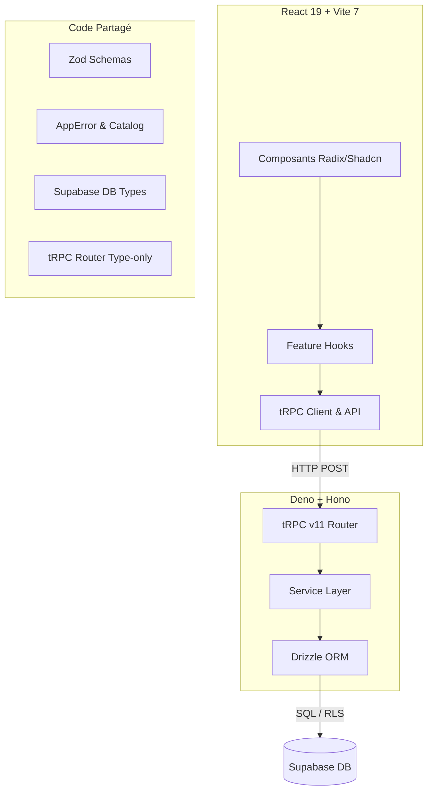

# Rapport d'Audit Technique et Fonctionnel Complet

**Date :** 4 Juin 2026  
**Périmètre :** Codebase `CIR-Cockpit` (Monorepo Frontend React + Backend Deno Edge Functions + Schéma Supabase + Contrats Partagés)  
**État global de la QA :** **100% PASS** (Vérifié via `pnpm run qa:fast`)

---

## 1. Diagnostic de Qualité Actuel (QA Gate & Conformité)

Avant d'analyser le code, une vérification complète de la solidité fonctionnelle a été effectuée à l'aide des scripts de test du projet. Les résultats confirment un niveau d'hygiène de code exceptionnellement élevé.

### Synthèse des Commandes Exécutées (`qa:fast`)
* **Hygiène du Repo (`repo:check`) :** **PASS**
  * Aucun fichier temporaire ou artefact Supabase (`supabase/.temp/*`) n'est indexé par Git.
  * Aucun drift d'import map Deno ni divergence de configuration détecté.
* **Typecheck Frontend (`tsc -p tsconfig.json --noEmit`) :** **PASS**
  * Typage strict respecté à 100%, aucune erreur de type ou non-conformité constatée.
* **Linter Frontend (`eslint . --max-warnings 0`) :** **PASS**
  * Zéro warning toléré.
* **Tests Unitaires Frontend (Vitest) :** **PASS**
  * **567 tests réussis** sur 138 suites de tests.
  * Couverture de code robuste, notamment sur les services critiques (`services/admin`, `services/api`, `services/errors`, `services/auth`, `services/entities`).
* **Conformité de la gestion des erreurs (`check:error-compliance`) :** **PASS**
  * 98 fichiers analysés. Zéro contournement de la pipeline d'erreurs.
* **Linter Backend (`deno lint`) :** **PASS**
  * 75 fichiers TypeScript backend analysés et conformes.
* **Typecheck Backend (`deno check`) :** **PASS**
* **Tests Backend (Deno test) :** **PASS**
  * **209 tests réussis** (8 tests d'intégration ignorés en local en l'absence de clés d'API distantes configurées, ce qui est le comportement attendu).

---

## 2. Audit de l'Architecture Applicative

L'architecture est structurée sous forme de monorepo découplé en trois grandes sections : `frontend/`, `backend/` et `shared/`.



### A. Frontend (Vite 7, React 19, TanStack Router & Query, Tailwind CSS 4)
* **Organisation générale :**
  * L'application utilise un modèle hybride : certains onglets (`cockpit`, `dashboard`, `settings`) sont gérés dans un état persistant "keep-alive" via `hidden={!isActive}` dans `AppMainTabContent.tsx` pour préserver le focus utilisateur et l'état des brouillons d'interaction.
  * Les onglets plus lourds (`clients`, `admin`) utilisent la structure d'Outlet de `TanStack Router` pour une gestion fine des sous-pages et des paramètres de l'URL.
* **State Management :**
  * **Server State :** Centralisé sous `TanStack Query v5`, assurant la mise en cache, l'invalidation automatique (via `queryInvalidation.ts`), les retries programmés et le rafraîchissement silencieux.
  * **Session State :** Utilisé via React Context pour la session d'authentification et les métadonnées de l'agence active.
  * **Global UI/Error State :** Zustand est utilisé à bon escient, restreint uniquement au journal et au store des erreurs applicatives (`stores/errorStore.ts`).
* **Optimisation des performances :**
  * **Lazy Loading :** L'overlay global de recherche (`AppSearchOverlay.tsx`) est importé de manière asynchrone (`lazy`) et préchargé au survol (`onSearchIntent` / `onSearchOpen`), évitant d'alourdir le bundle de démarrage.
  * **Virtualisation :** `@tanstack/react-virtual` est configuré dans le projet, prêt pour la virtualisation des listes volumineuses d'entités ou d'historique.

### B. Backend (Deno 1.x, Hono 4.x, tRPC v11, Drizzle ORM)
* **API et Routage Hono/tRPC :**
  * Entrée unique par une Edge Function Supabase (`verify_jwt = false` configuré au niveau de Supabase config, la sécurité étant directement assurée par le code Deno).
  * L'intégration de tRPC v11 et Hono est propre et respecte les contrats de payloads Zod stricts.
* **Accès aux données (Drizzle ORM) :**
  * Utilisation de deux clients de base de données distincts dans le contexte (`db` et `userDb`) permettant d'activer ou de désactiver des privilèges spécifiques (Service Role) pour des actions sensibles comme la suppression physique de fiches ou le transfert de propriété entre agences.
  * Requêtes bien typées basées sur le schéma déclaré dans `backend/drizzle/schema.ts`.
* **Rate Limiting :**
  * Implémenté via l'appel d'une fonction de base de données dédiée dans le schéma `private` (`private.check_rate_limit`). Cette approche est **excellente** en environnement Serverless/Edge, car elle évite l'écueil d'un limiteur purement en mémoire (inopérant en cas de multiples instances froides/sandboxes).

---

## 3. Audit Fonctionnel (Module par Module)

### A. Authentification et Session
* **Implémentation :** Basée sur le client d'authentification natif de Supabase côté frontend.
* **Sécurité :**
  * Détection automatique de la nécessité de changer de mot de passe (`must_change_password`). Si cette variable est à `true`, l'accès au cockpit est bloqué par une page de garde forcée (`ChangePasswordScreen.tsx`).
  * Les rôles utilisateur (`super_admin`, `agency_admin`, `tcs`) sont extraits et mis en cache de manière sécurisée dans la session.
* **Qualité du code :** Très propre. Le rafraîchissement de session (`refreshSession()`) et la gestion des expirations de tokens (`TOKEN_REFRESH_SAFETY_WINDOW_SECONDS = 30`) intègrent une marge de sécurité temporelle robuste avant chaque appel tRPC.

### B. Tableau de Bord et Kanban
* **Implémentation :** Utilise `useDashboardState` pour filtrer les interactions de l'agence courante.
* **Interactivité :**
  * La toolbar du dashboard permet de commuter entre une vue Kanban (organisée par colonnes : urgences, en cours, terminées) et une vue sous forme de liste.
  * La gestion des dates propose des presets (Semaine, Mois, Trimestre) ou des plages personnalisées avec détection des anomalies de saisie.
  * Raccourcis clavier exhaustifs (touches fléchées pour naviguer dans les cartes/lignes, `/` pour le focus recherche, `d` pour les filtres de date, `Backspace`/`Delete` pour supprimer, `Enter` ou `o` pour ouvrir).
* **Qualité du code :** La logique d'affichage est robuste. Toutefois, la complexité du hook `useDashboardState.ts` reste élevée en raison de la gestion croisée des agrégats, tris, et validations de suppressions.

### C. Onboarding de Tiers (Entity Onboarding)
* **Implémentation :** Dialogue multi-étapes géré par `EntityOnboardingDialog.tsx` et orchestré par un ensemble de sous-hooks spécialisés (`useOnboardingSubmit`, `useOnboardingNavigation`, `useOnboardingCompanyData`, etc.).
* **Fonctionnalités :**
  * Recherche entreprise en direct sur l'API Entreprises (Insee).
  * Détection automatique de doublons (SIRET/SIREN existants dans l'agence ou autres agences de l'utilisateur, ou doublons de particuliers par email/téléphone/nom).
  * Auto-remplissage des champs à partir des métadonnées officielles de l'Insee (raison sociale, code NAF, adresse).
* **Qualité du code :** Le découpage récent de `useEntityOnboardingFlow.ts` en sous-modules thématiques est un modèle de conception propre, respectant la lisibilité et facilitant les tests unitaires ciblés.

### D. Paramètres de l'Agence (Settings)
* **Implémentation :** Gère la configuration des statuts (Kanban), des services, des familles et des types d'interactions de l'agence.
* **Solidité métier :**
  * Archivage réversible au lieu de la suppression physique pour préserver l'historique des interactions passées.
  * Mécanisme de correction d'historique : si un libellé est modifié définitivement (correction de casse ou faute de frappe), une migration de masse est appliquée. Si le libellé est simplement retiré, il est archivé.
  * Protection contre les actions accidentelles : interdiction de supprimer le dernier statut actif et blocage des actions immédiates de réordonnancement si des brouillons de saisie sont en cours.
* **Qualité du code :** Excellente réorganisation de `useSettingsState.ts` en 4 sous-hooks dédiés.

### E. Gestion des Erreurs et Observabilité
* **Implémentation :** Architecture d'erreurs unifiée extrêmement robuste.
* **Composants :**
  * Catalogue d'erreurs unique (`shared/errors/catalog.ts`) contenant les codes d'erreur (`ErrorCode`) et les traductions françaises à destination de l'utilisateur.
  * Normalisation automatique des exceptions SQL, PostgREST et tRPC en objets `AppError` avec génération d'empreintes numériques (`fingerprint`) pour l'observabilité.
  * Les messages d'erreurs ne sont jamais affichés via des alertes système, mais gérés par la bibliothèque Sonner (`notifyError`) ou capturés par un `ErrorBoundary` React global.
  * Un module d'exportation du journal des erreurs (`ErrorJournalExport.tsx`) permet aux administrateurs de télécharger l'historique complet pour debug.

---

## 4. Audit de Conformité aux Règles Strictes du Projet

### A. Règle de Documentation des Fonctions (JSDoc)
* **Règle :** *Fn JSDoc: Params, returns, desc.* sur les signatures exportées.
* **Constat :** **DÉVIANCE IDENTIFIÉE.**
  * Si les hooks récents (`useSettingsState.ts`, etc.) et certains composants possèdent des blocs JSDoc clairs, **la quasi-totalité des services frontend** situés dans `frontend/src/services/` en sont exempts.
  * Exemples de fichiers sans JSDoc :
    * `frontend/src/services/admin/getAdminUsers.ts`
    * `frontend/src/services/admin/createAdminUser.ts`
    * `frontend/src/services/admin/resetAdminUserPassword.ts`
    * `frontend/src/services/entities/saveEntity.ts`

### B. Règle de Découpage des Fichiers (`Max 7 files/dir`)
* **Règle :** *Max 7 files/dir; sous-dirs si >.*
* **Constat :** **DÉVIANCE MAJEURE.**
  * Plusieurs dossiers stratégiques dépassent largement cette limite, ce qui nuit à la navigation à long terme et complexifie la lecture pour les développeurs.
  * **Dossiers en infraction :**
    1. `frontend/src/components` : Contient **33 fichiers** directement à sa racine.
    2. `frontend/src/services/admin` : Contient **16 fichiers** de service à sa racine.
    3. `frontend/src/services/errors` : Contient **17 fichiers** d'erreurs à sa racine.
    4. `frontend/src/hooks/settings-state` : Contient **8 fichiers**.

### C. Règle du Fichier Unique (One-fn-per-file)
* **Règle :** *One-fn-per-file: Export unique fn/composant; créez nouveaux fichiers pour logique isolée.*
* **Constat :** **BIEN RESPECTÉ.**
  * Les dossiers de services respectent rigoureusement cette règle avec un seul export par fichier.
  * **Exception mineure :** `frontend/src/App.tsx` contient des fonctions utilitaires privées (`getBestUserLabel`, `getUserInitials`, `preloadAppSearchOverlay`) qui gagneraient à être externalisées dans des fichiers de helpers dédiés (par exemple `frontend/src/utils/user/userFormatting.ts`).

### D. Règle sur l'Authentification et la Sécurité (Contrat HTTP)
* **Règle :** Pas d'utilisation de headers obsolètes comme `x-client-authorization`. Utilisation exclusive de `Authorization: Bearer <token>`.
* **Constat :** **BIEN RESPECTÉ.**
  * Le middleware backend (`auth.ts`) et le client tRPC frontend (`trpcClient.ts`) utilisent de manière exclusive le header standard `Authorization`. Les tests d'intégration backend vérifient explicitement le rejet de `x-client-authorization`.

---

## 5. Recommandations et Pistes d'Amélioration

### A. Améliorations de Logique (Code & Sécurité)

#### 1. Rendre les validations de retour API plus strictes (`api-responses.ts`)
Dans `shared/schemas/system/api-responses.ts`, les schémas Zod pour valider les lignes de la base de données utilisent des vérifications très permissives via `z.custom` :
```typescript
const isEntityRow = (value: unknown): value is EntityRow =>
  isRecord(value) && typeof value.id === 'string' && value.id.trim().length > 0;
  
const entityRowSchema = z.custom<EntityRow>((value) => isEntityRow(value), 'Entite invalide.');
```
* **Risque :** Si la structure de la table `entities` change ou si le serveur renvoie des colonnes invalides (nullabilité, mauvais types de données), Zod ne lèvera aucune erreur de validation à la frontière de l'API tRPC. Le frontend devra alors gérer des données potentiellement corrompues en mémoire.
* **Correction recommandée :** Remplacer ces `z.custom` par de vrais schémas Zod typés colonne par colonne, idéalement générés via `drizzle-zod` ou déclarés explicitement à partir des types Supabase.

#### 2. Sérialisation de l'invalidation de cache après Mutation
Certaines invalidations de requêtes TanStack Query se font de manière isolée dans les composants. Il serait plus robuste d'implémenter des fonctions d'invalidation centralisées ou de s'assurer que les clés de cache complexes sont toutes invalidées de façon atomique dans des hooks personnalisés (par exemple, lors de la création d'un tiers, s'assurer que la recherche unifiée ET l'annuaire sont invalidés simultanément).

### B. Améliorations de Design et Esthétique UI/UX

#### 1. Transitions et CSS Hardware Acceleration
* Quelques éléments UI possèdent des propriétés de transition génériques `transition-all` (notamment dans `SettingsSections.tsx` et `tabs.tsx`).
* **Correction recommandée :** Cibler explicitement les propriétés animées (ex. `transition-colors`, `transition-transform`) pour économiser des calculs de rendu du navigateur et améliorer la fluidité sur les appareils mobiles.

#### 2. Optimisation SEO et Structure HTML
* Le fichier `frontend/index.html` est très basique et ne contient pas de balises meta (description, open-graph, viewport optimal).
* **Correction recommandée :** Ajouter des métadonnées de base et s'assurer que la structure globale utilise des repères d'accessibilité complets (déclaration de langue dans `<html lang="fr">`).

#### 3. Découpage des répertoires surchargés
Pour résoudre la non-conformité à la règle `Max 7 files/dir`, les actions suivantes sont fortement recommandées avant d'intégrer de nouvelles fonctionnalités :
* **Composants :** Regrouper les 33 fichiers de `components/` dans des sous-dossiers thématiques :
  * `components/admin/` (pour `AdminPanel.tsx`, `AgenciesManager.tsx`, `UsersManager.tsx`...)
  * `components/auth/` (pour `LoginScreen.tsx`, `ChangePasswordScreen.tsx`...)
  * `components/dialogs/` (pour `ClientFormDialog.tsx`, `ProspectFormDialog.tsx`...)
  * `components/feedback/` (pour `ErrorBoundary.tsx`, `ConfirmDialog.tsx`...)
* **Services :** Diviser les services `admin/` et `errors/` en catégories (ex. `services/admin/users/`, `services/admin/agencies/`).

---

## 6. Tableau de Synthèse des Priorités d'Action

| Priorité | Type | Description | Fichiers Concernés |
| :--- | :--- | :--- | :--- |
| **Haute (P0)** | Structure | Résoudre la non-conformité `Max 7 files/dir` en créant des sous-dossiers pour les composants et les services. | `frontend/src/components/`, `frontend/src/services/admin/`, `frontend/src/services/errors/` |
| **Haute (P0)** | Doc | Ajouter les commentaires JSDoc manquants sur l'ensemble des signatures exportées des services du frontend. | `frontend/src/services/**/*.ts` |
| **Moyenne (P1)** | Sécurité / Type | Remplacer les validations `z.custom` de `api-responses.ts` par des schémas Zod stricts pour éviter les dérives de typage en runtime. | `shared/schemas/system/api-responses.ts` |
| **Moyenne (P1)** | UX / Perf | Remplacer les directives de transition génériques `transition-all` par des transitions CSS ciblées. | `frontend/src/components/` |
| **Basse (P2)** | SEO / HTML | Enrichir le fichier `index.html` avec les balises meta descriptives requises par les bonnes pratiques. | `frontend/index.html` |
